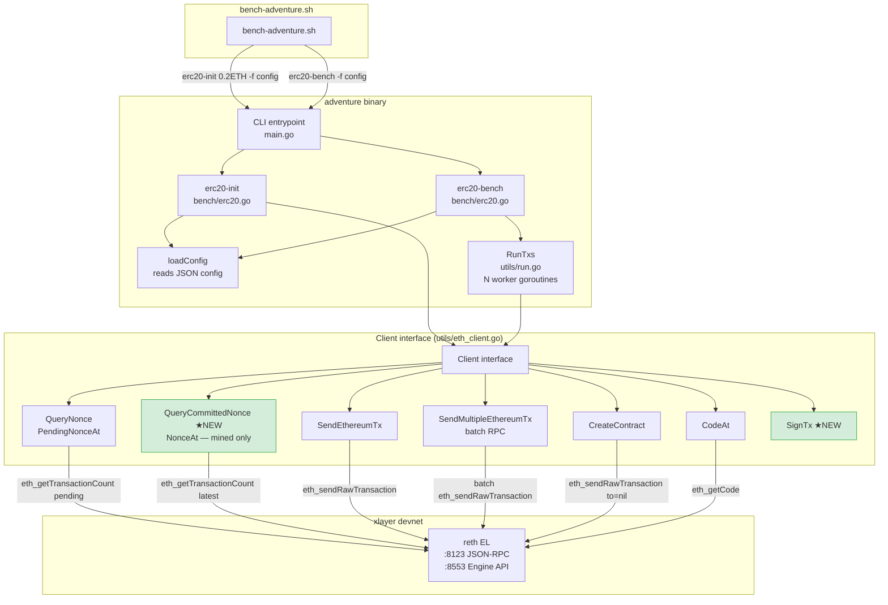
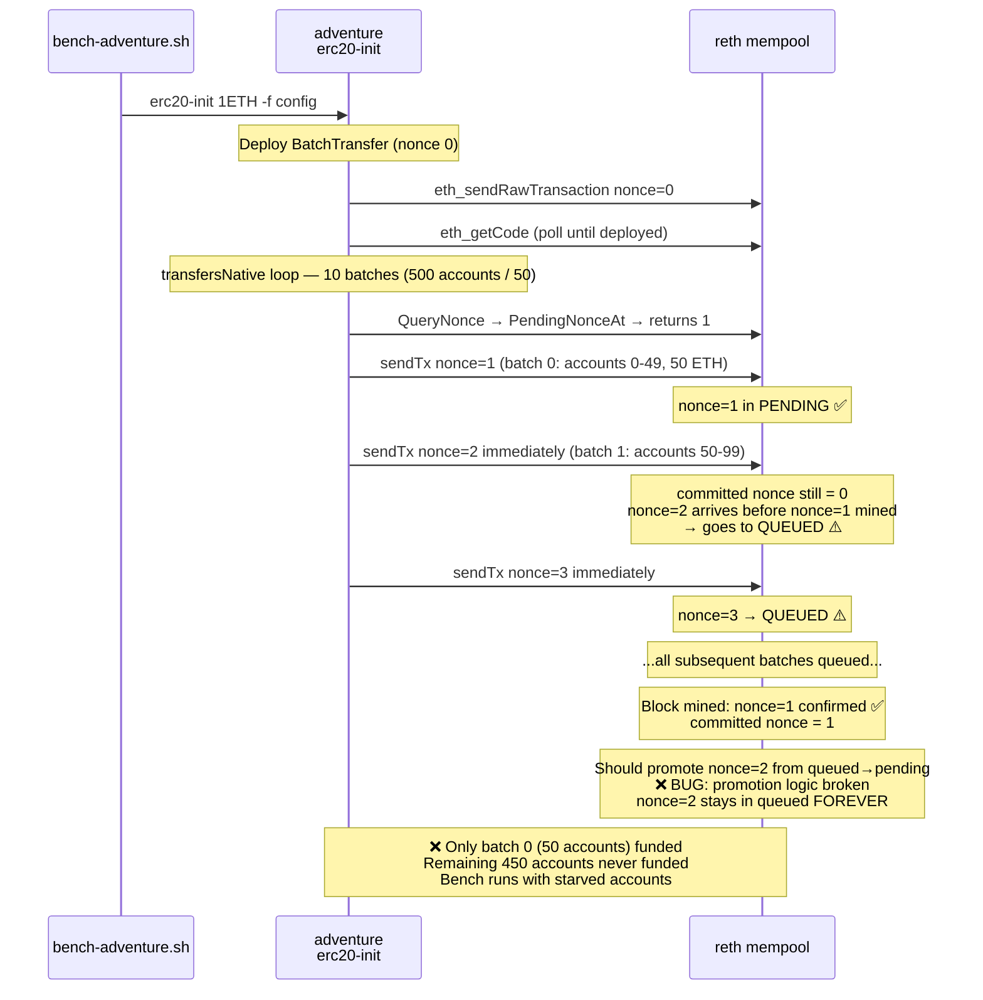
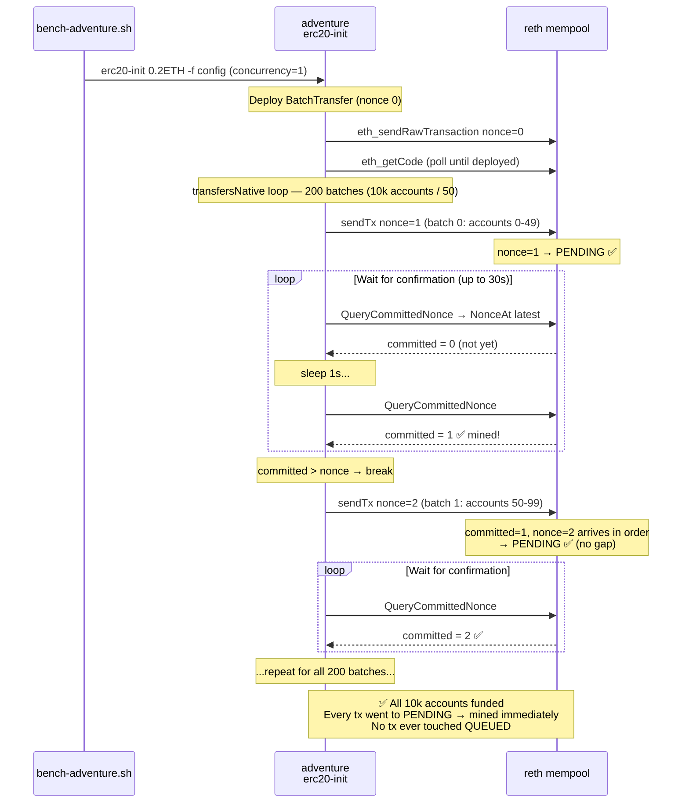
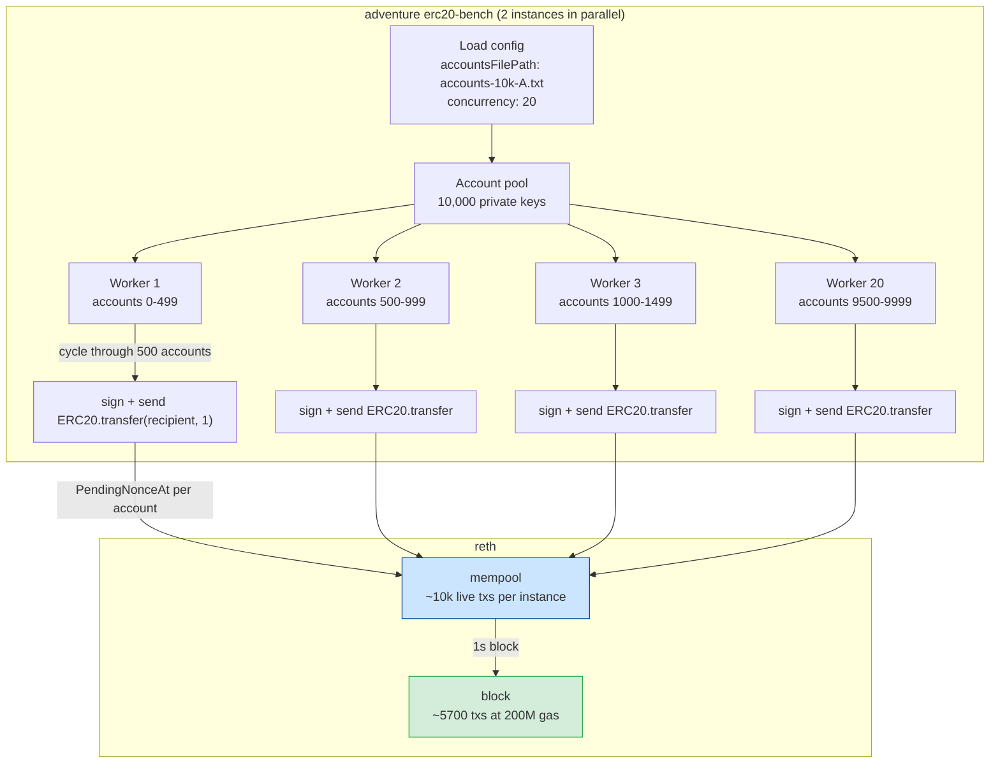
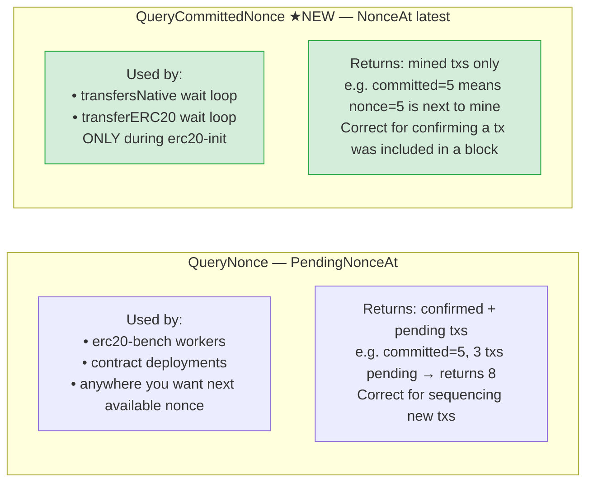

# adventure — Architecture & The reth Fix

> How the adventure Go tool works, what broke, and what was changed.

---

## 1. Overall component map



★ = added in this change

---

## 2. erc20-init flow — BEFORE the fix

The bug: batch txs were submitted without waiting for the previous one to be mined.
reth saw nonce N+1 while N was still in pending → moved N+1 to "queued" → it was **never executed**.



---

## 3. erc20-init flow — AFTER the fix

The fix: wait for `QueryCommittedNonce` to confirm the tx was mined before sending the next nonce.
This guarantees strictly sequential, gapless nonce delivery to reth.



---

## 4. The reth queued-promotion bug — illustrated

```mermaid
graph TD
    subgraph "BEFORE fix — concurrent submission"
        TX1A[nonce=1 sent] -->|arrives first| PEND1[PENDING ✅]
        TX2A[nonce=2 sent immediately] -->|arrives while nonce=1 not mined| QUEUE1[QUEUED ⚠️]
        TX3A[nonce=3 sent immediately] --> QUEUE2[QUEUED ⚠️]
        PEND1 -->|mined in block| COMMIT1[committed=1]
        COMMIT1 -->|should promote| QUEUE1
        QUEUE1 -->|❌ promotion broken| STUCK[STUCK FOREVER<br/>never executed]
        QUEUE2 --> STUCK
    end

    subgraph "AFTER fix — sequential with confirmation wait"
        TX1B[nonce=1 sent] --> PEND2[PENDING ✅]
        PEND2 -->|mined| COMMIT2[committed=1 confirmed]
        COMMIT2 -->|NOW send nonce=2| TX2B[nonce=2 sent]
        TX2B --> PEND3[PENDING ✅]
        PEND3 -->|mined| COMMIT3[committed=2 confirmed]
        COMMIT3 -->|NOW send nonce=3| TX3B[nonce=3 sent]
        TX3B --> PEND4[PENDING ✅]
    end

    style STUCK fill:#f8d7da,stroke:#dc3545
    style QUEUE1 fill:#fff3cd,stroke:#ffc107
    style QUEUE2 fill:#fff3cd,stroke:#ffc107
    style PEND2 fill:#d4edda,stroke:#28a745
    style PEND3 fill:#d4edda,stroke:#28a745
    style PEND4 fill:#d4edda,stroke:#28a745
    style COMMIT2 fill:#d4edda,stroke:#28a745
    style COMMIT3 fill:#d4edda,stroke:#28a745
```



---

## 5. erc20-bench flow (unchanged — no fix needed here)

During bench, each **account** sends from its own key. Workers cycle through accounts so fast
that any given account has at most 1 tx in flight at a time naturally.



---

## 6. QueryNonce vs QueryCommittedNonce — when each is used



---

## 7. What changed — diff summary for new devs

```
tools/adventure/utils/eth_client.go
  Client interface:
    + QueryCommittedNonce(hexAddr string) (uint64, error)
    + SignTx(privateKey, tx) (*Transaction, error)

  EthClient implementation:
    + func QueryCommittedNonce → e.NonceAt(ctx, addr, nil)   ← "nil" = latest block
    + func SignTx → types.SignTx(tx, e.signer, key)

tools/adventure/bench/erc20.go
  transfersNative() — after each batch tx send:
    + deployerAddr := GetEthAddressFromPK(privateKey)
    + for j := 0; j < 30; j++ {
    +     sleep(1s)
    +     committed = QueryCommittedNonce(deployerAddr)
    +     if committed > nonce { break }
    + }

  transferERC20() — same wait loop added (identical pattern)
```

**Nothing in the bench path (`Erc20Bench` / `RunTxs`) was changed.**
The fix is scoped entirely to the one-time init funding path.

---
