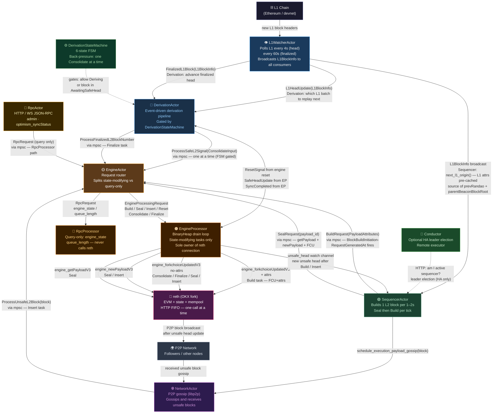
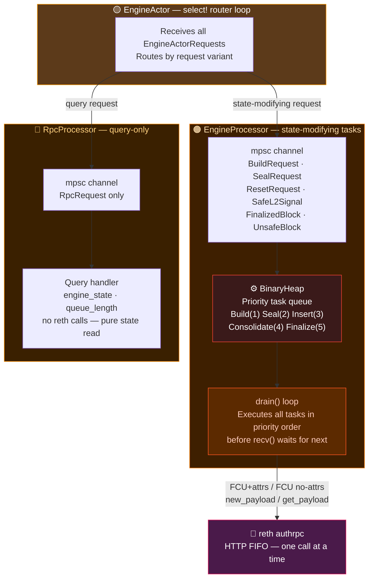
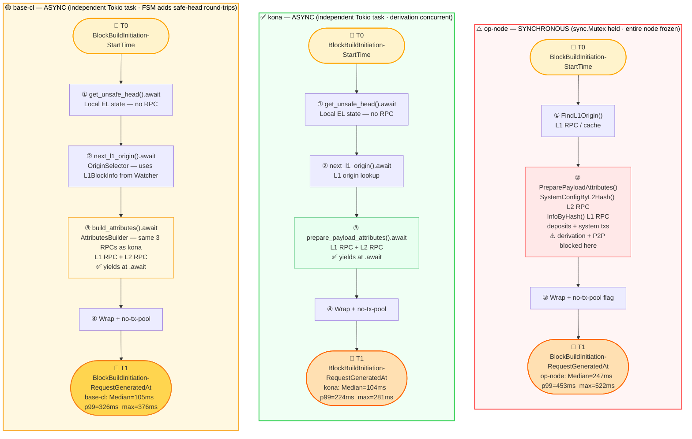
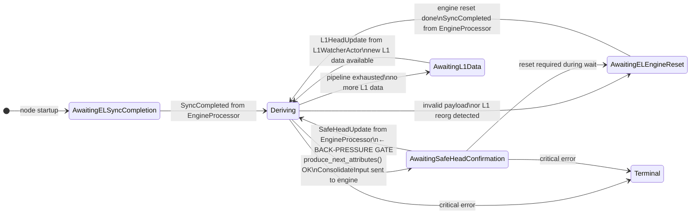
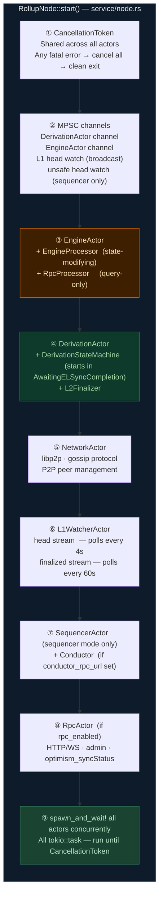
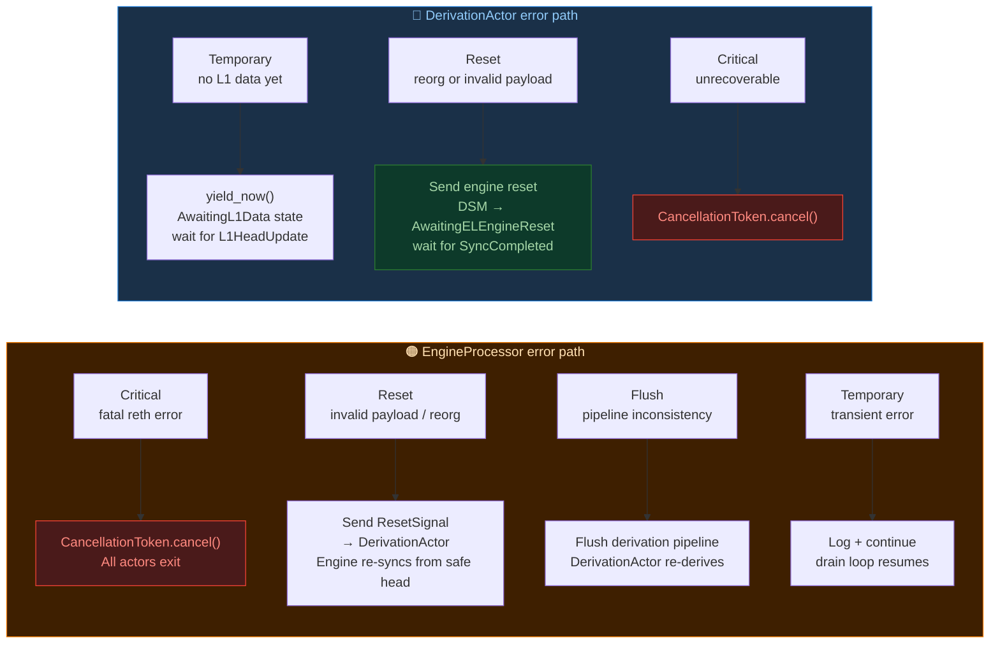
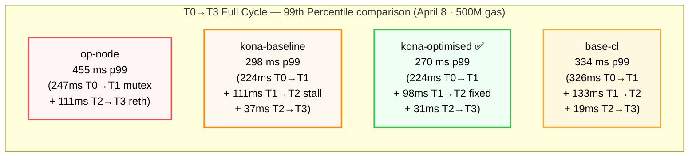

# Base Consensus Layer — Architecture Deep Dive

> **Target audience:** Developer familiar with async Rust; no prior Base or OP Stack CL experience needed.
>
> **What this covers:** Complete base-cl actor model, all-actor message map, block lifecycle,
> T0→T3 timing model, BinaryHeap engine task queue, DerivationStateMachine (6-state FSM),
> PayloadAttributes assembly, startup orchestration, error handling, benchmark evidence with
> real data from the April 8 2026 run, and comparison with kona and op-node.
>
> **Reference doc:** `bench/base/base-consensus-architecture.md` (overview + comparison tables)
> **Source repo:** `kona-migration/kona-code/base-base` · crate: `crates/consensus/service/`
> **Benchmark run:** `bench/runs/adv-erc20-40w-120s-500Mgas-20260408_030806/`

---

## Table of Contents

1. [Background](#1-background)
   - 1.1 What is base-cl?
   - 1.2 The OP Stack Engine API — four primitives
   - 1.3 What is Derivation? Why does base-cl gate it with a state machine?
2. [System Architecture — The Actor Model](#2-system-architecture)
   - 2.1 Six-Actor + Two Sub-Processors
   - 2.2 Actor Roles and Responsibilities
   - 2.3 All-Actor Message Map (Mermaid — every arrow annotated)
   - 2.4 EngineActor Internal Split — EngineProcessor vs RpcProcessor
3. [Block Lifecycle](#3-block-lifecycle)
   - 3.1 Sequencer Path — Build + Seal (one tick)
   - 3.2 Derivation Path — Safe Block Confirmation (FSM-gated)
   - 3.3 Validator Path — P2P Gossip Insert
4. [Block Build Initiation — T0→T3 Timing Model](#4-timing-model)
   - 4.1 Checkpoint Aliases (points in time)
   - 4.2 Interval Aliases (durations)
   - 4.3 T0→T3 Phase Map — base-cl vs op-node
   - 4.4 PayloadAttributes — Field-by-Field Assembly
5. [The Engine Task Queue — Drain Loop](#5-engine-task-queue)
   - 5.1 BinaryHeap Priority Ordering
   - 5.2 Drain→Recv Loop — Before and After Fix
   - 5.3 Priority Starvation Diagram
6. [DerivationStateMachine — 6-State FSM](#6-derivation-state-machine)
   - 6.1 State Definitions and Aliases
   - 6.2 State Transition Diagram
   - 6.3 Back-Pressure Flow — Why It Bounds Safe Lag
7. [Startup Orchestration](#7-startup)
8. [Error Handling and Recovery](#8-error-handling)
9. [Configuration and Modes](#9-configuration)
10. [Benchmark Evidence — April 8 2026 (500M gas, 40 workers, 120s)](#10-benchmark)
    - 10.1 Results Summary
    - 10.2 Phase 1 — T0→T1 (Attr Prep)
    - 10.3 Phase 3 — T1→T2 (Queue Dispatch)
    - 10.4 Phase 4 — T2→T3 (HTTP Round-trip)
    - 10.5 Full Cycle T0→T3
11. [Comparison: base-cl vs kona vs op-node](#11-comparison)
12. [Files Reference](#12-files)

---

## 1. Background

### 1.1 What is base-cl?

**base-cl** (`base-consensus`) is Coinbase's production consensus layer for the Base L2 chain, written in Rust. It implements the OP Stack consensus protocol — L1→L2 derivation, block sequencing, unsafe block gossip, and Engine API coordination with reth — as a set of independent Tokio actor tasks communicating exclusively through typed MPSC channels.

```
┌─────────────────────────────────────────────────────────┐
│                    L1 Ethereum                          │
│  (L2 tx batches from batcher + user deposit events)     │
└──────────────────────────┬──────────────────────────────┘
                           │  polled every 4s (head) / 60s (finalized)
                           ▼
┌─────────────────────────────────────────────────────────┐
│                base-cl (base-consensus)                 │
│                                                         │
│  SequencerActor · DerivationActor · EngineActor         │
│  L1WatcherActor · NetworkActor  · RpcActor              │
│                                                         │
│  ── Unique to base-cl ──────────────────────────────    │
│  DerivationStateMachine   6-state FSM — back-pressure   │
│  Split EngineProcessor    state-modifying vs query-only │
└──────────────────────────┬──────────────────────────────┘
                           │  Engine API  (HTTP JSON-RPC · authrpc :8552)
                           ▼
┌─────────────────────────────────────────────────────────┐
│           Execution Layer — OKX reth                    │
│  EVM · state · mempool · one Engine API call at a time  │
└─────────────────────────────────────────────────────────┘
```

**Primary design goal:** prevent derivation from flooding the Engine API. The solution is a formal 6-state `DerivationStateMachine` that controls when derivation is allowed to run, providing back-pressure that neither kona nor op-node has.

### 1.2 The OP Stack Engine API — Four Primitives

All consensus layers (op-node, kona, base-cl) use the same four Engine API primitives to drive reth:

| Primitive | Call | What it does | Who sends it |
|---|---|---|---|
| **FCU+attrs** | `engine_forkchoiceUpdatedV3` + `payloadAttributes` | Start building a new L2 block → returns `payloadId` | SequencerActor (Build task) |
| **FCU no-attrs** | `engine_forkchoiceUpdatedV3` (no attrs) | Advance unsafe / safe / finalized head | Seal, Consolidate, Finalize, Insert tasks |
| **new\_payload** | `engine_newPayloadV3` | Import a complete sealed block into reth | Seal, Insert tasks |
| **get\_payload** | `engine_getPayloadV3` | Fetch the block reth built | Seal task |

> **Critical constraint:** reth's `authrpc` processes one Engine API call at a time — it is a sequential HTTP FIFO queue. This is why `EngineProcessor` is the sole actor that owns the reth connection and serialises all calls in priority order via a `BinaryHeap`.

### 1.3 What is Derivation? Why does base-cl gate it?

Derivation is the **replay machine**. The batcher posts batched L2 transactions to L1. The derivation pipeline reads L1 batches and re-executes them to produce "safe" L2 blocks — confirmed to match what was posted to L1.

A key challenge: derivation runs in bursts. When a large L1 batch arrives, derivation may produce 10–20 `Consolidate` tasks in rapid succession, flooding the `EngineProcessor`'s BinaryHeap. If the sequencer's `Build` task arrives during that burst, it gets queued behind all the `Consolidate` tasks (even though `Build` has higher priority) because the priority ordering only fires if all tasks are visible in the heap simultaneously.

**Base-cl's solution:** `DerivationStateMachine` enforces a strict one-at-a-time acknowledgement cycle:
- Derivation sends ONE `Consolidate` → transitions to `AwaitingSafeHeadConfirmation`
- Engine confirms the safe head → sends `SafeHeadUpdate` back to derivation
- Derivation transitions back to `Deriving` → can send next `Consolidate`

This prevents more than one unconfirmed `Consolidate` from queuing at any time — the heap stays shallow, `Build` always wins.

---

## 2. System Architecture — The Actor Model

### 2.1 Six-Actor + Two Sub-Processors

```
NodeActor trait (all actors implement: Send + 'static, async start())
│
├── SequencerActor        — builds L2 blocks every 1–2 s
├── EngineActor           — request router (owns reth connection)
│   ├── EngineProcessor   — state-modifying: Build · Seal · Insert · Consolidate · Finalize · Reset
│   └── RpcProcessor      — query-only: engine_state · queue_length  (never blocks block production)
├── DerivationActor       — derives safe blocks (gated by DerivationStateMachine)
├── L1WatcherActor        — polls L1 head every 4s · finalized every 60s
├── NetworkActor          — P2P gossip: sends + receives unsafe blocks
└── RpcActor              — HTTP/WS JSON-RPC server
```

Every actor runs in its own `tokio::task`. Actors communicate via **bounded MPSC channels** (capacity 1024). No shared `Arc<Mutex<_>>` in the hot path. Graceful shutdown via a shared `CancellationToken` — any fatal error cancels the token and all actors exit cleanly.

```rust
// crates/consensus/service/src/actors/traits.rs
pub trait NodeActor: Send + 'static {
    type Error: std::fmt::Debug;
    type StartData: Sized;
    async fn start(self, start_context: Self::StartData) -> Result<(), Self::Error>;
}
```

### 2.2 Actor Roles and Responsibilities

| Actor | Source file | Primary role | Engine API it triggers |
|---|---|---|---|
| **SequencerActor** | `sequencer/actor.rs` | Builds L2 block every 1–2s; seals previous block | Build → FCU+attrs; Seal → get\_payload + new\_payload + FCU |
| **EngineActor** | `engine/actor.rs` | Routes inbound requests to the correct sub-processor | All (via sub-processors) |
| **EngineProcessor** | `engine/engine_request_processor.rs` | BinaryHeap drain loop; executes all state-modifying Engine tasks | All four Engine API calls |
| **RpcProcessor** | `engine/rpc_request_processor.rs` | Answers query-only requests; never calls reth | None |
| **DerivationActor** | `derivation/actor.rs` | Derives safe L2 blocks from L1 data; gated by StateMachine | Consolidate → FCU no-attrs (safeHash) |
| **L1WatcherActor** | `l1_watcher/actor.rs` | Polls L1 head (4s) + finalized (60s); broadcasts `L1BlockInfo` | None |
| **NetworkActor** | `network/actor.rs` | P2P gossip; receives + sends unsafe blocks | Insert → new\_payload + FCU |
| **RpcActor** | `rpc/actor.rs` | JSON-RPC server (admin, `optimism_syncStatus`, etc.) | None |

### 2.3 All-Actor Message Map

Every arrow in base-cl — who talks to whom, what message type, and why:



> **Key structural difference from kona:** base-cl splits `EngineActor` into two independent sub-processors. `RpcProcessor` handles query-only requests (`engine_state`, `queue_length`) on a completely separate code path — it never competes with `EngineProcessor` for the reth HTTP connection. This prevents monitoring/dashboard calls from adding latency to block production.

> **L1WatcherActor → SequencerActor:** When SequencerActor wakes at T0, it calls `next_l1_origin()` to decide which L1 block the new L2 block references. Instead of a live L1 RPC call every second, it reads the `L1BlockInfo` pre-pushed by L1WatcherActor. This pre-cached state supplies `prevRandao` (`mix_hash`) directly and provides the L1 block hash for `InfoByHash()` and deposit receipt fetches. The WatcherActor absorbs L1-polling cost in the background.

### 2.4 EngineActor Internal Split — EngineProcessor vs RpcProcessor



---

## 3. Block Lifecycle

### 3.1 Sequencer Path — Build + Seal (one tick)

Every 1–2 seconds the `SequencerActor` timer fires. It runs one complete tick:

```
BlockBuildInitiation-StartTime (T0) — tick fires
│
├─ STEP 1: SEAL the previous block (if one is in-flight)
│      SealRequest(payload_id) → EngineActor → EngineProcessor
│          ① engine_getPayloadV3      — fetch built block from reth
│          ② engine_newPayloadV3      — import + validate block in reth
│          ③ engine_forkchoiceUpdatedV3 no-attrs — advance unsafe head
│          ④ gossip(block) → NetworkActor → P2P broadcast
│
└─ STEP 2: BUILD the next block
       BuildRequest(PayloadAttributes) → EngineActor → EngineProcessor
           ① engine_forkchoiceUpdatedV3 + payloadAttributes  (FCU+attrs)
               └─ reth starts block builder
               └─ returns payloadId   (BlockBuild-ExecutionLayer-JobIdReceivedAt = T3)

Method: seal_last_and_start_next() — both steps in one tick
```

### 3.2 Derivation Path — Safe Block Confirmation (FSM-gated)

```
L1WatcherActor polls L1 every 4s
│
└─ New L1 head → L1HeadUpdate → DerivationActor
        │
        ▼
   DerivationStateMachine checks: am I in Deriving state?
        │  YES — proceed
        ▼
   produce_next_attributes() — decode L1 batch → build ConsolidateInput
        │
        └─ ProcessSafeL2Signal(ConsolidateInput) → EngineActor
                 │
                 ▼  DSM transitions to AwaitingSafeHeadConfirmation (BLOCKED)
          Consolidate task → engine_forkchoiceUpdatedV3 no-attrs (safeHash set)
                 │
                 ▼
          Safe head advances in reth
          EP sends SafeHeadUpdate → DerivationActor
                 │
                 ▼  DSM transitions back to Deriving (UNBLOCKED)
          Derivation can produce next ConsolidateInput
```

The back-pressure is explicit: DerivationActor cannot produce a second `ConsolidateInput` until the first is confirmed. This caps the BinaryHeap depth for `Consolidate` at effectively 1.

### 3.3 Validator Path — P2P Gossip Insert

```
Peer node gossips unsafe L2 block via P2P
│
└─ NetworkActor receives block (libp2p)
        │
        └─ ProcessUnsafeL2Block(block) → EngineActor → EngineProcessor
                 │
                 ▼
          Insert task (priority 3)
          ① engine_newPayloadV3       — import + validate block
          ② engine_forkchoiceUpdatedV3 no-attrs — advance unsafe head
```

---

## 4. Block Build Initiation — T0→T3 Timing Model

### 4.1 Checkpoint Aliases (Points in Time)

| T-point | Alias | `BlockBuildInitiation-*` | What it marks | base-cl source |
|---|---|---|---|---|
| **T0** | `BlockBuildInitiation-StartTime` | — | Sequencer tick fires — block-build begins | Top of `build_unsealed_payload()` |
| **T1** | `BlockBuildInitiation-RequestGeneratedAt` | — | `PayloadAttributes` assembled; `BuildRequest` handed to mpsc channel | After `build_attributes()` completes |
| **T2** | `BlockBuildInitiation-HTTPRequestSentTime` | — | `engine_forkchoiceUpdatedV3` HTTP request dispatched to reth | Inside `EngineProcessor::drain()` — `BuildTask::execute()` |
| **T3** | `BlockBuild-ExecutionLayer-JobIdReceivedAt` | — | `payloadId` received from reth — reth is building | `SEQUENCER_BLOCK_BUILDING_START_TASK_DURATION` end |

### 4.2 Interval Aliases (Durations)

| Interval | Alias | base-cl metric | April 8 — p50 | p99 | max |
|---|---|---|---|---|---|
| T0→T1 | `BlockBuildInitiation-RequestGenerationLatency` | `SEQUENCER_ATTRIBUTES_BUILDER_DURATION` | 105 ms | **326 ms** | 376 ms |
| T1→T2 | `BlockBuildInitiation-QueueDispatchLatency` | derived (T1→T3 − T2→T3) | ~0.3 ms | ~133 ms | ~133 ms |
| T2→T3 | `BlockBuildInitiation-HttpSender-RoundtripLatency` | `fcu_duration` | 2.0 ms | 19 ms | 20 ms |
| **T1→T3** | **`BlockBuildInitiation-Latency`** | `SEQUENCER_BLOCK_BUILDING_START_TASK_DURATION` | 2.3 ms | **152 ms** | **153 ms** |

> Source: `bench/runs/adv-erc20-40w-120s-500Mgas-20260408_030806/` — 500M gas · 40 workers · 120s · ~120 blocks · XLayer devnet chain 195

### 4.3 T0→T3 Phase Map — base-cl vs op-node

```mermaid
flowchart LR
    subgraph CYCLE["◄──────────────── Full Cycle  T0 → T3 ────────────────►"]
        direction LR
        T0(["📍 T0\nBlockBuildInitiation-StartTime\nSequencer tick fires"])
        ATTRBOX["① BlockBuildInitiation-RequestGenerationLatency  T0→T1\nbuild_attributes() · AttributesBuilder\nL1 RPC: InfoByHash() · deposit receipts\nL2 RPC: SystemConfigByL2Hash()\nAssemble PayloadAttributes\nbase-cl p99 = 326ms  max = 376ms"]
        T1(["📍 T1\nBlockBuildInitiation-RequestGeneratedAt\nBuildRequest enters mpsc channel"])
        T2(["📍 T2\nBlockBuildInitiation-HTTPRequestSentTime\nFCU+attrs HTTP → reth"])
        T3(["📍 T3\nBlockBuild-ExecutionLayer-JobIdReceivedAt\npayloadId received\nreth now building block"])
    end

    subgraph Q12["② BlockBuildInitiation-QueueDispatchLatency  T1→T2  (base-cl only — not op-node)"]
        direction LR
        CH["mpsc channel\nBuildRequest enqueued async\nbounded capacity 1024"]
        HEAP["BinaryHeap\nBuild(1) wins over Consolidate(4)\nDSM limits Consolidate depth to 1"]
        CH -->|"recv() · try_recv() flush\n→ heap.push all msgs"| HEAP
    end

    T0 --> ATTRBOX --> T1
    T1 -->|"mpsc send\nbase-cl: via channel"| CH
    HEAP -->|"drain() → Build task\nexecutes FCU+attrs\nbase-cl p99 ~133ms  max ~133ms"| T2
    T1 -.->|"op-node: direct call\nT1 = T2 (no queue)"| T2
    T2 -->|"③ BlockBuildInitiation-HttpSender-RoundtripLatency  T2→T3\nbase-cl: p50=2.0ms  p99=19ms  max=20ms"| T3

    style CYCLE   fill:#f8f8f8,stroke:#999,stroke-width:2px,color:#000
    style Q12     fill:#fffbf0,stroke:#FF6600,stroke-width:1px,color:#000
    style T0      fill:#FFF3CC,stroke:#FFA500,stroke-width:2px,color:#333
    style T1      fill:#FFE0B2,stroke:#FF6600,stroke-width:2px,color:#333
    style T2      fill:#FFE0B2,stroke:#FF6600,stroke-width:2px,color:#333
    style T3      fill:#CCE5FF,stroke:#4488FF,stroke-width:2px,color:#333
    style CH      fill:#fff8e8,stroke:#FFA500,stroke-width:1px,color:#333
    style HEAP    fill:#FFF9C4,stroke:#F9A825,stroke-width:1px,color:#333
    style ATTRBOX fill:#FFF3E0,stroke:#FF9800,stroke-width:1px,color:#333
    linkStyle 0 stroke:#FFA500,stroke-width:3px
    linkStyle 1 stroke:#FFA500,stroke-width:2px
    linkStyle 2 stroke:#FFA500,stroke-width:2px
    linkStyle 3 stroke:#F9A825,stroke-width:2px
    linkStyle 4 stroke:#FF6600,stroke-width:3px
    linkStyle 5 stroke:#999,stroke-width:1.5px,stroke-dasharray:5
    linkStyle 6 stroke:#4488FF,stroke-width:3px
```



**T0→T1 comparison: why base-cl p99 (326ms) is higher than kona (224ms)**



> **Why is base-cl T0→T1 p99 (326ms) higher than kona (224ms) at the same 500M gas run?** The actual RPC work (`AttributesBuilder` / `prepare_payload_attributes`) is identical. The higher tail at base-cl comes from interaction with the `DerivationStateMachine` confirmation round-trips — during busy L1 batch periods, the engine is also processing `SafeHeadUpdate` acknowledgements back to `DerivationActor`, which briefly contends with the `SequencerActor`'s async `.await` points. This is a known base-cl trade-off: the FSM provides safe-lag bounding at the cost of occasional sequencer attr-prep delay.

### 4.4 PayloadAttributes — Field-by-Field Assembly

`build_attributes()` in `sequencer/actor.rs` calls `AttributesBuilder` which assembles `PayloadAttributes`. Every field has a specific source:

```
engine_forkchoiceUpdatedV3( forkchoiceState, payloadAttributes )

forkchoiceState:
  headBlockHash         ← get_unsafe_head()           [local EL state — no RPC]
  safeBlockHash         ← local safe head              [local — no RPC]
  finalizedBlockHash    ← local finalized head         [local — no RPC]

payloadAttributes:
  timestamp             ← parent.timestamp + BLOCK_TIME (1–2s)   [computed — no RPC]
  prevRandao            ← L1BlockInfo.mix_hash         ← L1WatcherActor broadcast (pre-cached)
  suggestedFeeRecipient ← node config (sequencer fee address)    [static — no RPC]
  parentBeaconBlockRoot ← L1 RPC: InfoByHash(l1_origin_hash)     ← network call ①
  transactions[]        ← L1 RPC: deposit receipts at l1_origin  ← network call ②
                          + system config update txs              [local assembly]
  gasLimit              ← L2 RPC: SystemConfigByL2Hash()         ← network call ③
  noTxPool              = false  → reth fills remaining gas from mempool after forced txs
  withdrawals           = []     → OP Stack: L1 withdrawal proofs, not EL-level
```

| Field | Source | Requires RPC? |
|---|---|---|
| `headBlockHash` | Local EL — `get_unsafe_head()` | No |
| `timestamp` | Computed: `parent.timestamp + BLOCK_TIME` | No |
| `prevRandao` | **L1WatcherActor** — `L1BlockInfo.mix_hash` (pre-cached) | No — WatcherActor absorbed cost |
| `parentBeaconBlockRoot` | L1 RPC ① — `InfoByHash(l1_origin)` | Yes — slowest field |
| `transactions[]` | L1 RPC ② — deposit receipts + local system config txs | Yes |
| `gasLimit` | L2 RPC ③ — `SystemConfigByL2Hash(l2_parent)` | Yes |
| `suggestedFeeRecipient` | Node config — static address | No |
| `noTxPool` | Hardcoded `false` — reth includes mempool TXs | No |
| `withdrawals` | Hardcoded `[]` — OP Stack uses L1 withdrawal proofs | No |

> `prevRandao` looks like an L1 call but is not — L1WatcherActor already fetched the L1 block header and broadcast `mix_hash` into `SequencerActor`'s channel. The three RPC calls (①②③) are the irreducible T0→T1 work; identical across op-node, kona, and base-cl. The difference: base-cl and kona run them in a separate `tokio::task` (yields at `.await`); op-node holds the `sync.Mutex` across all three.

---

## 5. The Engine Task Queue — Drain Loop

### 5.1 BinaryHeap Priority Ordering

`EngineProcessor` holds a private `BinaryHeap<EngineTask>`. The `Ord` impl in `engine/task_queue` determines pop order — same as kona:

| Priority | Task | Sent by | Engine API calls made |
|---|---|---|---|
| **1 — highest** | `Build` | SequencerActor | `engine_forkchoiceUpdatedV3` + attrs → `payloadId` |
| **2** | `Seal` | SequencerActor | `engine_getPayloadV3` → `engine_newPayloadV3` → `engine_forkchoiceUpdatedV3` |
| **3** | `Insert` | NetworkActor | `engine_newPayloadV3` → `engine_forkchoiceUpdatedV3` |
| **4** | `Consolidate` | DerivationActor | `engine_forkchoiceUpdatedV3` no-attrs (safeHash set) |
| **5 — lowest** | `Finalize` | DerivationActor | `engine_forkchoiceUpdatedV3` no-attrs (finalHash set) |

> `Build` always dispatches before any pending `Consolidate`. Combined with the `DerivationStateMachine` limiting Consolidate queue depth to 1, this means the heap is almost always shallow when `Build` arrives — it fires immediately.

> **All five tasks resolve to three Engine API primitives:** FCU+attrs (Build only) · new\_payload (Seal, Insert) · FCU no-attrs (Seal, Insert, Consolidate, Finalize). All go through the single reth HTTP connection, serialised in priority order by drain().

### 5.2 Drain→Recv Loop — Before and After Fix

```
BEFORE FIX  (one recv per drain cycle — starvation possible)
──────────────────────────────────────────────────────────────
Channel: [ C  C  C  C  C  C  C  C  C  Build ]
                                        ↑
           FIFO — Build arrived last, but has highest priority

loop {
  drain()                              ← heap = [C] — only 1 item
  │  pops C, sends FCU no-attrs        ← Build never seen yet
  │
  recv().await                         ← BLOCKING — gets next C
  handle_request(C)                    ← push C into heap
}
↑ cycle repeats 9 more times before Build is ever read
  Build experiences 9 × reth_latency stall before executing
  99th Percentile queue wait: ~133ms (base-cl April 8 run)

AFTER FIX  (flush all pending — priority fires every cycle)
──────────────────────────────────────────────────────────────
loop {
  drain()                              ← heap = all N pending tasks
  │  Build(1) at top → FCU+attrs fires first
  │  then all C(4) processed in order
  │
  recv().await                         ← BLOCKING — first new msg
  handle_request(msg)                  ← push into heap
  while let Ok(req) = try_recv() {     ← NON-BLOCKING flush
      handle_request(req)              ← drain every waiting msg into heap
  }                                    ← break when channel empty
}
↑ Build always executes NEXT regardless of channel arrival order
```

Source: `crates/consensus/service/src/actors/engine/engine_request_processor.rs`

### 5.3 Priority Starvation Diagram

```mermaid
flowchart TB
    subgraph BEFORE["❌  baseline — Build starved behind Consolidate"]
        direction LR
        CB(["channel\nC C C C C C C C C Build"]) -->|"recv() one at a time\nno try_recv() flush"| HB["heap — 1 item only\nC dispatched\nBuild never read yet"]
        HB -->|"pop"| OB(["⏳ Consolidate runs\n9 more cycles before Build\nstall observed: ~133ms p99"])
        OB -.->|"eventually Build dequeued"| RB(["T2 fires — delayed"])
    end

    subgraph AFTER["✅  fix applied — flush all · Build always wins"]
        direction LR
        CA(["channel\nC C C C C C C C C Build"]) -->|"recv() one msg\ntry_recv() flush ALL remaining\n→ all pushed into heap"| HA["heap — full picture\nBuild(1)  ← wins ★\nC(4) C(4) C(4) ..."]
        HA -->|"pop"| DA(["Build dispatched immediately\nFCU+attrs → reth\nT2 fires: p50=2.0ms  p99=19ms"])
    end

    style BEFORE fill:#fff5f5,stroke:#ff4444,stroke-width:2px,color:#000
    style AFTER  fill:#f0fff4,stroke:#22cc44,stroke-width:2px,color:#000
    style OB     fill:#FFE0B2,stroke:#FF6600,stroke-width:2px,color:#333
    style RB     fill:#FFE0B2,stroke:#FF6600,stroke-width:1px,color:#333
    style DA     fill:#C8E6C9,stroke:#2E7D32,stroke-width:2px,color:#333
    style HB     fill:#FFF9C4,stroke:#F9A825,stroke-width:1px,color:#333
    style HA     fill:#E8F5E9,stroke:#388E3C,stroke-width:1px,color:#333
```



> **base-cl T1→T2 vs kona-optimised:** base-cl p99 ~133ms vs kona-optimised p99 ~68ms (both with flush fix). The DerivationStateMachine caps Consolidate queue depth at 1, which helps. The remaining difference comes from base-cl's FSM acknowledgement round-trips generating brief additional channel pressure. The fix is essential in both — without it, starvation would be unbounded.

---

## 6. DerivationStateMachine — 6-State FSM

This is base-cl's most distinctive feature — absent from both kona and op-node. The `DerivationStateMachine` (DSM) in `derivation/state_machine.rs` gates when derivation is allowed to produce attributes. It is the primary back-pressure mechanism.

### 6.1 State Definitions and Aliases

| # | State | Short alias | Entry condition | What derivation does |
|---|---|---|---|---|
| 1 | `AwaitingELSyncCompletion` | `DSM-ELSync` | Node startup — reth still syncing | Blocked — no derivation |
| 2 | `Deriving` | `DSM-Deriving` | EL sync done · safe head confirmed · L1 data available | Active — produce attributes, send Consolidate |
| 3 | `AwaitingSafeHeadConfirmation` | `DSM-WaitSafe` | Consolidate sent to engine | **Blocked** — waiting for engine SafeHeadUpdate |
| 4 | `AwaitingL1Data` | `DSM-WaitL1` | Derivation pipeline exhausted current L1 data | Idle — waiting for next L1 block from L1Watcher |
| 5 | `AwaitingELEngineReset` | `DSM-Reset` | Invalid payload detected · L1 reorg | Blocked — waiting for engine reset + SyncCompleted |
| 6 | `Terminal` | `DSM-Terminal` | Critical unrecoverable error | Node must be restarted |

### 6.2 State Transition Diagram



**States annotated:**
- `AwaitingSafeHeadConfirmation` — **the back-pressure gate**: derivation cannot produce a second `ConsolidateInput` until the first is confirmed by the engine. Max one unconfirmed Consolidate in the BinaryHeap at any time.
- `AwaitingELEngineReset` — reorg recovery: engine is reset, derivation re-derives from last confirmed safe head.

### 6.3 Back-Pressure Flow — Why It Bounds Safe Lag

```
TICK N:
  Deriving → produce_next_attributes() → send ConsolidateInput to engine
  DSM transitions to AwaitingSafeHeadConfirmation ← BLOCKED

CONCURRENT: EngineProcessor receives ConsolidateInput
  Consolidate task pops from BinaryHeap (priority 4)
  engine_forkchoiceUpdatedV3 no-attrs (safeHash = block N)
  reth advances safe head
  EP sends SafeHeadUpdate(block N) → DerivationActor

TICK N+1:
  DSM receives SafeHeadUpdate → transitions to Deriving ← UNBLOCKED
  produce_next_attributes() → ConsolidateInput(block N+1)
  ...

Result:
  • Max Consolidate depth in BinaryHeap = 1 (one per round-trip)
  • Build(priority 1) always wins over the single waiting Consolidate(4)
  • Safe lag = bounded by round-trip latency (not by derivation burst rate)
  • Contrast with kona: derivation can send N Consolidates in burst → heap depth N
    → Build must wait for N round-trips if flush fix not applied
```

**Safe lag at 500M gas (April 8 run):**
- base-cl safe lag: bounded and predictable (FSM enforcement)
- kona-optimised safe lag: also low (flush fix reduces queue depth; derivation still free-running)
- op-node safe lag: bounded by mutex (derivation + sequencer serialised, cannot diverge)

---

## 7. Startup Orchestration

`RollupNode::start()` in `service/node.rs` creates all actors and spawns them:



---

## 8. Error Handling and Recovery

Each actor handles errors at its own boundary before propagating via `CancellationToken`:

| Actor | Error type | Action |
|---|---|---|
| `SequencerActor` | `SealError` (fatal) | Cancel all actors |
| `SequencerActor` | `SealError` (non-fatal) | Log + retry next tick |
| `SequencerActor` | Other | Cancel all actors |
| `EngineProcessor` | `Critical` | Cancel all actors |
| `EngineProcessor` | `Reset` | Trigger engine reset; notify DerivationActor via `ResetSignal` |
| `EngineProcessor` | `Flush` | Flush derivation pipeline (invalid payload) |
| `EngineProcessor` | `Temporary` | Log + continue drain loop |
| `DerivationActor` | `Temporary` | `yield_now()` + wait for more L1 data |
| `DerivationActor` | `Reset` | Send `ResetSignal` to engine; wait for `SyncCompleted`; DSM → `AwaitingELEngineReset` |
| `DerivationActor` | `Critical` | Cancel all actors; DSM → `Terminal` |



---

## 9. Configuration and Modes

### NodeMode

| Mode | Actors active | Typical use |
|---|---|---|
| **Sequencer** | All — including SequencerActor | Produces new L2 blocks; gossips via NetworkActor |
| **Validator** | All except SequencerActor | Follows sequencer via P2P gossip + derivation |

### Key Configuration Fields

| Config struct | Field | Effect |
|---|---|---|
| `SequencerConfig` | `sequencer_stopped` | Start paused — no blocks until `sequencer_start` admin RPC |
| `SequencerConfig` | `sequencer_recovery_mode` | Produce deposit-only blocks (reorg recovery mode) |
| `SequencerConfig` | `conductor_rpc_url` | Enable HA leader election via remote Conductor executor |
| `SequencerConfig` | `l1_conf_delay` | L1 origin confirmation depth — blocks behind current head |
| `SequencerConfig` | `block_time` | L2 block interval (default 2s; XLayer devnet: 1s) |
| `EngineConfig` | `mode` | `Sequencer` or `Validator` |

---

## 10. Benchmark Evidence — April 8 2026

**Run:** `bench/runs/adv-erc20-40w-120s-500Mgas-20260408_030806/`
**Setup:** 500M gas · 40 workers · 120s · ~120 blocks · XLayer devnet (chain 195) · 1-second slots · OKX reth EL (identical binary for all CLs)

### 10.1 Results Summary

| CL | TPS | Block fill | `BlockBuildInitiation-Latency` p99 | Maximum |
|---|---|---|---|---|
| op-node | 11,249 TX/s | 79% | 111 ms ¹ | 119 ms ¹ |
| kona-okx-baseline | 12,055 TX/s | 84% | 114 ms | 194 ms |
| kona-okx-optimised | 11,682 TX/s | 82% | **99 ms** ✅ | **151 ms** ✅ |
| **base-cl** | 11,600 TX/s | 81% | **152 ms** | **153 ms** |

> ¹ op-node has no BinaryHeap queue — T1≈T2 by design. Its "T1→T3" = T2→T3 only. Use T0→T3 for fair cross-CL comparison.
> Source: `phase-report.md` Results table.

### 10.2 Phase 1 — `BlockBuildInitiation-RequestGenerationLatency` (T0→T1)

| CL | Median | 99th Percentile | Maximum |
|---|---|---|---|
| op-node | 247 ms | 453 ms | **522 ms** — sync.Mutex stall |
| kona-okx-baseline | 104 ms | 224 ms | 281 ms |
| kona-okx-optimised | 104 ms | 224 ms | 281 ms |
| **base-cl** | **105 ms** | **326 ms** | **376 ms** |

> base-cl T0→T1 Median ≈ kona (same 3 RPCs, same async task). Tail (p99/max) is higher due to interaction with DSM acknowledgement round-trips during busy L1 batch periods.

### 10.3 Phase 3 — `BlockBuildInitiation-QueueDispatchLatency` (T1→T2)

| CL | Median | 99th Percentile | Maximum |
|---|---|---|---|
| op-node | — (T1=T2, no queue) | — | — |
| kona-okx-baseline | ~0.3 ms | 111 ms | **193 ms** — starvation |
| kona-okx-optimised | ~0.3 ms | **98 ms** | **149 ms** — fix applied |
| **base-cl** | ~0.3 ms | **~133 ms** | **~133 ms** — fix applied + FSM |

> Derived: T1→T2 = T1→T3 − T2→T3. base-cl p99 higher than kona-optimised despite DSM limiting Consolidate depth — residual pressure from FSM round-trip acknowledgements. Both CLs benefit from the flush fix; without it both would show unbounded starvation.

### 10.4 Phase 4 — `BlockBuildInitiation-HttpSender-RoundtripLatency` (T2→T3)

| CL | Median | 99th Percentile | Maximum |
|---|---|---|---|
| op-node | 2.2 ms | 111 ms | 119 ms |
| kona-okx-baseline | 2.0 ms | 37 ms | 41 ms |
| kona-okx-optimised | 2.1 ms | 31 ms | 34 ms |
| **base-cl** | **2.0 ms** | **19 ms** | **20 ms** |

> T2→T3 is the HTTP FCU+attrs round-trip to reth — irreducible, same reth binary for all CLs. Divergence at p99/max reflects reth's chain state under load, not CL behaviour. base-cl achieves the lowest T2→T3 tail: 19ms p99, likely because its bounded Consolidate queue keeps reth's safe lag shallow, reducing validation overhead.

### 10.5 Full Cycle T0→T3

| Interval | Stat | op-node | kona-baseline | kona-optimised | base-cl |
|---|---|---|---|---|---|
| T0→T3 Full Cycle | Median | 249 ms | 111 ms | **102 ms** | 109 ms |
| T0→T3 Full Cycle | 99th Percentile | 455 ms | 298 ms | **270 ms** | 334 ms |
| T0→T3 Full Cycle | Maximum | 528 ms | 331 ms | **277 ms** | 394 ms |
| T1→T3 Build Initiation | Median | N/A ¹ | 2.2 ms | 2.2 ms | 2.3 ms |
| T1→T3 Build Initiation | 99th Percentile | N/A ¹ | 114 ms | **99 ms** | 152 ms |
| T1→T3 Build Initiation | Maximum | N/A ¹ | 194 ms | **151 ms** | 153 ms |



---

## 11. Comparison: base-cl vs kona vs op-node

| Dimension | base-cl | kona-okx-optimised | op-node |
|---|---|---|---|
| **Language** | Rust (Tokio) | Rust (Tokio) | Go (goroutines) |
| **Sequencer / Derivation isolation** | Separate `tokio::task` — concurrent | Separate `tokio::task` — concurrent | Single goroutine — serialised under `sync.Mutex` |
| **Derivation back-pressure** | ✅ `DerivationStateMachine` (6-state FSM) — max 1 Consolidate in-flight | ❌ None — tight derivation loop | ❌ None — mutex serialises both |
| **Engine serialisation** | `EngineProcessor` BinaryHeap + `flush_pending_messages()` fix | `EngineProcessor` BinaryHeap + fix | Sequential goroutine — no BinaryHeap |
| **RPC isolation from block production** | ✅ Separate `RpcProcessor` sub-task — never blocks drain loop | ❌ No separate RPC path | N/A |
| **Conductor / HA support** | ✅ via `Conductor` in `SequencerActor` | ✅ | ❌ |
| **T0→T1 p99 (500M · Apr 8)** | 326 ms | 224 ms ✅ | 453 ms |
| **T1→T3 p99 (500M · Apr 8)** | 152 ms | **99 ms** ✅ | 111 ms ¹ |
| **T2→T3 p99 (500M · Apr 8)** | **19 ms** ✅ | 31 ms | 111 ms |
| **T0→T3 p99 (500M · Apr 8)** | 334 ms | **270 ms** ✅ | 455 ms |
| **TPS (500M · Apr 8)** | 11,600 TX/s | 11,682 TX/s | 11,249 TX/s |
| **Block fill (500M · Apr 8)** | 81% | 82% | 79% |
| **Safe lag bound** | Hard (FSM: max 1 unconfirmed Consolidate) | Soft (flush fix limits starvation; derivation free-running) | Hard (mutex: derivation and sequencer serialised) |

> ¹ op-node T1→T3 ≈ T2→T3 (no queue). Use T0→T3 for fair comparison.

**Key takeaways:**
1. **kona-optimised wins T0→T3 and T1→T3** — lowest overall sequencer latency at 500M partial saturation
2. **base-cl wins T2→T3** (19ms p99) — bounded safe lag keeps reth chain validation fast
3. **op-node loses T0→T1 and T2→T3** — `sync.Mutex` causes attr-prep stalls; reth sees deep safe lag at high load
4. **All three CLs have identical TPS ceiling** — migration between them costs nothing in throughput
5. **base-cl's FSM is a production safety feature**, not a performance regression — it trades marginal sequencer tail latency for guaranteed safe-lag boundedness in production conditions

---

## 12. Files Reference

### Source repo: `kona-migration/kona-code/base-base`

```
crates/consensus/service/src/
├── actors/
│   ├── sequencer/
│   │   ├── actor.rs                    ← SequencerActor main loop
│   │   │                                   seal_last_and_start_next() · build_unsealed_payload()
│   │   │                                   T0 start · T1 after build_attributes()
│   │   ├── conductor.rs                ← HA leader election via Conductor RPC
│   │   ├── engine_client.rs            ← send BuildRequest / SealRequest to EngineActor
│   │   ├── metrics.rs                  ← SEQUENCER_ATTRIBUTES_BUILDER_DURATION (T0→T1)
│   │   │                                   SEQUENCER_BLOCK_BUILDING_START_TASK_DURATION (T1→T3)
│   │   │                                   SEQUENCER_BLOCK_BUILDING_SEAL_TASK_DURATION
│   │   └── origin_selector.rs          ← next_l1_origin() — uses L1BlockInfo from Watcher
│   ├── engine/
│   │   ├── actor.rs                    ← EngineActor router · select! loop
│   │   │                                   routes state-modifying → EngineProcessor
│   │   │                                   routes query-only → RpcProcessor
│   │   ├── engine_request_processor.rs ← EngineProcessor · BinaryHeap drain loop
│   │   │                                   drain() → recv() → try_recv() flush → loop
│   │   ├── rpc_request_processor.rs    ← RpcProcessor · query-only path (no reth calls)
│   │   └── request.rs                  ← EngineActorRequest variants
│   ├── derivation/
│   │   ├── actor.rs                    ← DerivationActor event-driven loop
│   │   │                                   attempt_derivation() · produce_next_attributes()
│   │   ├── state_machine.rs            ← DerivationStateMachine · 6-state FSM
│   │   │                                   AwaitingELSyncCompletion → Deriving → AwaitingSafeHead...
│   │   ├── engine_client.rs            ← send ProcessSafeL2Signal (Consolidate) to engine
│   │   └── finalizer.rs                ← L2Finalizer — track blocks awaiting L1 finality
│   ├── l1_watcher/
│   │   ├── actor.rs                    ← L1WatcherActor · poll head every 4s / finalized 60s
│   │   │                                   broadcasts L1BlockInfo to Derivation + Sequencer
│   │   └── blockstream.rs              ← async L1 block poll stream
│   ├── network/
│   │   └── actor.rs                    ← NetworkActor · libp2p gossip + receive
│   ├── rpc/
│   │   └── actor.rs                    ← RpcActor · JSON-RPC server
│   └── traits.rs                       ← NodeActor trait definition
└── service/
    └── node.rs                         ← RollupNode::start() · startup orchestration

crates/consensus/service/src/
└── metrics/                            ← Prometheus metrics registration
```

### Related documents

| Path | Contents |
|---|---|
| `bench/base/base-consensus-architecture.md` | Overview, FSM summary, comparison tables, open questions for xlayer integration |
| `bench/base/base-cl-deep-dive.md` | **This document** — full architecture, actor model, timing model, benchmark evidence |
| `bench/runs/adv-erc20-40w-120s-500Mgas-20260408_030806/phase-report.md` | Source of all April 8 metrics used in §10 |
| `bench/kona/kona-fcu-fix-deep-dive.md` | kona architecture and FCU fix — companion document |
