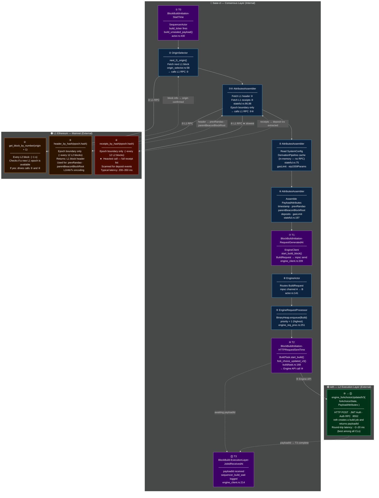

# base-cl — FCU+attrs & BlockBuildInitiation Deep Dive

> **Scope**: Full T0→T3 path for `engine_forkchoiceUpdated+attrs` in base-cl.
> External RPC calls, internal caches, field sourcing, and latency pinpoints.

---

## 1 — Checkpoint Aliases (shared with phase-reports)

| Alias | Meaning |
|---|---|
| `BlockBuildInitiation-StartTime` | **T0** — sequencer timer fires, decides to build |
| `BlockBuildInitiation-RequestGeneratedAt` | **T1** — PayloadAttributes assembled, about to send to engine actor |
| `BlockBuildInitiation-HTTPRequestSentTime` | **T2** — `engine_forkchoiceUpdatedV3` HTTP request leaves base-cl → reth |
| `BlockBuild-ExecutionLayer-JobIdReceivedAt` | **T3** — `payloadId` received back from reth |

| Interval alias | Duration |
|---|---|
| `BlockBuildInitiation-RequestGenerationLatency` | T0→T1 |
| `BlockBuildInitiation-QueueDispatchLatency` | T1→T2 |
| `BlockBuildInitiation-HttpSender-RoundtripLatency` | T2→T3 |
| `BlockBuildInitiation-Latency` | T1→T3 (component metric) |
| Full cycle | T0→T3 (canonical bench metric) |

---

## 2 — T0→T3 Swim-Lane Diagram

Three lanes — **base-cl internal** (top) · **L1 Ethereum mainnet** (middle) · **reth L2 execution layer** (bottom).
Numbered steps ①–⑪ track the exact sequence. Arrows going down = outbound RPC call. Dotted arrows going up = response back.



**Legend:**
- 🟣 Purple nodes = T0/T1/T2/T3 checkpoint timestamps (the 4 points we measure)
- 🔵 Blue nodes = base-cl internal components (no network)
- 🟠 Orange nodes = L1 Ethereum RPC calls (external, latency varies)
- 🔴 Red node (④) = slowest L1 call — `receipts_by_hash` on epoch boundary
- 🟢 Green node = reth Engine API call (fast — ~2–20 ms)

---

## 3 — What is the Derivation Pipeline and its State Machine?

> Skip this if you're already familiar with OP stack derivation. Read it if "Derivation State Machine" is jargon to you.

### Derivation Pipeline (the L1-replay engine)

The **Derivation Pipeline** [think of it as the "L1 historian" — it re-reads L1 blocks and reconstructs the canonical L2 chain from them] is a continuous background process in every OP-stack consensus layer. It:
- Fetches L1 block data (headers, receipts, batch transactions)
- Extracts L2 batch data embedded in L1 blobs/calldata
- Re-derives the sequence of L2 blocks that *should* exist given the L1 history
- Advances the **safe head** (the highest L2 block confirmed by L1 data)

The sequencer and the derivation pipeline run in parallel. The sequencer builds new blocks (unsafe head). The derivation pipeline catches up and confirms them as safe.

### Derivation State Machine (the pipeline gatekeeper)

The **Derivation State Machine** (DSM) [think of it as the "traffic light" that tells the derivation pipeline when it is allowed to proceed to the next step] is a 6-state FSM (finite state machine) unique to base-cl that controls the derivation pipeline's progress. It prevents the pipeline from advancing until certain conditions are met — most importantly, that the engine (reth) has confirmed the last sealed block.

| State | Alias | Meaning (plain English) |
|---|---|---|
| `AwaitingELSyncCompletion` | `DSM-ELSync` | Waiting for reth to finish syncing before derivation starts |
| `Deriving` | `DSM-Deriving` | Normal operation — pipeline is actively processing L1 data |
| `AwaitingSafeHeadConfirmation` | `DSM-WaitSafe` | **Back-pressure gate**: pipeline has submitted a block to reth and is waiting for reth to confirm it as safe before continuing |
| `AwaitingL1Data` | `DSM-WaitL1` | No new L1 data available — pipeline is waiting for the next L1 block |
| `AwaitingELEngineReset` | `DSM-Reset` | Engine state diverged — waiting for reth to reset to a known good state |
| `Terminal` | `DSM-Terminal` | Unrecoverable error — pipeline stopped |

### DSM Acknowledgement (the confirmation round-trip)

The **DSM acknowledgement** [the moment when reth tells base-cl "yes, I've processed the block you sent me"] is what puts the pipeline into `AwaitingSafeHeadConfirmation`:

```
Sequencer seals block N
    ↓
InsertTask sends new_payload(blockN) to reth
    ↓
reth processes and advances its safe head
    ↓
base-cl reads back the new safe head
    ↓
DSM transitions: AwaitingSafeHeadConfirmation → Deriving  ← this is the acknowledgement
    ↓
Derivation pipeline can advance
```

**Why does this add latency?** The acknowledgement involves an async channel message from the engine state back to the derivation actor. Under high load (full blocks, many derivation messages), this round-trip can add 10–30 ms to the overall T0→T3 cycle. kona does **not** have this pattern — kona's sequencer starts the next block build without waiting for a derivation confirmation.

---

## 4 — PayloadAttributes Field Map

Every field in the `OpPayloadAttributesV3` call to reth — where it comes from.

| # | Field | Value source | Who builds it | Code location | External call? | Frequency |
|---|---|---|---|---|---|---|
| 1 | `timestamp` | `l2_parent.timestamp + block_time` | AttributesAssembler | `stateful.rs:130` | No | Every block |
| 2 | `prevRandao` | `l1_header.mix_hash` | AttributesAssembler | `stateful.rs:200` | **L1** header fetch | Epoch boundary ¹ |
| 3 | `suggestedFeeRecipient` | `Predeploys::SEQUENCER_FEE_VAULT` (0x4200…0011) | AttributesAssembler | `stateful.rs:201` | No — hardcoded address | — |
| 4 | `withdrawals` | `Some(Vec::new())` — always empty on OP Stack | AttributesAssembler | `stateful.rs:187` | No | — |
| 5 | `parentBeaconBlockRoot` | `l1_header.parent_beacon_block_root` | AttributesAssembler | `stateful.rs:194` | **L1** header fetch | Epoch boundary ¹ |
| 6 | `transactions[0]` | L1 info transaction (RLP-encoded from L1 header data) | AttributesAssembler | `stateful.rs:180` | **L1** header fetch | Epoch boundary ¹ |
| 7 | `transactions[1..n]` | Deposit events extracted from L1 receipts | AttributesAssembler | `stateful.rs:99` | **L1** receipts fetch | Epoch boundary ¹ ★ |
| 8 | `transactions[n+1..]` | Protocol upgrade transactions (hardcoded per hardfork) | AttributesAssembler | `stateful.rs:183` | No — static bytes | Upgrade blocks only |
| 9 | `noTxPool` | `!should_use_tx_pool(l1_origin)` — `false` in normal operation | SequencerActor | `actor.rs:295` | No | Every block |
| 10 | `gasLimit` | `sys_config.gas_limit` — see note ² below | AttributesAssembler | `stateful.rs:207` | **No RPC** — derivation cache | Only on L1 config change |
| 11 | `eip1559Params` | `sys_config.eip_1559_params()` — see note ² below | AttributesAssembler | `stateful.rs:210` | **No RPC** — derivation cache | Only on L1 config change |

> ¹ **Epoch boundary**: L1 advances every ~12 s, L2 every 1 s → ~12 L2 blocks share the same L1 epoch. L1 header and receipts are fetched **once per epoch** (when the epoch changes), not every L2 block. The remaining 11 blocks in that epoch reuse the same data from the in-progress derivation state.
>
> ² **`gasLimit` and `eip1559Params` — why no RPC?** These come from the **Derivation Pipeline's in-memory SystemConfig state** — NOT from a live reth RPC call every second. Here is why:
>
> The `SystemConfig` (chain-wide parameters like gas limit and EIP-1559 base fee curve) is governed by an L1 contract. When operators change these parameters, they emit a `SystemConfigUpdate` event on L1. The **derivation pipeline** processes these L1 events as it replays L1 history, and maintains an in-memory table of `block_number → SystemConfig`. A call to `system_config_by_number(l2_parent.number)` is an **O(1) in-memory lookup** — zero network latency, zero RPC.
>
> In a typical bench run, `SystemConfig` never changes. The same in-memory value is returned for every single block. There is no polling, no caching timeout, no L2 RPC involved.

---

## 5 — External RPC Calls: Frequency and Impact

### Per-block calls (every L2 block = every ~1 s)

| Call | Target | Latency | Purpose |
|---|---|---|---|
| `get_block_by_number(origin + 1)` | L1 RPC | ~10–30 ms | Check if a new L1 epoch is available to advance to |
| `get_unsafe_head()` | RpcProcessor (in-memory) | ~0 ms | Read current unsafe head — served from base-cl's own engine state, no reth RPC |

### Epoch-boundary calls (~every 12 L2 blocks)

| Call | Target | Latency | Purpose |
|---|---|---|---|
| `header_by_hash(epoch.hash)` | L1 RPC | ~20–50 ms | Fetch L1 block header → prevRandao, parentBeaconBlockRoot, L1InfoTx |
| `receipts_by_hash(epoch.hash)` | L1 RPC | **~200–350 ms** | Fetch all receipts for the L1 block → extract deposit events |

### Engine API call (every L2 block)

| Call | Target | Latency | Purpose |
|---|---|---|---|
| `engine_forkchoiceUpdatedV3(fcs, attrs)` | reth Engine API | ~2–20 ms | Start block build — hands PayloadAttributes to reth, receives payloadId |

### Epoch boundary vs same-epoch impact on T0→T1

```
Same-epoch block (11 of every 12 blocks):
  Only get_block_by_number() fires  →  T0→T1 ≈ 10–30 ms

Epoch-boundary block (1 of every 12 blocks):
  get_block_by_number() + header_by_hash() + receipts_by_hash()  →  T0→T1 ≈ 200–350 ms

This explains the p99/max spikes in base-cl T0→T1:
  p99 = 326 ms  ←  almost always an epoch-boundary block
  max = 376 ms  ←  worst-case epoch boundary with L1 RPC jitter
```

---

## 6 — T1→T2 Internal Queue Path

After PayloadAttributes are assembled (T1), the build request traverses **two mpsc channels** and a **BinaryHeap priority queue** before the FCU HTTP fires (T2).

```
T1 ── SequencerActor
         │  engine_actor_request_tx.send(BuildRequest)
         │  [mpsc channel A]
         ▼
      EngineActor  ·  actor.rs:141
         │  send_engine_processing_request(Build)
         │  [mpsc channel B — bounded]
         ▼
      EngineRequestProcessor  ·  engine_req_proc.rs:251
         │  engine.enqueue(EngineTask::Build)
         │  [BinaryHeap — priority 1 = highest]
         ▼
      BuildTask::execute()  ·  build/task.rs:169
         │  fork_choice_updated_v3()
T2 ──────┘
```

### BinaryHeap priority table (base-cl — same as kona)

| Priority | Task | What it does | Starvation risk |
|---|---|---|---|
| **1 (highest)** | `Build` | Starts a new block build | Never starved |
| 2 | `Seal` | Seals a completed block | Can wait behind Build |
| 3 | `Insert` (new_payload) | Sends sealed block to reth | Waits behind Build+Seal |
| 4 | `Consolidate` | Advances safe head (derivation confirm) | **Main competitor for Build at 500M** |
| 5 | `Finalize` | Marks finalized head | Lowest priority |

> At 500M gas / partial block fill, many `Consolidate` tasks queue up (derivation keeps pace with sequencer). Since `Build` is priority 1, it always wins, but if the engine processor is momentarily busy processing many tasks, the channel B becomes the bottleneck rather than the heap. T1→T2 p99 = ~133 ms at 500M reflects this.

---

## 7 — Code Walk: Full T0→T3 with File:Line References

```
T0  actor.rs:430          build_ticker.tick() fires (Tokio interval, every block_time)
    actor.rs:432          seal_last_and_start_next() called
    actor.rs:182          build_total_start = Instant::now()  ← T0 timestamp

    ── T0→T1: ATTRIBUTE PREPARATION ──────────────────────────────────────────

    actor.rs:183          engine_client.get_unsafe_head()      [RpcProcessor: in-memory, ~0 ms]
    actor.rs:185          origin_selector.next_l1_origin(unsafe_head)
      origin_selector.rs:168  L1 RPC: get_block_by_number(l1_origin.number + 1)  [every block]
      origin_selector.rs:132  L1 RPC: get_block_by_hash(l1_origin.hash)          [recovery only]

    actor.rs:200          build_attributes(l1_origin, unsafe_head)
      stateful.rs:75      DerivationPipeline.system_config_by_number(l2_parent.number)
                          → in-memory lookup, no RPC, ~0 ms
      stateful.rs:86      L1 RPC: header_by_hash(epoch.hash)        [epoch boundary only]
      stateful.rs:98      L1 RPC: receipts_by_hash(epoch.hash)      [epoch boundary only, SLOWEST]
      stateful.rs:99      derive_deposits(epoch.hash, &receipts)    [scan receipts for deposits]
      stateful.rs:130     timestamp   = l2_parent.timestamp + block_time
      stateful.rs:180     transactions[0] = L1InfoTx::encode(l1_header)
      stateful.rs:183     transactions[1..] = upgrade_txs            [hardfork blocks only]
      stateful.rs:187     withdrawals = Some(vec![])                 [always empty on OP]
      stateful.rs:194     parent_beacon_block_root = l1_header.parent_beacon_block_root
      stateful.rs:200     prev_randao = l1_header.mix_hash
      stateful.rs:201     suggested_fee_recipient = SEQUENCER_FEE_VAULT (0x4200…0011)
      stateful.rs:207     gas_limit   = sys_config.gas_limit         [in-memory cache]
      stateful.rs:210     eip_1559_params = sys_config.eip_1559_params()  [in-memory cache]

    actor.rs:295          attributes.no_tx_pool = !should_use_tx_pool(l1_origin)

T1  engine_client.rs:209  build_request_start = Instant::now()  ← T1 timestamp
    engine_client.rs:88   engine_actor_request_tx.send(BuildRequest { attributes })

    ── T1→T2: QUEUE DISPATCH ──────────────────────────────────────────────────

    actor.rs:141          EngineActor receives BuildRequest from channel A
    actor.rs:142          send_engine_processing_request(Build)   → channel B
    engine_req_proc.rs:251 EngineRequestProcessor receives Build
    engine_req_proc.rs:256 engine.enqueue(EngineTask::Build)      → BinaryHeap priority=1
    engine_req_proc.rs:259 task dequeued → BuildTask::execute()

T2  build/task.rs:168     fcu_start_time = Instant::now()         ← T2 timestamp
    build/task.rs:169     start_build(state, engine, attributes)
    build/task.rs:108     forkchoice_state = unsafe_head.create_forkchoice_state()
    build/task.rs:116     version = EngineForkchoiceVersion::from_cfg(cfg, timestamp)
    build/task.rs:121     engine_client.fork_choice_updated_v3(fcs, Some(attrs))
                          HTTP POST → reth Auth RPC :8552

    ── T2→T3: reth ROUND-TRIP ─────────────────────────────────────────────────

    [reth validates FCU, creates build job, assigns payloadId, returns response]

T3  client.rs:367         ForkchoiceUpdated { payload_id } returned
    build/task.rs:170     fcu_duration = fcu_start_time.elapsed()  [T2→T3 logged]
    build/task.rs:179     payload_id_tx.send(payload_id)
    engine_client.rs:100  payload_id_rx.recv()                     [SequencerActor wakes]
    engine_client.rs:214  build_elapsed = build_request_start.elapsed()  [T1→T3]
    engine_client.rs:215  total_elapsed = build_total_start.elapsed()    [T0→T3]
    engine_client.rs:216  log: sequencer_build_wait=<T1→T3>  sequencer_total_wait=<T0→T3>
```

---

## 8 — April 8 Benchmark Evidence (500M gas, 40w, 120s)

### base-cl vs peers — T1→T3 (BlockBuildInitiation-Latency)

| CL | p50 | p99 | max | Notes |
|---|---|---|---|---|
| op-node | — | 111 ms | 119 ms | Go `sync.Mutex` stall across sequencer + derivation goroutines |
| kona-okx-baseline | 2.0 ms | 114 ms | 194 ms | BinaryHeap Consolidate starvation |
| **kona-okx-optimised** | 2.1 ms | **99 ms** | **151 ms** | `flush_pending_messages()` fix reduces starvation |
| **base-cl** | 2.3 ms | **152 ms** | **153 ms** | Same BinaryHeap path, plus Derivation State Machine acknowledgement latency |

### base-cl phase breakdown (Apr 8)

| Phase | Interval | p50 | p99 | max | Main driver |
|---|---|---|---|---|---|
| Attr prep | T0→T1 | 105 ms | 326 ms | 376 ms | L1 `receipts_by_hash` on epoch boundary |
| Queue dispatch | T1→T2 | ~3 ms | ~133 ms | ~133 ms | Consolidate task backpressure in BinaryHeap |
| reth round-trip | T2→T3 | 2.0 ms | 19 ms | 20 ms | Best among all CLs |
| **Full cycle** | **T0→T3** | **109 ms** | **334 ms** | **394 ms** | Dominated by T0→T1 |

### Why base-cl T0→T1 p99 (326 ms) is higher than kona T0→T1 p99 (224 ms)

1. **L1 `receipts_by_hash` latency** — same call exists in kona, but kona's L1 provider path may have different connection/timeout settings.
2. **Derivation State Machine acknowledgement** — after sealing a block, base-cl's sequencer briefly waits for the derivation engine to confirm `AwaitingSafeHeadConfirmation → Deriving`. kona does not have this confirmation step.
3. **`system_config_by_number` path** — in base-cl this traverses the derivation pipeline's Tokio task (channel message), adding a small async yield. In kona, the sequencer actor holds a direct `Arc<RollupConfig>` reference.

---

## 9 — Optimisation Opportunities

| # | Optimisation | Interval | Effort | Expected gain | Notes |
|---|---|---|---|---|---|
| **A** | Pre-fetch L1 header + receipts in L1WatcherActor | T0→T1 | Medium | −200 ms on epoch blocks | L1WatcherActor already runs; extend it to also cache the receipt list for the upcoming epoch. Sequencer reads from cache at T0 — zero RPC wait. |
| **B** | Remove Derivation State Machine acknowledgement from sequencer build path | T0→T1 | High | −10–30 ms | The `AwaitingSafeHeadConfirmation` confirmation adds a channel round-trip to the sequencer's timing. Decoupling them (sequencer starts build immediately, DSM catches up async) is an architectural change. |
| **C** | Urgent bypass channel for BuildTask | T1→T2 | Medium | −130 ms p99 at 500M | Same as kona Opt-2: a dedicated high-priority channel that BuildTask drains before the BinaryHeap. Eliminates Consolidate backpressure at peak load. |
| **D** | Cache L1 header+receipts per epoch hash | T0→T1 | Low | ~0 ms normal | Protects against recovery/reorg retry scenario where the same epoch is fetched twice. Negligible in bench runs. |

**Highest ROI for base-cl**: Opt-A (T0→T1 receipt pre-fetch) + Opt-C (T1→T2 urgent channel).
Together: T1→T3 p99 could drop from ~152 ms → ~20 ms at 500M — matching or beating kona-optimised.
