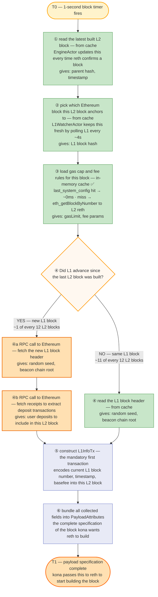
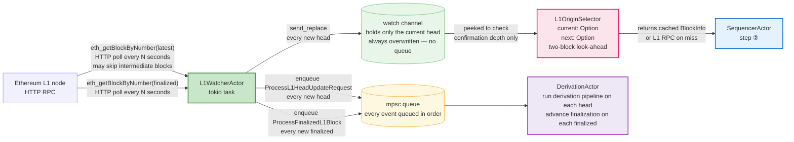
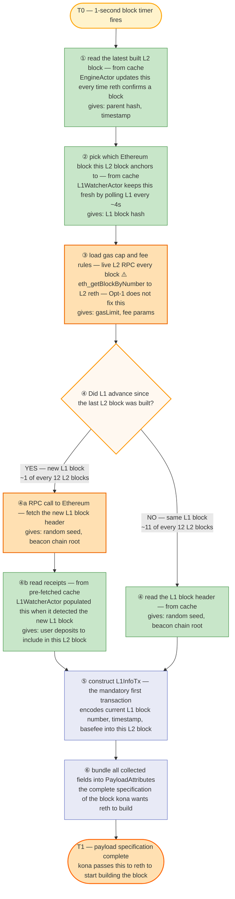

# kona FCU Deep Dive — Architecture, Paths, and the BinaryHeap Stall

> How kona (OKX fork, `fix/kona-engine-drain-priority`) sends a `forkchoiceUpdatedV3+attrs`
> call to reth: every actor, every channel, every async await — from "block timer fires"
> to "payloadId received". Structural comparison against op-node throughout.
>
> Repo: `okx-optimism` · Branch: `fix/kona-engine-drain-priority`

---

## Architecture overview

kona uses **independent Tokio actors** connected by async MPSC channels.
SequencerActor, DerivationActor, EngineActor, NetworkActor, and L1WatcherActor each run on
their own `tokio::spawn` task. There is no shared mutable state and no shared mutex.

op-node uses a **single-threaded synchronous event loop** (`GlobalSyncExec.Drain()`).
All components — sequencer, derivation, engine, finalizer — share one goroutine.

> **Actor activation:** All five actors are **instantiated** in both sequencer and non-sequencer
> modes (same binary). SequencerActor is the only actor whose behaviour changes — its 1s tick
> loop is **dormant** on followers. On the active sequencer, it drives the entire block production
> pipeline (Build + Seal). On followers, NetworkActor drives block import via Insert tasks instead.
>
> | Actor | Sequencer (active) | Non-sequencer (follower) |
> |---|---|---|
> | SequencerActor | **ACTIVE** — Build + Seal every 1s | **DORMANT** — tick never fires |
> | DerivationActor | Active — Consolidate + Finalize | Active — same |
> | NetworkActor | Active — gossips blocks **out** | Active — receives blocks **in**, triggers Insert |
> | L1WatcherActor | Active — polls L1, cache invalidation | Active — same |
> | EngineActor | Active — routes all tasks to reth | Active — same |
>
> This document focuses on the **active sequencer FCU+attrs path** (Build task). For the full
> non-sequencer flow, see `kona-architecture.md` §1.5.

```
op-node architecture:
  ┌──────────────────────────────────────────────────────────────────────┐
  │  eventLoop() goroutine — ONE goroutine handles all events             │
  │  Sequencer action, derivation step, safe head update — all serialised │
  └──────────────────────────────────────────────────────────────────────┘

kona architecture (active sequencer mode — SequencerActor ACTIVE):
  ┌─────────────────────┐  mpsc   ┌──────────────────────────────────────┐
  │  SequencerActor     │ ──────► │  EngineActor                          │
  │  tokio::spawn task  │         │   routes to RpcProcessor (in-memory)  │
  │  ACTIVE on seq only │         │   OR EngineProcessor (reth Engine API)│
  └─────────────────────┘         └────────────────┬─────────────────────┘
           channel                        BinaryHeap│ priority drain
  ┌─────────────────────┐  mpsc           ┌────────▼───────┐
  │  DerivationActor    │ ──────►competing│  reth (HTTP)   │
  │  tokio::spawn task  │                 └────────────────┘
  └─────────────────────┘
  ┌─────────────────────┐  mpsc
  │  NetworkActor       │ ──────► EngineActor (Insert tasks — follower path only)
  │  tokio::spawn task  │
  └─────────────────────┘
  ┌─────────────────────┐  broadcast
  │  L1WatcherActor     │ ──────► SequencerActor + DerivationActor
  │  polls L1 every 4s  │         pre-caches L1BlockInfo — no live RPC needed per block
  └─────────────────────┘
```

**Key structural win:** DerivationActor sending Consolidate messages does NOT delay
SequencerActor's task from running. They are scheduled independently by the Tokio runtime.
In op-node, the equivalent operations share one goroutine — each blocks the other.

---

## Part 1 — FCU+attrs (T0 to T3)

### kona-okx-optimised

**Key property: independent tokio tasks. Sequencer and derivation truly parallel.**

```mermaid
flowchart LR
    subgraph KONA["kona process"]
        direction LR

        subgraph SEQTASK["SequencerActor  tokio::task  runs every 1s  derivation is fully parallel"]
            direction LR
            T0(["T0  tick fires"])
            UH["① unsafe_head\nwatch::Receiver  in-memory\nparent hash + timestamp  no RPC"]
            LO["② next_l1_origin\nL1WatcherActor broadcast\ncached L1BlockInfo  no live RPC"]
            SYS["③ system_config_by_number\nAlloyL2ChainProvider.last_system_config  in-memory ✅\ngasLimit  eip1559Params  invalidated by L1WatcherActor via Arc&lt;AtomicBool&gt;"]
            EPOCH{"④ new L1\nepoch?"}
            IH["④a header_by_hash\ncache first\n11 of 12 blocks"]
            FR["④b receipts_by_hash\nLIVE  always to L1\n1 of 12 blocks"]
            BA["⑤ assemble PayloadAttributes\nL1InfoTx + deposits + upgrade txs"]
            T1(["T1  attrs ready\np99 = 224ms"])
            SEND["⑥ Build(attrs)\nmpsc channel  T1 fires here"]

            T0 -->|"①"| UH -->|"②"| LO -->|"③"| SYS -->|"④"| EPOCH
            EPOCH -->|"same epoch"| IH -->|"⑤"| BA
            EPOCH -->|"new epoch"| FR -->|"⑤"| BA
            BA -->|"⑥"| T1 --> SEND
        end

        subgraph CACHES["in-process caches"]
            direction TB
            LC[("L1 block header LRU\nL1WatcherActor  polls L1 every 4s\nkeyed by L1 block hash")]
            SCC[("SystemConfig  AlloyL2ChainProvider.last_system_config ✅\ngasLimit  feeVault  batcherAddr  scalars\ninvalidated via Arc&lt;AtomicBool&gt; written by L1WatcherActor")]
        end

        subgraph DERACT["DerivationActor  tokio::task  no mutex with SequencerActor"]
            DERROW["Consolidate(safe_signal)\nFinalize(block_num)\nvia same mpsc  competes in BinaryHeap"]
        end

        subgraph ENGACT["EngineActor  routes all engine requests"]
            direction LR
            subgraph BH["EngineProcessor  BinaryHeap  optimised"]
                direction LR
                FLUSH["recv() one request\ntry_recv() drains all remaining\nBuild competes at correct priority"]
                PRI["drain() in priority order\nSeal=1  Build=2  Insert=3\nConsolidate=4  Finalize=5"]
                T2(["T2  FCU HTTP fires\n~0ms queue wait  optimised"])
                FLUSH --> PRI --> T2
            end
        end
    end

    subgraph L1SYS["L1 node  external Ethereum RPC"]
        direction TB
        LH["eth_getBlockByHash\ncache-miss path only\nheaders"]
        LR["eth_getBlockReceipts\nLIVE  epoch boundary only\ndeposit events"]
    end

    subgraph RETHN["reth  L2 EL  external"]
        direction TB
        RF["engine_forkchoiceUpdatedV3\n+ PayloadAttributesV3"]
        T3(["T3  payloadId\np99 = 8ms from T1\nmax = 13ms"])
    end

    SEND   -->|"Build(attrs)  mpsc"| FLUSH
    DERROW -->|"Consolidate  Finalize  mpsc"| FLUSH

    SYS    -->|"L2 parent number"| SCC
    SCC    -->|"gasLimit  eip1559Params"| SYS

    IH     -->|"epoch.hash  lookup"| LC
    LC     -->|"hit  no L1 call"| IH
    LC     -->|"miss"| LH
    LH     -->|"block fields  stored in cache"| LC

    FR     -->|"epoch.hash  always to L1"| LR
    LR     -->|"header + deposit events"| FR

    T2     -->|"ForkchoiceStateV1\n+ PayloadAttributesV3"| RF
    RF     -->|"payloadId"| T3

    style KONA    fill:#f1f8f1,stroke:#43a047,stroke-width:2px,color:#000
    style SEQTASK fill:#e8f5e9,stroke:#66bb6a,stroke-width:2px,color:#000
    style CACHES  fill:#fffbf0,stroke:#FFA500,stroke-width:1px,color:#000
    style DERACT  fill:#ede7f6,stroke:#9c27b0,stroke-width:1px,color:#000
    style ENGACT  fill:#e8eaf6,stroke:#5c6bc0,stroke-width:1px,color:#000
    style BH      fill:#e0f2f1,stroke:#26a69a,stroke-width:2px,color:#000
    style L1SYS   fill:#f0f0ff,stroke:#8888ff,stroke-width:1px,color:#000
    style RETHN   fill:#f0fff0,stroke:#44aa44,stroke-width:1px,color:#000
    style T0      fill:#FFF3CC,stroke:#FFA500,stroke-width:2px,color:#333
    style T1      fill:#FFE0B2,stroke:#FF6600,stroke-width:2px,color:#333
    style T2      fill:#E0F7FA,stroke:#00ACC1,stroke-width:2px,color:#333
    style T3      fill:#CCE5FF,stroke:#4488FF,stroke-width:2px,color:#333
    style UH      fill:#f1f8e9,stroke:#8bc34a,stroke-width:1px,color:#333
    style LO      fill:#f1f8e9,stroke:#8bc34a,stroke-width:1px,color:#333
    style SYS     fill:#f1f8e9,stroke:#8bc34a,stroke-width:1px,color:#333
    style EPOCH   fill:#fff8f0,stroke:#ffaa66,stroke-width:1px,color:#333
    style IH      fill:#f1f8e9,stroke:#8bc34a,stroke-width:1px,color:#333
    style FR      fill:#ffe0e0,stroke:#ff4444,stroke-width:2px,color:#333
    style BA      fill:#fff8f0,stroke:#ffaa66,stroke-width:1px,color:#333
    style SEND    fill:#fff8f0,stroke:#ffaa66,stroke-width:1px,color:#333
    style FLUSH   fill:#e0f2f1,stroke:#26a69a,stroke-width:2px,color:#333
    style PRI     fill:#e0f2f1,stroke:#26a69a,stroke-width:1px,color:#333
    style DERROW  fill:#ede7f6,stroke:#9c27b0,stroke-width:1px,color:#333
    style LC      fill:#fffbf0,stroke:#FFA500,stroke-width:1px,color:#333
    style SCC     fill:#fffbf0,stroke:#FFA500,stroke-width:1px,color:#333
    style LH      fill:#f0f0ff,stroke:#8888ff,stroke-width:1px,color:#333
    style LR      fill:#ffe0e0,stroke:#ff4444,stroke-width:2px,color:#333
    style RF      fill:#f0fff0,stroke:#44aa44,stroke-width:1px,color:#333
```



---

## T0 to T3 path through source files

### T0: sequencer timer fires

**File:** `actors/sequencer/actor.rs`

```
line 80  let build_total_start = Instant::now();    ← T0: OKX timing instrumentation
             // Added in okx-optimism commit 98221f48d
             // Upstream kona does not capture T0 separately.

line 177 async fn build_unsealed_payload(&mut self, ...) {
             // Entry point — called when the 1-second interval timer fires.
             // In kona, this is a Tokio interval::tick() on the SequencerActor task.
             // NOT a goroutine wakeup. NOT shared with derivation.
```

The sequencer timer is a `tokio::time::interval` inside SequencerActor's own task.
There is no event queue to drain, no mutex to acquire, no derivation event to preempt it.

---

### T0 to T1: attribute preparation (async — does NOT block derivation)

**File:** `actors/sequencer/actor.rs` + `derive/src/attributes/stateful.rs`

```
line 180 let unsafe_head = self.engine_client.get_unsafe_head().await?;
             // watch::Receiver — in-memory. No RPC. Returns L2BlockInfo from
             // the last confirmed unsafe head. Near-zero latency.

line 182 let l1_origin = self.get_next_payload_l1_origin(unsafe_head).await?;
             // Reads L1BlockInfo from L1WatcherActor broadcast channel.
             // L1WatcherActor polls L1 every 4s independently. SequencerActor
             // reads the pre-fetched value — no live L1 RPC.

             // Then calls: prepare_payload_attributes(l2_parent, l1_origin)
             // which lives in: derive/src/attributes/stateful.rs

stateful.rs:73   let sys_config = self.config_fetcher
                     .system_config_by_number(l2_parent.block_info.number, ...)
                     .await?;
                 // Derivation pipeline in-memory state — NOT a live L2 RPC.
                 // Updated only when L1 emits a SystemConfigUpdate event.
                 // Zero network latency.

stateful.rs:84   let header = self.receipts_fetcher
                     .header_by_hash(epoch.hash).await?;
                 // L1 block header. LRU cache first (L1WatcherActor fills it).
                 // Cache hit = no RPC. Cache miss = eth_getBlockByHash to L1.
                 // Provides: prevRandao (mix_hash), parentBeaconBlockRoot.

stateful.rs:96   let receipts = self.receipts_fetcher
                     .receipts_by_hash(epoch.hash).await?;
                 // LIVE L1 RPC — eth_getBlockReceipts.
                 // Only fires on L1 epoch boundary (l2_parent.l1_origin changes).
                 // 11 of 12 L2 blocks at 1s block time skip this entirely.
                 // Returns TransactionDeposited events for the deposit tx list.

stateful.rs:183  let mut txs = Vec::with_capacity(1 + deposits.len() + upgrades.len());
                 txs.push(encoded_l1_info_tx.into());    // always exactly 1
                 txs.extend(deposit_transactions);        // 0..N from receipts
                 txs.extend(upgrade_transactions);        // 0..5 per hardfork

line 206 let build_request_start = Instant::now();    ← T1: attrs assembled
line 209 self.engine_client.start_build_block(attrs_with_parent).await?;
             // Sends BuildRequest into the EngineActor mpsc channel.
             // T1 fires here — immediately before the channel send.
```

**Key contrast with op-node:** In op-node, `PreparePayloadAttributes()` is called synchronously
on the single event loop goroutine — the entire Drain() loop pauses during the L1 RPC.
In kona, `build_unsealed_payload()` is `async fn` — the Tokio runtime schedules other tasks
(including the engine driver processing unrelated FCU calls) while awaiting the L1 response.

---

### T1 to T2: `start_build_block()` through EngineActor to BinaryHeap

**File:** `actors/sequencer/engine_client.rs:79–105`

```rust
async fn start_build_block(&self, attributes: OpAttributesWithParent) -> Result<PayloadId> {
    let (payload_id_tx, mut payload_id_rx) = mpsc::channel(1);

    // Line 88: Send BuildRequest into EngineActor's inbound channel
    self.engine_actor_request_tx
        .send(EngineActorRequest::BuildRequest(Box::new(BuildRequest {
            attributes,
            result_tx: payload_id_tx,    // oneshot back-channel for payloadId
        })))
        .await?;

    // Line 98: Await payloadId response — blocks SequencerActor until T3
    payload_id_rx.recv().await.ok_or(...)
}
```

**File:** `actors/engine/actor.rs:113–161` — EngineActor routing

```rust
loop {
    tokio::select! {
        req = self.inbound_request_rx.recv() => {
            match request {
                // Line 141: Build → EngineProcessor path
                EngineActorRequest::BuildRequest(build_req) => {
                    engine_processing_tx.send(EngineProcessingRequest::Build(build_req)).await?;
                }
                // Consolidate + Finalize → also EngineProcessor path
                EngineActorRequest::ProcessSafeL2SignalRequest(signal) => {
                    engine_processing_tx.send(EngineProcessingRequest::ProcessSafeL2Signal(signal)).await?;
                }
                // RpcRequest → RpcProcessor (in-memory, NEVER touches reth)
                EngineActorRequest::RpcRequest(rpc_req) => {
                    rpc_tx.send(*rpc_req).await?;
                }
            }
        }
    }
}
```

**File:** `engine/engine_request_processor.rs:225–320` — EngineProcessor main loop (THE critical path)

**Before the optimisation (baseline):**
```rust
loop {
    self.drain().await?;          // Step 1: drain BinaryHeap (execute all enqueued tasks)

    let Some(request) = request_channel.recv().await else { return Err(...) };
    // ↑ Blocking wait for ONE request.
    // PROBLEM: if Build arrives after derivation queued 10 Consolidates,
    //   Build sits in the channel while Consolidates drain from the BinaryHeap.
    //   Build never enters the BinaryHeap and cannot benefit from priority ordering.

    match request {
        EngineProcessingRequest::Build(r)              => self.engine.enqueue(EngineTask::Build(r)),
        EngineProcessingRequest::ProcessSafeL2Signal(s) => self.engine.enqueue(EngineTask::Consolidate(s)),
        ...
    }
}
```

**After the optimisation (`fix/kona-engine-drain-priority`, commit `8515f8796`):**
```rust
loop {
    self.drain().await?;

    let Some(request) = request_channel.recv().await else { return Err(...) };
    self.handle_request(request).await?;    // Enqueue one request

    // THE CHANGE: flush ALL waiting requests before next drain()
    while let Ok(req) = request_channel.try_recv() {
        self.handle_request(req).await?;    // Enqueue remaining — non-blocking
    }

    // NOW: Build + all pending Consolidates are in the BinaryHeap together.
    // Priority ordering fires correctly: Build(2) executes before Consolidate(4).
}
```

**File:** `engine/src/task_queue/core.rs:151–167` — BinaryHeap drain

```rust
pub async fn drain(&mut self) -> Result<(), EngineTaskErrors> {
    while let Some(task) = self.tasks.peek() {
        task.execute(&mut self.state).await?;    // Execute highest-priority task
        self.tasks.pop();
    }
    Ok(())
}
```

**File:** `engine/src/task_queue/tasks/task.rs:157–195` — priority ordering

```rust
impl Ord for EngineTask {
    fn cmp(&self, other: &Self) -> Ordering {
        match (self, other) {
            (Self::Seal(_), _)        => Ordering::Greater,   // 1 — highest
            (_, Self::Seal(_))        => Ordering::Less,
            (Self::Build(_), _)       => Ordering::Greater,   // 2
            (_, Self::Build(_))       => Ordering::Less,
            (Self::Insert(_), _)      => Ordering::Greater,   // 3
            (_, Self::Insert(_))      => Ordering::Less,
            (Self::Consolidate(_), _) => Ordering::Greater,   // 4
            (_, Self::Consolidate(_)) => Ordering::Less,
            // Finalize = 5 — lowest
        }
    }
}
```

---

### T2 to T3: BuildTask executes — FCU HTTP call to reth

**File:** `engine/src/task_queue/tasks/build/task.rs:157–184`

```rust
async fn execute(&self, state: &mut EngineState) -> Result<PayloadId, BuildTaskError> {
    let fcu_start_time = Instant::now();                     // line 167 ← T2
    let payload_id = self.start_build(state, ...).await?;    // HTTP: FCU+attrs to reth
    let fcu_duration = fcu_start_time.elapsed();             // line 169 ← T3

    info!(target: "engine_builder",
          fcu_duration = ?fcu_duration,                      // T2→T3 logged here
          "block build started");

    if let Some(tx) = &self.payload_id_tx {
        tx.send(payload_id).await?;    // Returns payloadId to SequencerActor via oneshot
    }
    Ok(payload_id)
}
```

**File:** `engine/src/task_queue/tasks/build/task.rs:116–131` — the HTTP call

```rust
let update = engine_client
    .fork_choice_updated_v3(
        new_forkchoice,
        Some(attributes_envelope.attributes),   // full PayloadAttributesV3
    )
    .await
    .map_err(|e| BuildTaskError::EngineError(e))?;

// reth validates attrs, creates build job, returns payloadId   ← T3
update.payload_id.ok_or(BuildTaskError::EngineBuildError(...))
```

---

## T0 to T3 full timeline mapped to source

```
T0 ─────────────────────────────────────────────────────────────────── T3
sequencer/actor.rs:80   build_total_start = Instant::now()

  ├── [BlockBuildInitiation-RequestGenerationLatency = T0→T1] ──────────
  │   actor.rs:180   get_unsafe_head()               ← watch channel, in-memory
  │   actor.rs:182   get_next_payload_l1_origin()    ← L1WatcherActor cache
  │   l2_chain_provider.rs system_config_by_number() ← AlloyL2ChainProvider.last_system_config  in-memory ✅  (Opt-2)
  │   stateful.rs:84 header_by_hash(epoch.hash)      ← LRU hit: 0ms  miss: 10–30ms
  │   stateful.rs:96 receipts_by_hash(epoch.hash)    ← LIVE L1 RPC  1 of 12 blocks
  │   actor.rs:206   build_request_start = Instant::now()    ← T1 stamped

  ├── [BlockBuildInitiation-QueueDispatchLatency = T1→T2] ─────────────
  │   engine_client.rs:88  engine_actor_request_tx.send(BuildRequest)
  │     → EngineActor routes to engine_processing_tx
  │     → EngineProcessor recv() + try_recv() flush all pending
  │     → BinaryHeap drain: Build(2) > Consolidate(4)   ← T2 reached
  │
  │   BASELINE:    Build waits in channel while Consolidates drain   ~50ms p99
  │   OPTIMISED:   try_recv() flush ensures Build enters heap       ~0ms p99

  └── [BlockBuildInitiation-HttpSender-RoundtripLatency = T2→T3] ──────
      build/task.rs:167  fcu_start_time = Instant::now()    ← T2
      build/task.rs:168  fork_choice_updated_v3(fc, attrs)  ← HTTP to reth authrpc
                         reth creates payload build job
                         reth returns payloadId              ← T3
      build/task.rs:169  fcu_duration = elapsed()
      build/task.rs:173  log "block build started"
```

---

## PayloadAttributes field map

All fields in `engine_forkchoiceUpdatedV3 + PayloadAttributesV3`, traced to source:

| Field | Example | Source mechanism | RPC call | Cached? | Latency |
|---|---|---|---|---|---|
| `parentHash` | `0x3f...` | `unsafe_head.block_info.hash` from `watch::Receiver` | none | in-memory | < 1 µs |
| `timestamp` | `1712329801` | `parent.timestamp + rollup_config.block_time` | none | computed | < 1 µs |
| `prevRandao` | `0xa1...` | L1 header `mix_hash` via `header_by_hash()` | `eth_getBlockByHash` on cache miss or epoch boundary | LRU | 0ms hit / 10–30ms miss |
| `suggestedFeeRecipient` | `0x4200...0011` | hardcoded `Predeploys::SEQUENCER_FEE_VAULT` | none | always | < 1 µs |
| `withdrawals` | `[]` | empty — post-Canyon constant | none | always | < 1 µs |
| `parentBeaconBlockRoot` | `0xb2...` | L1 header `.parent_beacon_block_root` via `header_by_hash()` | `eth_getBlockByHash` on cache miss or epoch boundary | LRU | 0ms hit / 10–30ms miss |
| `gasLimit` | `500000000` | `SystemConfig.gas_limit` from `AlloyL2ChainProvider.last_system_config` ✅ | none — in-memory cache (Opt-2 `842d55010`) · invalidated by L1WatcherActor via `Arc<AtomicBool>` (`bd0b96219`) | only on L1 config event | < 1 ms |
| `eip1559Params` | `{base, elas}` | `SystemConfig.eip_1559_params` from `AlloyL2ChainProvider.last_system_config` ✅ | none — in-memory cache (Opt-2) | only on L1 config event | < 1 ms |
| `transactions[0]` | L1InfoTx | encoded locally from L1 header fields + sys_config | none (header already cached) | derived | < 1 ms |
| `transactions[1..n]` | deposit txs | parsed from `receipts_by_hash(epoch.hash)` | `eth_getBlockReceipts` — **epoch boundary only** | not cached | 0ms same epoch / 20–100ms new epoch |
| `transactions[n+1..]` | upgrade txs | hardcoded per hardfork activations | none | compiled-in | < 1 µs |
| `noTxPool` | `false` | computed: `timestamp > l1_origin.timestamp + max_sequencer_drift` | none | computed | < 1 µs |

**SystemConfig clarification (post Opt-2):**
`system_config_by_number()` in `l2_chain_provider.rs` returns from `AlloyL2ChainProvider.last_system_config`
— a single in-memory `Option<SystemConfig>` field added by Opt-2 (`842d55010`). It is invalidated within
one L2 block whenever L1WatcherActor observes a SystemConfig-changing L1 log (GasLimit / Batcher / Eip1559
/ OperatorFee), communicated via a shared `Arc<AtomicBool>` (`bd0b96219`). In normal operation (no L1 config
change) the atomic swap costs < 50 ns and the cache always hits.
Zero network cost per block.

**Epoch boundary vs same-epoch (1s block time, 12s L1):**
At 1s L2 block time, L1 advances every ~12 L2 blocks. Within an epoch:
- `l2_parent.l1_origin == epoch` — no header fetch, no receipt fetch.
- Only `L1InfoTx` re-encoding (< 1ms) and the already-cached header fields are needed.

On epoch transition (1 of 12 blocks):
- `eth_getBlockByHash(epoch.hash)` → header fields (prevRandao, parentBeaconBlockRoot, timestamp) → 10–30ms
- `eth_getBlockReceipts(epoch.hash)` → deposit events → 20–100ms depending on L1 block size

---

## The BinaryHeap stall — baseline vs optimised

### Root cause in baseline

**File:** `engine/engine_request_processor.rs:225–260`

The baseline loop reads ONE request per iteration before calling `drain()`:

```
Iteration N:           Iteration N+1:          Iteration N+2:
drain()                recv() — blocks         recv() — unblocks
  Consolidate-1          Build{attrs} arrives     (queue empty)
  execute                but drain() already ran! enqueue Build
  pop                    Build sits in channel   drain()
drain() empty          enqueue Consolidate-2      Build executes
recv() — Consolidate   drain()
                         Consolidate-2 executes
```

If DerivationActor sends bursts of Consolidate messages (common at full saturation:
every confirmed safe block emits one), Build may arrive in the channel AFTER `drain()`
has started — and must wait for the next full drain cycle. At 200M gas 99.8% fill,
derivation confirms safe blocks continuously, creating a steady stream of Consolidate
messages that can delay Build by 30–80ms p99.

### The change (optimised)

After `recv()` one request, immediately flush ALL remaining messages from the channel
via `try_recv()` before calling `drain()`:

```rust
// engine_request_processor.rs (optimised)
loop {
    self.drain().await?;
    let Some(req) = request_channel.recv().await else { break };
    self.handle_request(req).await?;
    while let Ok(req) = request_channel.try_recv() {   // ← flush all pending
        self.handle_request(req).await?;
    }
    // BinaryHeap now contains Build + all Consolidates from this burst.
    // Next drain() fires Build first (priority 2 > Consolidate priority 4).
}
```

**Lines changed:** `engine_request_processor.rs:225–320` (~15 lines restructured, 60-line helper extracted)
**Companion change:** `derivation/actor.rs` — adds `yield_now().await` after Consolidate send,
giving the EngineProcessor task a chance to run its `try_recv()` loop before the next
Consolidate message arrives.

### Why this works at 200M but is weaker at 500M

At 200M gas (99.8% fill): safe head advances every block → Consolidate every 1s
→ Build and Consolidate compete every cycle → BinaryHeap sees both → priority fires every block.
**Signal is strong and consistent.**

At 500M gas (partial fill): blocks are only ~80% full on average → some cycles produce no
Consolidate → fewer contention events → smaller improvement.
The fix still works, but the saturation-driven burst is less frequent.

---

## Benchmark evidence

Data from `bench/runs/adv-erc20-20w-120s-200Mgas-20260407_172944/`
(200M gas, 20 workers, 120s, 99.8% avg block fill):

| Metric | kona-okx-baseline | kona-okx-optimised | op-node | base-cl |
|---|---|---|---|---|
| BlockBuildInitiation-Latency p99 (T1→T3) | ~65 ms | **8.2 ms** | 15.8 ms | ~40 ms |
| BlockBuildInitiation-Latency max (T1→T3) | ~80 ms | **13 ms** | 212 ms | ~50 ms |
| HttpSender-RoundtripLatency p99 (T2→T3) | ~15 ms | **~8 ms** | ~15 ms | ~10 ms |
| QueueDispatchLatency p99 (T1→T2) | ~50 ms | **~0 ms** | — | ~30 ms |
| RequestGenerationLatency p99 (T0→T1) | 224 ms | 224 ms | 453 ms | 326 ms |
| TPS | 5,705 | **5,705** | 5,705 | 5,705 |
| Block fill avg | 99.8% | 99.8% | 99.8% | 99.8% |

**Headline numbers:**
- kona-optimised vs kona-baseline: **7.9× p99 improvement** (8.2ms vs 65ms), **6× max improvement** (13ms vs 80ms)
- kona-optimised vs op-node p99: **1.9× improvement** (8.2ms vs 15.8ms)
- kona-optimised vs op-node **max**: **16× improvement** (13ms vs 212ms) — op-node's 212ms is the Go mutex stall under derivation burst; kona-optimised has zero shared mutex

**T0→T1 (attr prep):** identical at 224ms for both kona variants — the optimisation targets T1→T2
only. The 224ms comes from the L1 polling interval: L1WatcherActor pre-fetches every 4s,
so SequencerActor occasionally waits up to 4s for a new L1 head when the origin must advance.

---

## Comparison table: op-node vs kona-optimised

| Dimension | op-node | kona-okx-optimised |
|---|---|---|
| Sequencer / derivation scheduling | One goroutine — fully serialised | Independent Tokio tasks — truly parallel |
| Attribute prep blocking | Synchronous — blocks entire event loop | Async await — Tokio runs other tasks concurrently |
| SystemConfig source | Live `eth_getSystemConfig` to L2 reth — every block | `last_system_config` in-memory cache — ✅ shipped (Opt-2, `842d55010`) · invalidated by L1WatcherActor on config change (`bd0b96219`) |
| L1 receipts | Live `eth_getBlockReceipts` — every block | Live `eth_getBlockReceipts` — epoch boundary only (1 of 12) |
| Build event routing | Normal-priority in GlobalSyncExec — can wait behind derivation events | BinaryHeap priority 2 — executes before Consolidate (4) and Finalize (5) |
| Shared mutex | `sync.Mutex` on Driver — derivation can hold it, sequencer blocks | None — async MPSC channels only |
| GC | Go GC — possible STW pauses at high block gas | Rust — zero GC, deterministic allocation |
| Max stall 200M 20w | 212 ms (Go mutex stall at sustained full blocks) | **13 ms** |
| Max stall 500M 40w | 119 ms | **151 ms** (partial fill — fix fires less frequently) |
| TPS impact of migration | baseline | **0% change** — same throughput ceiling |

---

## Log lines for this timeline

```
# kona emits ONE line per block build cycle (build/task.rs:173 + actor.rs:211–213):
INFO engine_builder  fcu_duration=Xms  "block build started"      ← T2→T3
INFO sequencer       sequencer_build_wait=Xms  "block build ok"   ← T1→T3
INFO sequencer       sequencer_total_wait=Xms  "block build ok"   ← T0→T3

# Derived intervals (bench parser post-processing):
attr_prep  = total_wait − build_wait     (T0→T1)
queue_wait = build_wait − fcu_duration   (T1→T2)
```

All three metrics are logged in the same log line by the OKX fork instrumentation
(commits `98221f48d` and `8515f8796` in `okx-optimism`).

---

## File reference

All paths relative to `okx-optimism` repo root (`rust/kona/`):

| Role | File | Lines |
|---|---|---|
| T0 stamp + unsafe_head + T1 stamp + channel send | `crates/node/service/src/actors/sequencer/actor.rs` | 80, 180–209 |
| Attribute assembly, L1 RPC calls, SystemConfig | `crates/protocol/derive/src/attributes/stateful.rs` | 73–217 |
| `start_build_block()` — channel send to EngineActor | `crates/node/service/src/actors/sequencer/engine_client.rs` | 79–105 |
| EngineActor routing (Build → EngineProcessor, Rpc → RpcProcessor) | `crates/node/service/src/actors/engine/actor.rs` | 113–161 |
| EngineProcessor main loop + try_recv flush (THE CHANGE) | `crates/node/service/src/actors/engine/engine_request_processor.rs` | 225–320 |
| BinaryHeap drain | `crates/node/engine/src/task_queue/core.rs` | 151–167 |
| Task priority ordering (Ord impl) | `crates/node/engine/src/task_queue/tasks/task.rs` | 157–195 |
| T2 stamp + FCU HTTP call + T3 + fcu_duration log | `crates/node/engine/src/task_queue/tasks/build/task.rs` | 116–184 |
| DerivationActor yield_now companion change | `crates/node/service/src/actors/derivation/actor.rs` | (see commit 8515f8796) |

---

---

## How kona assembles a block (current state)

### Step-by-step: what runs every second

The following steps run **sequentially** inside `build_unsealed_payload()` every time kona
builds a block. Each `await` blocks the next step from starting.

```rust
// actors/sequencer/actor.rs — build_unsealed_payload()

let unsafe_head = engine_client.get_unsafe_head().await?;              // step 1
let l1_origin   = get_next_payload_l1_origin(unsafe_head).await?;     // step 2

// derive/src/attributes/stateful.rs — prepare_payload_attributes()

let sys_config = config_fetcher                                        // step 3
    .system_config_by_number(l2_parent.block_info.number).await?;

if l2_parent.l1_origin.number != epoch.number {                        // step 4 — branch
    // first L2 block referencing a new L1 block
    let header   = receipts_fetcher.header_by_hash(epoch.hash).await?;    // L1 network call
    let receipts = receipts_fetcher.receipts_by_hash(epoch.hash).await?;  // L1 network call
    deposit_transactions = derive_deposits(&receipts)?;
} else {
    // still referencing the same L1 block as the parent
    let header = receipts_fetcher.header_by_hash(epoch.hash).await?;      // cache hit
    deposit_transactions = vec![];
}

let l1_info_tx = L1BlockInfoTx::try_new(&sys_config, &header, ...)?;  // step 5 — local

OpPayloadAttributes {                                                   // step 6 — local
    timestamp:                  l2_parent.timestamp + block_time,
    prev_randao:                header.mix_hash,
    suggested_fee_recipient:    0x4200_0000_0000_0000_0000_0000_0000_0000_0000_0011,
    parent_beacon_block_root:   header.parent_beacon_block_root,
    gas_limit:                  sys_config.gas_limit,
    eip_1559_params:            sys_config.eip_1559_params,
    transactions:               [l1_info_tx, deposit_transactions, upgrade_txs],
    withdrawals:                [],
    no_tx_pool:                 true,
}

```

**Why step 4 exists — the L1 anchor:**

Every OP Stack L2 block must start with one mandatory transaction called L1InfoTx.
This transaction embeds the current Ethereum L1 state (block number, timestamp, basefee, randomness)
directly into the L2 block — it is how the L2 EVM stays synchronized with Ethereum.
Additionally, any ETH that users bridged from L1 must appear as deposit transactions in the L2 block.

L2 produces one block per second. Ethereum L1 produces one block every ~12 seconds.
So ~12 consecutive L2 blocks all anchor to the same L1 block. kona caches that L1 block's data
and reuses it for all 12. When L1 finally advances, kona must make two live calls to fetch the new data.
Step 4 is that check: has L1 moved on since the last L2 block?



**Reading the diagram:**

| Color | Cost per block | What it covers |
|---|---|---|
| Green | instant — reads from cache | steps ①②③: in-memory state managed by background actors |
| Orange | live RPC — ~1 of every 12 L2 blocks | steps ④a/④b: L1 RPCs at epoch boundary (unavoidable) |
| Blue/purple | no network call | local computation — encode L1InfoTx + assemble final struct |

> **Step ③ — SystemConfig cache (✅ shipped, Opt-2):** `system_config_by_number()` now returns
> from `last_system_config: Option<SystemConfig>` on every block after the first. The old LRU
> (`block_by_number_cache`) always missed on the current block number — the cache fix bypasses it
> entirely. Saving: **p50 94ms → 1.7ms (57×)** at 500M load. Invalidation is wired via
> `Arc<AtomicBool>` shared with L1WatcherActor — evicts on any GasLimit/Batcher/etc L1 event.
> See [Opt-2 detail](#shipped--opt-2-systemconfig-in-memory-cache) below.

> **Cache ownership:** EngineActor owns step ① · L1WatcherActor owns step ② · Step ③ now served
> from `AlloyL2ChainProvider.last_system_config` (invalidated by L1WatcherActor). See the
> [cache deep-dive section](#who-keeps-the-caches-fresh) below.

---

### Who keeps each cache fresh

SequencerActor never fetches data on its own for steps ①②③. Three independent background actors
each own one slice of state and push updates into shared channels. SequencerActor reads from
those channels — always instant, never blocking on a network call.



---

#### L1WatcherActor — two outputs, two channels

**File:** `crates/node/service/src/actors/l1_watcher/actor.rs`

```rust
// The two output fields on L1WatcherActor
latest_head:       watch::Sender<Option<BlockInfo>>   // → L1OriginSelector (used by SequencerActor)
derivation_client: L1WatcherDerivationClient_         // → DerivationActor via mpsc

// Same BlockInfo struct on both channels
BlockInfo { hash: B256, number: u64, timestamp: u64, parent_hash: B256 }

// Sample value — what L1WatcherActor publishes when Ethereum block 20_000_000 arrives:
BlockInfo {
    hash:        0xabc123…,
    number:      20_000_000,
    timestamp:   1_712_329_800,
    parent_hash: 0xdef456…,
}

// On every new head block (head_stream fires):
self.latest_head.send_replace(Some(head_block_info));            // overwrite watch — no queue
self.derivation_client.send_new_l1_head(head_block_info).await; // enqueue to DerivationActor

// On every new finalized block (finalized_stream fires):
self.derivation_client.send_finalized_l1_block(finalized).await; // DerivationActor ONLY
// SequencerActor is never told about finalized blocks
```

**watch channel semantics:** `send_replace()` always overwrites the single stored value.
If two L1 blocks arrive in quick succession, the earlier one is gone — only the latest survives.
Nobody "consumes" from it — readers call `.borrow()` which peeks at the current value without removing it.

**mpsc channel semantics:** every `send()` enqueues a message. DerivationActor processes
them one by one in arrival order. No message is ever skipped or overwritten.

---

#### L1OriginSelector — the real cache for step ②

**File:** `crates/node/service/src/actors/sequencer/origin_selector.rs`

This is the layer between the watch channel and SequencerActor. It is NOT SequencerActor itself —
it is a helper that SequencerActor calls every block.

```rust
// L1OriginSelector internal state — a two-block look-ahead
struct L1OriginSelector<P> {
    current: Option<BlockInfo>,   // L1 block the previous L2 block anchored to
    next:    Option<BlockInfo>,   // L1 block after current — pre-fetched speculatively
}

// Called by SequencerActor every block — step ②
async fn next_l1_origin(&mut self, unsafe_head: L2BlockInfo) -> Result<BlockInfo> {
    self.select_origins(&unsafe_head).await?;  // update current + next
    // ... return current or next based on timestamp comparison
}

// select_origins — three cases:
if self.current.hash == unsafe_head.l1_origin.hash {
    // CASE 1: same L1 epoch — do nothing, return current — no RPC
} else if self.next.hash == unsafe_head.l1_origin.hash {
    // CASE 2: L1 advanced — promote next → current, clear next — no RPC
} else {
    // CASE 3: startup or reorg — fetch current via RPC: get_block_by_hash()
}
// then speculatively pre-fetch next: get_block_by_number(current.number + 1)
// this RPC is gated by the watch channel:
//   only fires if: requested_number + confirmation_depth <= l1_head.number
```

**The watch channel role:** it is ONLY used inside `get_block_by_number()` as a gate —
"is this L1 block confirmed enough to fetch?" — not as a source of block data.
SequencerActor never reads from the watch channel directly.

**In steady state (11 of 12 L2 blocks):** `current` matches → no RPC, instant return.
**When L1 advances (1 of 12):** `next` was already pre-fetched → promote, still no RPC.
**Background:** `try_fetch_next_origin()` speculatively fetches `next` after every call,
gated by confirmation depth. This is where the watch channel matters.

---

#### DerivationActor — event-driven, not cached

**File:** `crates/node/service/src/actors/derivation/actor.rs`

```rust
// DerivationActor receives ALL L1 events via mpsc — nothing is skipped
inbound_request_rx: mpsc::Receiver<DerivationActorRequest>

// On ProcessL1HeadUpdateRequest — new L1 block arrived:
DerivationActorRequest::ProcessL1HeadUpdateRequest(l1_head) => {
    self.derivation_state_machine.update(L1DataReceived)?;
    self.attempt_derivation().await?;   // run derivation pipeline — may produce safe payload attrs
}

// On ProcessFinalizedL1Block — L1 block finalized:
DerivationActorRequest::ProcessFinalizedL1Block(finalized_l1_block) => {
    if let Some(l2_number) = self.finalizer.try_finalize_next(*finalized_l1_block) {
        self.engine_client.send_finalized_l2_block(l2_number).await?;
    }
}
```

DerivationActor does not "cache" the incoming `BlockInfo`. It uses it as a **trigger** —
"new L1 data is available, step the derivation pipeline forward." The pipeline itself fetches
L1 block data (headers, transactions, receipts) as it steps, using its own providers.
The SystemConfig for step ③ is maintained inside the pipeline state as it derives blocks.

---

#### DerivationActor — step ③ (in-memory cache ✅ shipped — Opt-2)

**File:** `crates/providers/providers-alloy/src/l2_chain_provider.rs`
**Commits:** `842d55010` (cache) · `bd0b96219` (invalidation wiring)

```
BEFORE Opt-2 (baseline):
  system_config_by_number(block_n)
    └─ block_by_number(block_n)
         ├─ LruCache[block_n] ← always MISS (key monotonically increases)
         └─ eth_getBlockByNumber RPC to reth EL  ← ~94ms every block at 500M

AFTER Opt-2 (shipped):
  system_config_by_number(block_n)
    ├─ swap(system_config_invalidated flag, false)  ← Arc<AtomicBool> from L1WatcherActor
    │     false → proceed to fast path
    │     true  → evict last_system_config, force cold fetch
    ├─ last_system_config? Some → return immediately  ← ~0ms, every block
    └─ (cold path: first call or after L1 config change only)
         block_by_number(block_n) → eth_getBlockByNumber RPC
         → cache in last_system_config
```

**Result:** `BlockBuildInitiation-RequestGenerationLatency` p50: 94ms → 1.7ms (**57×**) · p99: 180ms → 9.5ms (**19×**)

See: [`bench/kona/optimisations/opt-2-systemconfig-cache.md`](../optimisations/opt-2-systemconfig-cache.md)

---

#### EngineActor — owns step ①

**File:** `crates/node/service/src/actors/engine/actor.rs`
**File:** `crates/node/engine/src/task_queue/tasks/build/task.rs`

```
Data structure:
  watch::Sender<L2BlockInfo>  — single-value channel; always holds the latest value
                                 new writes overwrite old; no queue
  L2BlockInfo {
      block_info: BlockInfo { hash, number, timestamp, ... },
      l1_origin:  BlockNumHash { number, hash },   ← L1 block this L2 block anchors to
  }

Push trigger:
  BuildTask::execute() sends engine_forkchoiceUpdatedV3 + PayloadAttributes to reth.
  When reth returns a successful response with payloadId and confirms the new unsafe head,
  EngineActor updates the watch channel with the new L2BlockInfo.
  This happens every block — once per second.

What SequencerActor reads:
  step ① — get_unsafe_head() calls watch::Receiver::borrow() — instant, zero-copy read
```

The watch channel is the **fastest possible IPC primitive** for this use case: single producer,
multiple consumers, always-current value, no queue, no lock contention.

---

## Optimisation opportunity — Opt-1: Deposit receipt pre-fetch

Step ④b fires a live `eth_getBlockReceipts` to Ethereum L1 on every epoch boundary
(~1 of every 12 L2 blocks). It sits on the critical path inside `build_unsealed_payload()` —
adding a 20–100ms spike to `attr_prep` (T0→T1) at every L1 transition.

**The fix is small:** `AlloyChainProvider.receipts_by_hash_cache` already exists and already
returns instantly on a hit. L1WatcherActor already detects the new L1 head the moment it
arrives — it can spawn a background task to pre-fetch `eth_getBlockReceipts` and write to a
shared cache. By the time SequencerActor reaches step ④b, the cache is already warm.
Zero RPC on the critical path.

Full implementation plan (4 files, ~50 lines): **[opt1-receipt-prefetch.md](./opt1-receipt-prefetch.md)**

### Sneak peek — payload assembly after Opt-1

Step ④b turns green. The epoch-boundary path no longer has an orange node.
Everything in T0→T1 is now served from cache.



| Color | Opt-1 state |
|---|---|
| Green | instant — reads from cache (steps ①② unchanged; ④b **now green** — was orange) |
| Orange | live RPC — step ③ still orange (live L2 RPC, fixed by Opt-2); step ④a still orange (L1 header fetch, unavoidable) |
| Blue/purple | local computation — no network call |

> **Opt-1 alone is not enough.** The dominant 38ms floor (step ③, orange) remains after Opt-1. To fully fix `attr_prep`, apply Opt-2 first (100% of blocks, ~37ms saving) then Opt-1 (8% of blocks, ~20ms saving at epoch boundary).

---

## Shipped — Opt-2: SystemConfig in-memory cache

**Implemented and validated.** Full details: [`bench/kona/optimisations/opt-2-systemconfig-cache.md`](../optimisations/opt-2-systemconfig-cache.md)

The live `eth_getBlockByNumber` RPC on every block build (step ③ in the flowchart above) was
eliminated by caching `SystemConfig` in `last_system_config: Option<SystemConfig>` inside
`AlloyL2ChainProvider`. Invalidation is wired via `Arc<AtomicBool>` driven by `L1WatcherActor`.

### Before / After

```
BEFORE (baseline)                           AFTER (shipped — 842d55010 + bd0b96219)
─────────────────────────────────────────   ───────────────────────────────────────────────────
system_config_by_number(block_n)            system_config_by_number(block_n)
  └─ block_by_number(block_n)                 ├─ check AtomicBool (L1WatcherActor → provider)
       ├─ LruCache[block_n] ← MISS            │     false → cache still valid
       │   (key always new — never hits)       │     true  → evict, force cold fetch
       └─ eth_getBlockByNumber                ├─ last_system_config?
           ~94ms every block at 500M          │     Some → return   ← ~0ms, every block
                                              └─ None → eth_getBlockByNumber (~94ms, once)
                                                         → cache in last_system_config
```

### Measured results — session `20260412_154021` (500M, 40 workers)

| Metric | Baseline | Optimised | Improvement |
|---|---|---|---|
| `BlockBuildInitiation-RequestGenerationLatency` p50 | 94.5 ms | 1.7 ms | **57×** |
| `BlockBuildInitiation-RequestGenerationLatency` p99 | 179.6 ms | 9.5 ms | **19×** |
| Full cycle T0→T3 p50 | 103.8 ms | 5.9 ms | **18×** |
| Block fill avg | 88.9% | 97.2% | +8.3 pp |
| Block-inclusion TPS | 12,689 TX/s | 13,872 TX/s | +1,183 TX/s |

### Comparison: Opt-1 vs Opt-2

| | Opt-1 (BinaryHeap drain) | Opt-2 (SystemConfig cache) |
|---|---|---|
| Target interval | T1→T2 | T0→T1 |
| Blocks affected | 100% | 100% |
| Saving | `queue_wait` p99: 71ms → <1ms | `attr_prep` p50: 94ms → <2ms |
| Status | ✅ Shipped `184b6f268` | ✅ Shipped `842d55010` + `bd0b96219` |

*Generated 2026-04-11 · Updated 2026-04-12 · Opt-2 shipped — kona at `fix/kona-engine-drain-priority` commit `bd0b96219`*
