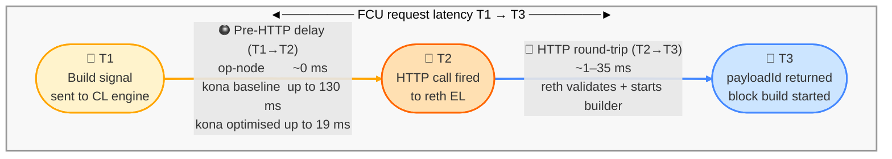
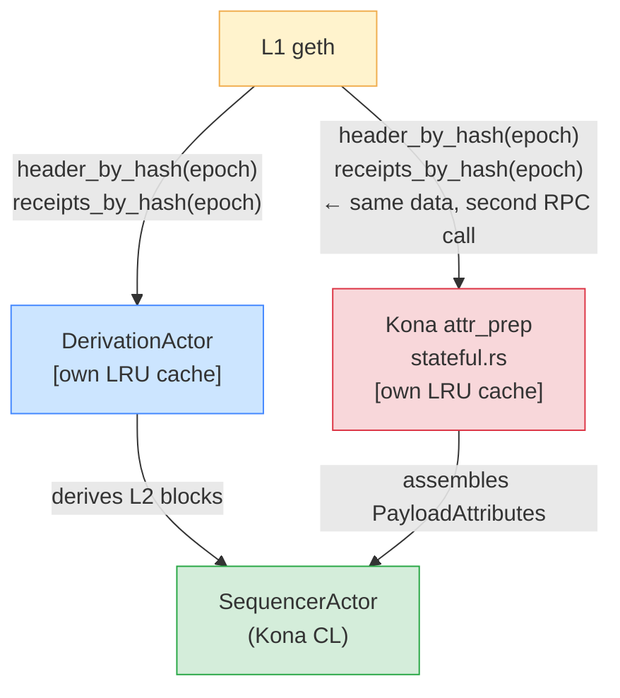
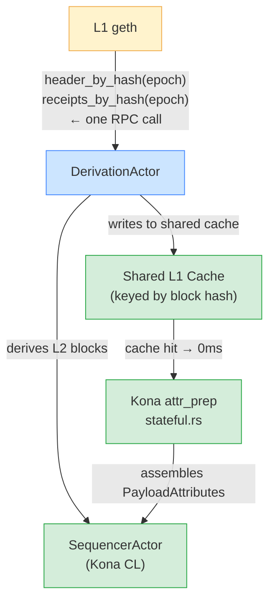

# kona Optimisation Proposal — xlayer Sequencer

> Branch: `fix/kona-engine-drain-priority` · Chain: xlayer devnet (ID 195, 1s blocks)
> Updated: 2026-04-12

---

## Aliases (used throughout this doc and in phase reports)

### Interval aliases

| Alias | Interval | Metric key | Meaning |
|---|---|---|---|
| **EL** | — | — | Execution layer — OKX reth. Same binary and config for all CL runs. |
| **CL** | — | — | Consensus layer — the component being benchmarked (kona / op-node / base-cl) |
| **BuildDriver** | — | — | CL-internal block-build component. In kona: `sequencer actor`. In op-node: `Driver` goroutine. ¹ |
| **attr_prep** | T0→T1 | `attr_prep` | Full attribute preparation phase — all steps below run inside this |
| **Pre-HTTP delay** | T1→T2 | `queue_wait` | Time inside CL after `Build{attrs}` is ready, before HTTP fires to reth |
| **FCU request latency** | T1→T3 | `build_wait` | Full round-trip: `Build{attrs}` signal → `payloadId` returned |
| **FCU HTTP round-trip** | T2→T3 | `fcu_duration` | HTTP call to reth EL: send FCU → receive `payloadId` |

> ¹ "BuildDriver" is a doc alias only. In kona source: `SequencerActor::build_unsealed_payload()`.
> In op-node source: `Sequencer.startBuildingBlock()` → `EngineController.onBuildStart()`.

### T0→T1 micro-step aliases (kona only — instrumented 2026-04-12)

| Alias | Metric key | Source function | Cached? |
|---|---|---|---|
| **`l2_head_fetch`** | `attr_step_a` | `get_unsafe_head()` | Unknown — Opt-3 hypothesis: may be EL RPC |
| **`l1_origin_lookup`** | `attr_step_b` | `get_next_payload_l1_origin()` | Yes — 11/12 blocks; slow on epoch change |
| **`sys_config_fetch`** | `attr_step_c1` | `system_config_by_number()` | Yes — Opt-2 eliminated this (was ~7ms) |
| **`l1_header_fetch`** | `attr_step_c2` | `header_by_hash(epoch.hash)` | Yes — LRU cached; slow on epoch change |
| **`l1_receipts_fetch`** | `attr_step_c3` | `receipts_by_hash(epoch.hash)` | N/A — only called on epoch-change blocks |
| **`l1info_tx_encode`** | `attr_step_c4` | `L1BlockInfoTx::try_new() + encode` | N/A — pure computation, no RPC |

---

## Optimisation Tracker

| # | Name | Interval | Alias (report) | Metric key | Micro-step targeted | Status | Measured saving |
|---|---|---|---|---|---|---|---|
| Opt-1 | FCU priority fix (BinaryHeap drain) | **T1→T2** | Pre-HTTP delay | `queue_wait` | `Build` task starved behind `Consolidate` in BuildDriver BinaryHeap | ✅ Shipped | `queue_wait` p99: −71ms (311×) · `build_wait` p99: −8ms at 200M (2×) |
| Opt-2 | SystemConfig cache + invalidation | **T0→T1** | `BlockBuildInitiation-RequestGenerationLatency` · `SystemConfigByL2Hash` | `attr_step_c1` | `system_config_by_number()` → per-block RPC to reth - EL (LRU double-miss) | ✅ Shipped · ✅ Invalidation wired (`bd0b96219`) | p50: 94ms → 2ms (**57×**) · p99: 180ms → 10ms (**19×**) at 500M |
| Opt-3 | Cache unsafe_head per-block | **T0→T1** | attr_prep · `l2_head_fetch` | `attr_step_a` | `get_unsafe_head()` → suspected per-block RPC to reth - EL | 🔬 Measuring — awaiting next bench run | **If** `l2_head_fetch` is confirmed as a live reth RPC: −100ms p50 on `attr_prep`. **If not:** source of 100ms is still unknown. |
| Opt-4 | Dedicated engine Tokio runtime | **T2→T3** | FCU HTTP round-trip | `fcu_duration` | FCU response future starved by derivation/`new_payload` in shared Tokio runtime | 📋 Planned | `fcu_duration` max: 42ms → <5ms (projected) |
| Opt-5 | Pipeline attr_prep into engine build time | **T0→T1** | attr_prep (whole) | `attr_prep` | Entire T0→T1 runs serially before touching EL — can overlap with EL block build | 📋 Planned | `attr_prep` p50: 100ms → ~0ms (projected) |
| Opt-6 | L1 watcher pre-fetch (header + receipts) | **T0→T1** | attr_prep · `l1_header_fetch` · `l1_receipts_fetch` | `attr_step_c2` · `attr_step_c3` | On epoch-change blocks, L1 header + receipts are fetched live from L1 — blocking attr_prep | 📋 Planned | Epoch-change spike eliminated: `l1_header_fetch` + `l1_receipts_fetch` → 0ms on epoch change |

---

## Block Build Timing Model

```
                        ◄──────── total_wait (T0→T3) ────────────────────────────────────►

T0 ──────── attr_prep ──────── T1 ──── Pre-HTTP delay ──── T2 ──── FCU HTTP ──── T3
│           (T0→T1)            │            (T1→T2)         │      (T2→T3)       │
│                              │                             │                    │
Sequencer                  Build{attrs}                 HTTP fires            payloadId
decides                    ready, enters                to reth EL            received,
to build                   engine channel                                     reth starts
                                                                              building
        ◄── attr_prep ────────►◄──────── build_wait (T1→T3) ────────────────────►
                               ◄─ queue_wait ─►◄─── fcu_duration (T2→T3) ────────►
```

| Metric | Interval | Logged as | Source |
|---|---|---|---|
| `total_wait` | T0→T3 | `sequencer_total_wait=` | actor.rs |
| `attr_prep` | T0→T1 | derived: `total_wait − build_wait` | parser |
| `build_wait` | T1→T3 | `sequencer_build_wait=` | actor.rs |
| `queue_wait` | T1→T2 | derived: `build_wait − fcu_duration` | parser |
| `fcu_duration` | T2→T3 | `fcu_duration=` | build/task.rs |

---

## T0→T1 Drill-down — What Happens Inside attr_prep

Every block, between T0 and T1, the BuildDriver runs these steps **in sequence**.

### What each step does and who it talks to

> **Context for new readers:** Before the Consensus Layer (CL) can ask the reth - Execution Layer (EL) to build a new XLayer block, it must first collect information from two sources — the EL (to know the current chain state and settings) and L1 (because every XLayer block must reference an L1 block and include any deposits users sent from L1 to XLayer). The steps below do that, in order, before block building can start.

| Step | What Kona (Consensus Layer) does | Queries | Why it is needed | Cached? |
|---|---|---|---|---|
| `l2_head_fetch` | Kona asks the reth - Execution Layer (EL): "What is the latest unsafe block you have produced?" An unsafe block is the most recently built block, not yet confirmed on L1. Kona needs this to know which block to extend next. | **reth - Execution Layer (EL)** | Blocks are produced by the EL. Kona cannot request the next block without knowing where the EL currently is. | Unknown — may be a live EL query on every block. Instrumentation will confirm. |
| `l1_origin_lookup` | Kona looks up which L1 block this XLayer block is anchored to. Every XLayer block must reference one L1 block — this anchoring is how XLayer inherits L1 security. | **L1** | Every XLayer block must reference a valid L1 block to be protocol-valid. | ✅ Cached in memory — only queries L1 once per epoch (~every 12th XLayer block) |
| `sys_config_fetch` | Kona reads chain settings from the reth - Execution Layer (EL): gas limit per block, fee collector address, batch submitter address. | **reth - Execution Layer (EL)** | Kona must pass these settings to the EL when requesting a new block — cannot build without them. | ✅ Cached in memory — was a live EL query (~7ms per block) before caching, now 0ms |
| `l1_header_fetch` | Kona fetches the L1 block's details — number, hash, timestamp, base fee. These are embedded into every XLayer block so validators can verify which L1 block it references. | **L1** | Every XLayer block must contain a record of its linked L1 block. | ✅ Cached — only re-fetched from L1 at the start of each epoch (~every 12 XLayer blocks) |
| `l1_receipts_fetch` | Kona checks whether any user sent assets or messages from L1 to XLayer in this L1 block. Such deposits are protocol-mandatory — Kona must include them in the correct block and cannot skip or delay them. | **L1** | L1-to-XLayer deposits are enforced by the protocol. Missing one makes the block invalid. | ✅ Skipped entirely for 11 of every 12 XLayer blocks — only runs on epoch-change blocks |
| `l1info_tx_encode` | Kona assembles the mandatory first transaction of every XLayer block — a system transaction recording the L1 block reference so any observer can verify the chain. | Processing step — no external or cache queries | Required by the protocol in every XLayer block. | N/A — always ~0ms |

> **Why is `attr_prep` still ~100ms even when most steps are cached?**
> For 11 of every 12 XLayer blocks, `l1_origin_lookup`, `l1_header_fetch`, and `l1_receipts_fetch` are all served from cache instantly.
> `sys_config_fetch` is also 0ms after caching.
> Yet `attr_prep` p50 is still ~100ms on every single block.
> The only step without a confirmed cache is `l2_head_fetch` — instrumentation will reveal whether Kona is making a live EL query on every block.

---

### Execution flow

```
T0  sequencer tick fires
     │
     ├─ l2_head_fetch        get_unsafe_head()                   ~?ms  ← Opt-3 target: may be EL RPC
     │
     ├─ l1_origin_lookup     get_next_payload_l1_origin()        ~0ms for 11/12 blocks (cached)
     │                         └─ on epoch change (~12th block): slow  (L1 geth RPC)
     │
     ├─ sys_config_fetch     system_config_by_number()            0ms  ← Opt-2 eliminated (was ~7ms)
     │
     ├─ l1_header_fetch      header_by_hash(epoch.hash)           0ms for 11/12 blocks (LRU cached)
     │                         └─ on epoch change:               slow  (L1 geth RPC)
     │
     ├─ l1_receipts_fetch    receipts_by_hash(epoch.hash)         0ms  (skipped on same-epoch blocks)
     │                         └─ on epoch change:               slow  (L1 geth RPC)
     │
     └─ l1info_tx_encode     L1BlockInfoTx::try_new() + encode   ~0ms  (pure computation)
T1  Build{attrs} enters engine channel
```

**The paradox:** For 11/12 blocks, `l1_origin_lookup`, `l1_header_fetch`, `l1_receipts_fetch` are all cached → should be ~0ms.
After Opt-2, `sys_config_fetch` is also 0ms. Yet p50 `attr_prep` is still ~100ms on EVERY block.
→ `l2_head_fetch` is the remaining uncached call — instrumentation will confirm whether it is an EL RPC.
→ **Run bench with new images (2026-04-12 build) to see `l2_head_fetch` avg/p99 directly.**

---

## T1→T2 — Pre-HTTP Delay (where Opt-1 acts)

After T1, `Build{attrs}` sits in the engine actor's mpsc channel. The engine actor must
dequeue it and fire the HTTP call. The time it spends waiting in or around the queue is T1→T2.



**What causes the delay in kona baseline (before Opt-1):**

```mermaid
flowchart TB
    subgraph BEFORE["❌  Before Opt-1 — recv() one at a time"]
        direction LR
        CB(["channel"]) -->|"recv() one msg"| HB["heap  (incomplete view)
Consolidate [LOW]  ← dequeued 1st
Consolidate [LOW]  ← dequeued 2nd
Build [HIGH]  ← not yet read from channel"]
        HB -->|"dequeue top"| OB(["⏳  Consolidate runs
Build waits  up to 130 ms"])
        OB -.->|"eventually: dequeue Build"| RB(["HTTP engine_forkchoiceUpdated → reth EL
payloadId returned  (delayed)"])
    end

    subgraph AFTER["✅  After Opt-1 — flush_pending_messages()"]
        direction LR
        CA(["channel"]) -->|"flush_pending_messages()"| HA["heap  (complete view)
Build [HIGH]  ← dequeued 1st  ★
Consolidate [LOW]
Consolidate [LOW]"]
        HA -->|"dequeue Build"| DA(["HTTP engine_forkchoiceUpdated → reth EL"])
        DA --> OA(["🏆  payloadId returned immediately
reth starts building"])
    end

    style BEFORE fill:#fff5f5,stroke:#ff4444,stroke-width:2px,color:#000
    style AFTER  fill:#f0fff4,stroke:#22cc44,stroke-width:2px,color:#000
    style OB     fill:#FFE0B2,stroke:#FF6600,stroke-width:2px,color:#333
    style RB     fill:#FFE0B2,stroke:#FF6600,stroke-width:1px,color:#333
    style DA     fill:#E8F5E9,stroke:#388E3C,stroke-width:1px,color:#333
    style OA     fill:#C8E6C9,stroke:#2E7D32,stroke-width:2px,color:#333
    style HB     fill:#FFF9C4,stroke:#F9A825,stroke-width:1px,color:#333
    style HA     fill:#E8F5E9,stroke:#388E3C,stroke-width:1px,color:#333
```



---

## Opt-1 — FCU Priority Fix (T1→T2)

**Micro-step:** BinaryHeap task dispatch inside BuildDriver engine actor.

**Plain English:** kona queues build tasks (Build, Consolidate, Seal) in a priority queue.
Build should always win. But the queue only saw tasks already inserted — if Consolidate tasks
arrived first, Build sat unread in the channel and waited behind all of them.

**Fix:** Drain the entire channel into the heap before picking any task. Build is now always
visible and always wins.

**Measured results:**

| Metric | Before | After | Saving |
|---|---|---|---|
| queue_wait (T1→T2) p99 at 500M | 71.2ms | 0.2ms | **−71ms (311×)** |
| build_wait (T1→T3) p99 at 200M | 16.5ms | 8.2ms | **−8ms (2×)** |
| build_wait (T1→T3) p99 at 500M | ~114ms | ~99ms | **−15ms** |

---

## Opt-2 — SystemConfig Cache (T0→T1, `SystemConfigByL2Hash`)

**Micro-step:** `system_config_by_number()` inside `prepare_payload_attributes()` — step C1.

**File:** `rust/kona/crates/providers/providers-alloy/src/l2_chain_provider.rs`

---

### How did we achieve 57× improvement?

The root cause was a **double cache miss by design**.

`system_config_by_number(l2_parent_hash)` internally called `block_by_number()`, which has an LRU cache keyed by **block number**. Block numbers increment by 1 every block — so the LRU key is always new, and the cache **never hits**. Every single block build issued a live `eth_getBlockByNumber` RPC call to reth - Execution Layer (EL).

At 500M gas load, reth - EL is busy executing ~14k TX/s — that RPC takes ~94ms instead of the ~38ms seen on idle reth. This alone consumed nearly the entire 100ms `attr_prep` budget on every block.

The fix: cache the `SystemConfig` result itself — not the block — since `SystemConfig` only changes when an L1 governance transaction fires (extremely rare). First block build after startup pays the RPC cost. Every subsequent block returns from memory in ~0ms.

```
Before:  every block  →  block_by_number(N)  →  LRU miss (N+1 next time)  →  eth_getBlockByNumber RPC  →  ~94ms
After:   first block  →  fetch + cache                                                                  →  ~94ms
         every block  →  cache hit                                                                      →  ~0ms
```

---

### What fields are cached

The full `SystemConfig` struct — 5 fields:

| Field | Used in `PayloadAttributes`? | Notes |
|---|---|---|
| `gasLimit` | ✅ Yes — every block | Set as `gasLimit` field in every FCU+attrs call to reth - EL |
| `eip1559Params` | Yes — fee scaling | Base fee scalar values |
| `feeVault` | No — not used by sequencer directly | Fee collector address |
| `batcherAddr` | No — not used by sequencer | L1 batch submitter address |
| `unsafeBlockSigner` | No — handled via separate channel | Signer for P2P block gossip |

`gasLimit` is the critical field — if stale, the sequencer could build blocks exceeding the on-chain gas limit.

---

### Measured results

| Metric | Before | After | Saving |
|---|---|---|---|
| `BlockBuildInitiation-RequestGenerationLatency` p50 (500M, isolated) | 94.5ms | 1.7ms | **57× faster** |
| `BlockBuildInitiation-RequestGenerationLatency` p99 (500M, isolated) | 179.6ms | 9.5ms | **19× faster** |
| `Block Build Initiation Latency` total p50 (500M) | 98ms | 6ms | **16× faster** |

> Session: `adv-erc20-40w-120s-500Mgas-20260412_154021` — isolated Opt-2 comparison (both images have Opt-1)

---

### Correctness gaps — all fixed in `bd0b96219` ✅

Three correctness gaps existed in the initial cache commit (`842d55010`). All three were fixed in `bd0b96219`.

---

### Gap 1 (fixed) — dead `invalidate_system_config_cache()` → replaced with `Arc<AtomicBool>`

`invalidate_system_config_cache()` (sets `last_system_config = None`) had zero callers. Replaced with an `Arc<AtomicBool>` flag written by `L1WatcherActor` and read atomically in `system_config_by_number()`.

### Gap 2 (fixed) — L1WatcherActor only handled UnsafeBlockSigner

L1WatcherActor already scans all L1 logs for `SystemConfigUpdate` events on every new L1 head. But it only routes one variant:

```rust
// actor.rs lines 130–148
if let Ok(SystemConfigUpdate::UnsafeBlockSigner(UnsafeBlockSignerUpdate { unsafe_block_signer })) = sys_cfg_log.build() {
    self.block_signer_sender.send(unsafe_block_signer).await
}
// All other variants — GasLimit, Batcher, GasConfig, Eip1559, OperatorFee — silently dropped
```

The full set of `SystemConfigUpdate` variants that exist but are ignored:

| Variant | What changes | Impact if stale |
|---|---|---|
| `GasLimit` | L2 block gas limit | **Critical** — sequencer builds blocks with wrong `gasLimit` |
| `Batcher` | L1 batch submitter address | Low for sequencer |
| `GasConfig` | Fee scalar values | Medium — affects fee calculations |
| `Eip1559` | Base fee parameters | Medium |
| `OperatorFee` | Operator fee parameters | Low |
| `UnsafeBlockSigner` | P2P gossip signer | ✅ Already handled via `block_signer_sender` |

A `GasLimit` change via L1 governance would leave the sequencer's cache holding the old value indefinitely, producing blocks that reth - EL would reject or that violate the on-chain limit.

---

### Gap 3 (fixed) — two separate provider instances, no shared invalidation path

`node.rs` creates **two separate** `AlloyL2ChainProvider` instances:

```rust
// node.rs line 133 — for StatefulAttributesBuilder (sequencer attr_prep)
let l2_derivation_provider = AlloyL2ChainProvider::new_with_trust(...);
StatefulAttributesBuilder::new(..., l2_derivation_provider, ...)  // ← Opt-2 cache lives here

// node.rs line 155 — for derivation pipeline
let l2_derivation_provider = AlloyL2ChainProvider::new_with_trust(...);  // ← separate instance
```

Each instance has its own `last_system_config: Option<SystemConfig>`. Even if invalidation were wired, it must target the **sequencer's instance** (line 133), not the derivation instance.

---

### Shipped fix — `bd0b96219` (`Arc<AtomicBool>` invalidation)

**Mechanism:** `Arc<AtomicBool>` created in `node.rs`, cloned to `L1WatcherActor` (writer) and the sequencer's `AlloyL2ChainProvider` (reader).

- `L1WatcherActor` now `match`es all `SystemConfigUpdate` variants — `GasLimit`, `Batcher`, `GasConfig`, `Eip1559`, `OperatorFee` all call `system_config_changed.store(true, Relaxed)`
- `system_config_by_number()` begins with `swap(false, Relaxed)` — atomically clears the flag and evicts the cache in one op
- The derivation pipeline's separate provider instance receives a private `Arc::new(AtomicBool::new(false))` — never written; no cross-instance interference

Full implementation details: [opt-2-systemconfig-cache.md](./opt-2-systemconfig-cache.md)

---

### Production correctness note

`SystemConfig` changes happen via L1 governance transactions — extremely rare in normal operation (months apart). With `bd0b96219` shipped, the sequencer will automatically invalidate its cache on the block immediately following any `GasLimit`, `Batcher`, `GasConfig`, `Eip1559`, or `OperatorFee` change on L1. No node restart required.

---

## Opt-3 — Cache unsafe_head (T0→T1, step A) — Needs Instrumentation

**Micro-step:** `get_unsafe_head()` — first call inside BuildDriver each block.

**Hypothesis:** `engine_client.get_unsafe_head()` may be making an RPC call to reth on every
block. If true, this is the dominant ~100ms cost in attr_prep (scales with reth EL load,
affects ALL blocks, same pattern as base-cl).

**Why we haven't fixed it yet:** We need to confirm which step actually costs ~100ms before
writing code. The fix is 15 lines if confirmed — but we must not guess.

**Instrumentation shipped** (2026-04-12 — in `kona-node:okx-baseline` + `kona-node:okx-optimised`):
Logs `l2_head_fetch` (`attr_step_a`) per block. Run bench with new images to see data in report.

**If confirmed:** Cache `unsafe_head` after each block build — we already know the value
(it's the block we just sealed). Skip the reth RPC next tick.
Potential saving: **−100ms p50 on `attr_prep`** — 10× bigger than Opt-2.

---

## Opt-4 — Dedicated Engine Tokio Runtime (T2→T3)

**Micro-step:** FCU HTTP response polling delayed by Tokio task contention.

**Plain English:** kona sends `engine_forkchoiceUpdated` via HTTP. reth responds in ~0.054ms.
But kona's Tokio runtime is shared with derivation and `new_payload` — those tasks may not
yield for up to 40ms, so the FCU response just sits in the TCP buffer unread.

**Fix:** Give the engine API client its own 2-thread Tokio runtime. FCU response is always
polled promptly. Does not affect derivation throughput.

**Expected saving:** FCU max: 42ms → <5ms.

---

## Opt-5 — Pipeline attr_prep into Engine Build Time (T0→T1)

**Micro-step:** All of T0→T1 — moves it off the critical path entirely.

**Plain English:** After sealing block N, reth spends ~900ms building it. During that time,
the CL is idle. We can prepare block N+1's attributes in the background during that 900ms.
When block N+1's T0 fires, attrs are already ready — T0→T1 becomes ~0ms.

**Proposed flow:**
```
Block N:   T0 ── attr_prep(100ms) ── T1 ── FCU ── T3 ── [reth builds: 900ms] ──
Block N+1:                                               [prepare N+1 attrs in background]
                                                          T0 ─ 0ms ─ T1 ── FCU ── T3 ...
```

Caveat: must re-validate L1 origin hash at T0 in case L1 reorged while N was building.

**Expected saving:** attr_prep p50: 100ms → ~0ms. Most impactful after Opt-3 confirms root cause.

---

## Opt-6 — Shared L1 Cache: Header + Receipts (T0→T1, epoch-change blocks)

**Micro-steps targeted:** `l1_header_fetch` · `l1_receipts_fetch`

**Interval:** T0→T1 · `attr_prep` · epoch-change blocks only (~every 12th XLayer block)

### The problem

Every ~12 XLayer blocks, the epoch changes. On that block, Kona (Consensus Layer) must fetch the new L1 block header and receipts live from L1. These are blocking calls that delay `attr_prep` — visible as spikes in `attr_prep` p99.

### Root cause — two actors, two separate caches, same data



DerivationActor already fetches the exact same L1 block header and receipts it needs for derivation. That data goes into DerivationActor's own LRU cache. When `attr_prep` runs shortly after on the epoch-change block, it fetches the same data again from L1 into its own separate cache. **Two RPC calls to L1 geth for identical data.**

### Why adding pre-fetch to WatcherActor is risky

The first instinct is to have `L1WatcherActor` pre-fetch receipts when it sees a new L1 block. Reading the actual `L1WatcherActor` source (lines 117–151), it already runs the following inline on every new L1 head — all awaited in sequence before the `select!` loop can proceed:

```
new L1 head detected
  ├─ send latest_head (watch channel)          ← instant
  ├─ send_new_l1_head() → DerivationActor      ← awaited
  └─ get_logs() for system config changes      ← awaited (L1 RPC)
  → [select! loop resumes]
```

Two implementation options for adding pre-fetch here — both have problems:

#### Option A — Inline (await in the loop)

```
  ├─ send_new_l1_head() → DerivationActor      ← awaited (as today)
  ├─ get_logs() for sys config                 ← awaited (as today)
  └─ get_receipts() + get_header()             ← NEW await, 50–200ms on loaded L1
  → [select! loop resumes — delayed]
```

While this await runs, `WatcherActor` **cannot** process finalized block updates or inbound queries. DerivationActor misses finalized block notifications → safe head stalls → safe lag increases.

**Verdict: dangerous. WatcherActor already does too much inline.**

#### Option B — `tokio::spawn()` fire-and-forget

```
  ├─ send_new_l1_head() → DerivationActor      ← awaited (as today)
  ├─ get_logs() for sys config                 ← awaited (as today)
  └─ tokio::spawn(fetch receipts + header)     ← non-blocking, returns immediately
  → [select! loop resumes immediately]
```

WatcherActor itself is not blocked. But the spawned task and DerivationActor now make concurrent L1 RPC calls to the same L1 geth node — increasing total RPC load. L1 geth responds slower to everyone, including DerivationActor's own fetches.

**Verdict: no actor starvation, but increases L1 geth load → safe lag slightly worsens.**

#### Comparison

| Approach | L1 geth load | WatcherActor | DerivationActor | Safe lag |
|---|---|---|---|---|
| Option A — inline await | Same | ❌ Loop stalls | ❌ Finalized update delayed | Increases |
| Option B — `tokio::spawn` | Increases | ✅ Not blocked | ⚠️ RPC contention | Slight increase |
| **Shared cache (recommended)** | **Decreases** | **✅ Unchanged** | **✅ No change** | **No impact** |

### Recommended fix — shared L1 data cache

Instead of adding new pre-fetch work anywhere, share the existing L1 data cache between DerivationActor and Kona `attr_prep`. When DerivationActor fetches the L1 header and receipts for derivation (which it already does), the result is written into a shared cache. When `attr_prep` runs the epoch-change block shortly after, it reads from that shared cache — cache hit, 0ms, zero additional RPC calls.



Derivation's existing work warms the cache as a side effect. No new code paths. No new risk to any actor.

### Edge cases and correctness constraints

| Scenario | Result | Safe? |
|---|---|---|
| L1 block has no deposits → `receipts = []` cached | `attr_prep` reads `[]`, builds block with no deposits | ✅ Correct |
| Race: `attr_prep` epoch-change fires before DerivationActor has fetched | Cache miss → falls back to live L1 RPC (same as today) | ✅ Safe, no regression |
| L1 reorg: block N replaced by N' | N' has different hash → cache miss → live fetch of N' | ✅ Safe, stale N entry harmless |
| L1 geth timeout/error silently stored as `[]` | `attr_prep` skips deposits → **invalid block** | ❌ Correctness bug |

**Non-negotiable implementation constraint:** the shared cache must only write on a fully successful L1 RPC response. Any error, timeout, or partial response must propagate as an error — never written to cache as an empty result. This is the single correctness guard that makes the shared cache safe.

**Expected saving:** `l1_header_fetch` + `l1_receipts_fetch` → 0ms on epoch-change blocks. Eliminates the ~1-in-12 spike visible in `attr_prep` p99.

---

## What Cannot Be Optimised from the CL Side

The ~100ms base cost in attr_prep at 500M gas is reth responding slowly under EL load.
Confirmed shared: base-cl (no kona code) also shows ~103ms attr_prep at 500M gas.
No CL-side optimisation can remove this — only Opt-5 (pipelining) can **hide** it.

---

## Bench Sessions Reference

| Session | Gas | Workers | Notes |
|---|---|---|---|
| `20260407_172944` | 200M | 20 | Canonical 200M reference |
| `20260408_030806` | 500M | 40 | Canonical 500M reference (50k accounts) |
| `20260412_154021` | 500M | 40 | Current — pre-opt2 vs optimised isolated comparison |
