# op-node Deep Dive

> **Audience:** Developer familiar with Go and async concurrency but new to op-node internals.
>
> **Scope:** What op-node is, how its single event-loop model works, how blocks are built and
> derived, how the engine API is used, and how it compares to kona's actor model.
>
> **Read time:** ~25 minutes

---

## Table of Contents

1. [Terminology](#1-terminology)
2. [Background](#2-background)
3. [Architecture — The Single Event Loop](#3-architecture--the-single-event-loop)
4. [Component Registry](#4-component-registry)
5. [Block Head State Machine](#5-block-head-state-machine)
6. [Block Build Cycle — Sequencer Mode](#6-block-build-cycle--sequencer-mode)
7. [Derivation Pipeline](#7-derivation-pipeline)
8. [Finalization](#8-finalization)
9. [Unsafe Payload Sync](#9-unsafe-payload-sync)
10. [The Serialization Constraint & Latency](#10-the-serialization-constraint--latency)
11. [XLayer Modifications](#11-xlayer-modifications)
12. [op-node vs kona Architectural Comparison](#12-op-node-vs-kona-architectural-comparison)

---

## 1. Terminology

| Term | Description |
|---|---|
| **CL** | Consensus Layer — responsible for block production decisions. In XLayer: op-node (Go) or kona (Rust). |
| **EL** | Execution Layer — OKX reth. Executes EVM transactions, maintains state and mempool. |
| **Driver** | The top-level struct in `driver/driver.go`. Owns the single `eventLoop()` goroutine. |
| **Sequencer** | The `sequencing.Sequencer` struct. Tracks block-building state, computes `nextAction`. NOT the OKX node — see below. |
| **Sequencer Node** | OKX/XLayer term for the combined CL+EL node. Both op-node (CL) and reth (EL) together form the "sequencer". |
| **EngineController** | The `engine.EngineController` struct. Wraps all RPC calls to reth, tracks head states, holds `gosync.RWMutex`. |
| **SyncDeriver** | Orchestrates derivation steps: calls `Engine.TryUpdateEngine()`, `Engine.RequestPendingSafeUpdate()`. |
| **DerivationPipeline** | Multi-stage L1→L2 pipeline (`derive.DerivationPipeline`). Transforms L1 data into `PayloadAttributes`. |
| **AttributesHandler** | Buffers derived `PayloadAttributes` and emits `BuildStartEvent` to start block building. |
| **StepSchedulingDeriver** | Manages derivation step scheduling with exponential backoff. Owns `stepReqCh` channel. |
| **Finalizer** | Tracks L1 finality signals and promotes L2 blocks from safe to finalized. |
| **Drain / event.Registry** | The event bus. Components register handlers; emitted events are queued and drained in the event loop. |
| **FCU** | `engine_forkchoiceUpdatedV3` — Engine API call that triggers block building (with attrs) or head update (without attrs). |
| **unsafe head** | Latest known L2 block — may be unconfirmed sequencer output or a P2P-received block. |
| **pendingSafe** | Derived from L1, mid-span-batch, not yet a completed batch boundary. |
| **localSafe** | Derived from L1, completed span-batch boundary, not yet cross-verified. |
| **safe / crossSafe** | Derived from L1 AND cross-verified (= localSafe pre-interop). |
| **finalized** | Derived from finalized L1 data. Irreversible. |
| **SequencerActionEvent** | Event emitted by the Driver when `sequencerTimer` fires. Tells `Sequencer` it is time to act. |
| **BuildStartEvent** | Event requesting EngineController to call FCU+attrs to reth. Emitted by either Sequencer or AttributesHandler. |
| **PayloadAttributes** | L2 block descriptor: timestamp, L1 origin, fee recipient, gas limit, deposit txs, user txs flag. |
| **defaultSealingDuration** | 50 ms — the time before block deadline at which the sequencer calls `GetPayload` to seal. |
| **T0** | Sequencer tick fires (sequencerTimer expires or ForkchoiceUpdate received). |
| **T1** | `PreparePayloadAttributes()` returns — attrs ready. `BuildStartEvent` emitted. |
| **T2** | `engine_forkchoiceUpdatedV3+attrs` HTTP POST dispatched to reth. |
| **T3** | `payloadId` received from reth response. reth has started building the block. |

---

## 2. Background

### What is op-node?

op-node is the **Go consensus-layer client** for the OP Stack. It is the reference implementation of the
OP Stack rollup consensus protocol. Given the same L1 state, any two op-node instances will produce
identical L2 blocks — this is the property that enables the fault proof system.

op-node operates in two modes:
- **Sequencer mode** — produces new L2 blocks at each block-time tick
- **Verifier/Validator mode** — follows L1 data only, derives what the sequencer should have produced

At XLayer, op-node is one of three CL implementations alongside kona (Rust) and base-cl. All three
talk to the same EL (reth) via the Engine API.

### The fundamental design: one goroutine

op-node's Driver runs in **a single Go goroutine** (`eventLoop()`). All sequencing, derivation, and
engine interactions are serialized through this loop. There are no concurrent worker goroutines for
block building vs derivation. This is fundamentally different from kona's actor model.

```text
┌─────────────────────────────────────────────────────────────┐
│  op-node process                                            │
│                                                             │
│  ┌──────────────────────────────────────────────────────┐  │
│  │  Driver.eventLoop() — ONE goroutine                  │  │
│  │                                                      │  │
│  │  select {                                            │  │
│  │    case <-sequencerCh   → emit SequencerActionEvent  │  │
│  │    case <-sched.NextStep() → sched.AttemptStep()     │  │
│  │    case <-drain.Await() → drain.Drain()              │  │  ← RPC calls happen here
│  │    case <-altSyncTicker.C → checkForGap()           │  │
│  │    case <-upstreamSyncTicker.C → followUpstream()   │  │  ← XLayer
│  │    case <-driverCtx.Done() → return                 │  │
│  │  }                                                  │  │
│  └──────────────────────────────────────────────────────┘  │
│                                                             │
│  ┌───────┐  ┌────────────┐  ┌──────────────────────────┐  │
│  │Engine │  │Derivation  │  │StatusTracker / Finalizer │  │
│  │Ctrlr  │  │Pipeline    │  │                          │  │
│  └───────┘  └────────────┘  └──────────────────────────┘  │
│                   │HTTP                                     │
└───────────────────┼─────────────────────────────────────────┘
                    ▼
              ┌──────────┐
              │  reth EL │
              └──────────┘
```

---

## 3. Architecture — The Single Event Loop

### The event system

op-node uses an **event bus** pattern (`op-service/event`). Components register with a `Registry`;
the Driver owns one emitter and a `Drain`. Events are:

1. **Emitted** — any component calls `emitter.Emit(ctx, event)`. The event is queued in the Drain.
2. **Drained** — the event loop detects pending events via `drain.Await()`, then calls `drain.Drain()`.
   `Drain()` iterates all registered components and calls each component's `OnEvent(ctx, ev)`.
3. **Handled** — if a component's `OnEvent` returns `true`, that component handled the event.
   Components that handle an event may emit new events, which are also queued and drained.

This means: **every engine RPC call happens inside `drain.Drain()`**, blocking the event loop
until the RPC completes.

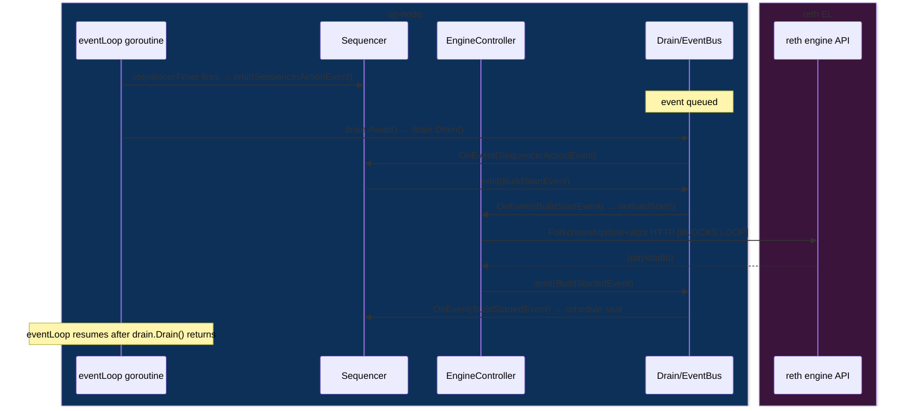

### The event loop select arms

```go
// driver/driver.go:337-393
for {
    planSequencerAction() // update sequencerCh timer

    select {
    case <-sequencerCh:
        s.emitter.Emit(s.driverCtx, sequencing.SequencerActionEvent{})

    case <-altSyncTicker.C:
        s.checkForGapInUnsafeQueue(ctx)        // P2P gap detection

    case <-upstreamSyncTickerC:
        s.followUpstream()                     // XLayer: follow external safe/finalized

    case <-s.sched.NextDelayedStep():
        s.sched.AttemptStep(s.driverCtx)       // derivation step (backoff)

    case <-s.sched.NextStep():
        s.sched.AttemptStep(s.driverCtx)       // derivation step (immediate)

    case respCh := <-s.stateReq:
        respCh <- struct{}{}                   // sync API request gate

    case respCh := <-s.forceReset:
        s.SyncDeriver.Derivation.Reset()       // manual pipeline reset

    case <-s.drain.Await():
        s.drain.Drain()                        // ← RPC calls happen here

    case <-s.driverCtx.Done():
        return
    }
}
```

**Key insight:** The `drain.Drain()` case processes ALL pending events synchronously. Engine RPC calls
(ForkchoiceUpdate, NewPayload, GetPayload) are invoked inside `OnEvent` handlers, which run inside
`drain.Drain()`. This blocks the entire event loop.

---

## 4. Component Registry

op-node's components form a flat registry (not a hierarchy). Each component registers by name and
gets its own emitter. All components share the same drain.

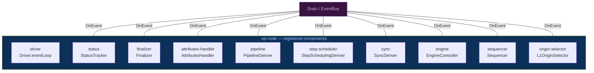

| Component | File | Role |
|---|---|---|
| **Driver** | `driver/driver.go` | Event loop, timer management, startup |
| **StatusTracker** | `status/` | Tracks L1/L2 head sync status |
| **Finalizer** | `finality/finalizer.go` | L1 finality → L2 finalization |
| **AttributesHandler** | `attributes/attributes.go` | Buffers derived attrs, emits BuildStartEvent |
| **PipelineDeriver** | `derive/pipeline_deriver.go` | Wraps DerivationPipeline in event system |
| **StepSchedulingDeriver** | `driver/step_scheduling_deriver.go` | Backoff-controlled step scheduling |
| **SyncDeriver** | `driver/sync_deriver.go` | Drives SyncStep, handles reset events |
| **EngineController** | `engine/engine_controller.go` | All Engine API RPC calls, head state |
| **Sequencer** | `sequencing/sequencer.go` | Block-build state machine, nextAction |
| **L1OriginSelector** | `sequencing/origin_selector.go` | Finds L1 origin for next block |

---

## 5. Block Head State Machine

EngineController tracks **seven L2 head references** at any time:

```mermaid
stateDiagram-v2
    direction LR
    unsafe: unsafeHead<br/>(latest, may reorg)
    crossUnsafe: crossUnsafeHead<br/>(cross-verified unsafe)
    pendingSafe: pendingSafeHead<br/>(mid span-batch)
    localSafe: localSafeHead<br/>(span-batch complete)
    safe: safeHead / crossSafe<br/>(cross-verified)
    finalized: finalizedHead<br/>(irreversible)

    [*] --> unsafe : FCU/BuildStarted/UnsafePayload
    unsafe --> crossUnsafe : PromoteCrossUnsafe (pre-interop: immediate)
    crossUnsafe --> pendingSafe : TryUpdatePendingSafe (derivation step)
    pendingSafe --> localSafe : TryUpdateLocalSafe (span batch ends)
    localSafe --> safe : PromoteSafe (pre-interop: immediate)
    safe --> finalized : PromoteFinalized (L1 finalized)
```

Head transitions trigger `tryUpdateEngine()` which calls `ForkchoiceUpdate` to reth with the latest
safe + finalized heads (without attrs — no new block building).

```go
// engine/engine_controller.go:96-155 — head fields
type EngineController struct {
    unsafeHead         eth.L2BlockRef  // latest known (may reorg)
    crossUnsafeHead    eth.L2BlockRef  // cross-verified (= unsafeHead pre-interop)
    pendingSafeHead    eth.L2BlockRef  // mid span-batch
    localSafeHead      eth.L2BlockRef  // span-batch complete, not cross-verified
    backupUnsafeHead   eth.L2BlockRef  // rollback target if pending-safe fails
    deprecatedSafeHead eth.L2BlockRef  // cross-safe (supervisor only)
    deprecatedFinalizedHead eth.L2BlockRef

    needFCUCall        bool            // pending FCU to reth
    needSafeHeadUpdate bool            // safe head debounce
    // ...
    mu gosync.RWMutex  // protects all of the above
}
```

---

## 6. Block Build Cycle — Sequencer Mode

### Timing phases

```text
T0 ──── PreparePayloadAttributes() ──── T1 ──── FCU+attrs HTTP ──── T3
        [L1 RPC: eth_getBlockByNumber]          [reth builds block]
        [blocking in event handler]

                [reth builds: ~block_time - sealingDuration]

Seal timer fires (payloadTime - 50ms):
T1' ─── BuildSealEvent ─── GetPayload HTTP ─── BuildSealedEvent
                           [sealing RPC]

After sealing:
── gossip to P2P ── conductor.CommitUnsafePayload ── NewPayload HTTP ── FCU (head update)
```

### Step-by-step sequence

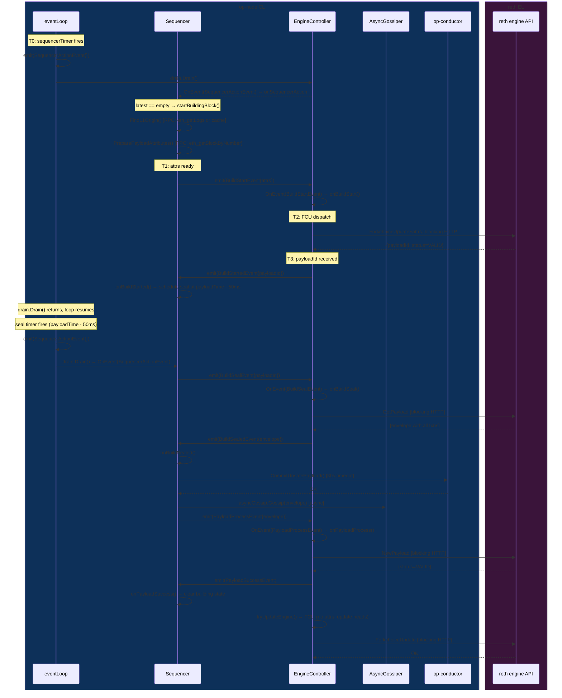

### startBuildingBlock() — the synchronous attr prep

```go
// sequencing/sequencer.go:494-629
func (d *Sequencer) startBuildingBlock() {
    // T0: l2Head is current unsafe head
    l2Head := d.latestHead

    // FindL1Origin: resolves L1 origin for this L2 block
    // May use cached data or RPC eth_getLogs / eth_getBlockByHash
    l1Origin, err := d.l1OriginSelector.FindL1Origin(ctx, l2Head)

    // PreparePayloadAttributes: SYNCHRONOUS L1 RPC call
    // Calls eth_getBlockByNumber("latest") to get L1 info tx data
    // At 500M gas blocks: p50=4ms, p99=128ms, max=135ms
    attrs, err := d.attrBuilder.PreparePayloadAttributes(fetchCtx, l2Head, l1Origin.ID())

    // T1: attrs ready, emit BuildStartEvent
    // This call triggers EngineController.onBuildStart() in same drain.Drain() call
    d.emitter.Emit(d.ctx, engine.BuildStartEvent{
        Attributes: &derive.AttributesWithParent{
            Attributes:  attrs,
            Parent:      l2Head,
            Concluding:  false,
            DerivedFrom: eth.L1BlockRef{}, // zero = sequencer block, not derived
        },
    })
}
```

### onBuildStart() — the direct FCU call

```go
// engine/build_start.go:21-81
func (e *EngineController) onBuildStart(ctx context.Context, ev BuildStartEvent) {
    rpcCtx, cancel := context.WithTimeout(e.ctx, buildStartTimeout)
    defer cancel()

    fc := eth.ForkchoiceState{
        HeadBlockHash:      ev.Attributes.Parent.Hash,    // build on unsafe head
        SafeBlockHash:      e.SafeL2Head().Hash,
        FinalizedBlockHash: e.FinalizedHead().Hash,
    }
    buildStartTime := time.Now()

    // T2→T3: Direct synchronous HTTP call — no queue, no channel
    // Blocks the event loop goroutine until reth responds
    id, errTyp, err := e.startPayload(rpcCtx, fc, ev.Attributes.Attributes)
    // startPayload calls e.engine.ForkchoiceUpdate() which is the HTTP RPC

    // T3: payloadId received
    e.emitter.Emit(ctx, BuildStartedEvent{
        Info:         eth.PayloadInfo{ID: id, Timestamp: ...},
        BuildStarted: buildStartTime,
        ...
    })
}
```

### Seal timing calculation

```go
// sequencing/sequencer.go:244-253
func (d *Sequencer) onBuildStarted(x engine.BuildStartedEvent) {
    now := d.timeNow()
    payloadTime := time.Unix(int64(x.Parent.Time + d.rollupCfg.BlockTime), 0)
    remainingTime := payloadTime.Sub(now)

    if remainingTime < d.sealingDuration { // sealingDuration = 50ms default
        d.nextAction = now                 // no time left: seal immediately
    } else {
        d.nextAction = payloadTime.Add(-d.sealingDuration) // seal at T_block - 50ms
    }
}
```

---

## 7. Derivation Pipeline

### Overview

The derivation pipeline transforms L1 data into L2 `PayloadAttributes`. It runs as a step-based
pipeline where each step advances one or more stages. Steps are scheduled by `StepSchedulingDeriver`
with exponential backoff on errors.

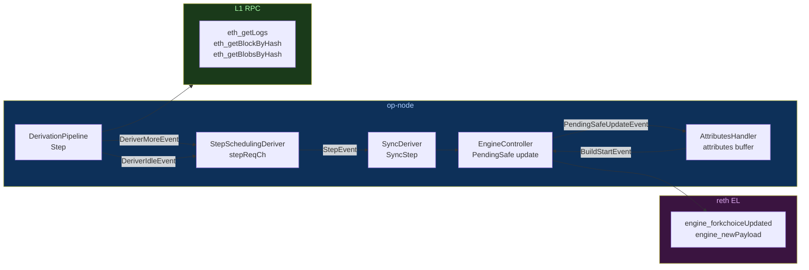

### Derivation pipeline stages

L1 data flows through a chain of stages, each consuming output from the previous:

```text
L1 Chain (eth_getLogs, eth_getBlockByNumber, eth_getBlobsByHash)
  │
  ▼
L1Traversal — tracks L1 head, emits L1 blocks one at a time
  │
  ▼
L1Retrieval — fetches calldata/blob DA data for each L1 block
  │
  ▼
FrameQueue — decodes raw DA data into op-stack frames
  │
  ▼
ChannelBank — reassembles frames into channels (handles out-of-order)
  │
  ▼
ChannelInReader / BatchMux — decompresses and decodes channel data into batches
  │
  ▼
BatchQueue — orders batches, applies batch validity rules
  │
  ▼
AttributesQueue — converts batches into PayloadAttributes
  │
  ▼
AttributesHandler.OnEvent(PendingSafeUpdateEvent)
  → emits BuildStartEvent{attrs, DerivedFrom=L1Block}
```

### Derivation sequence

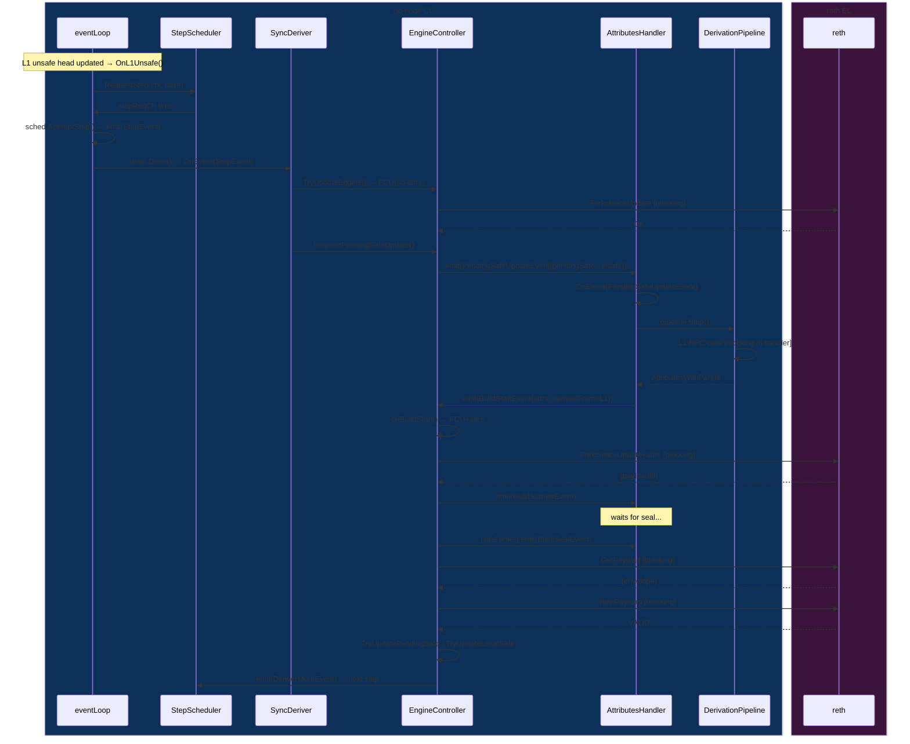

### Step backoff strategy

```go
// driver/step_scheduling_deriver.go:84-108
func (s *StepSchedulingDeriver) RequestStep(ctx context.Context, resetBackoff bool) {
    if s.stepAttempts > 0 {
        // Re-attempt with exponential backoff — avoids spamming L1 on errors
        delay := s.bOffStrategy.Duration(s.stepAttempts)
        s.delayedStepReq = time.After(delay)  // fires in eventLoop's NextDelayedStep()
    } else {
        // First attempt: immediate, non-blocking channel send
        select {
        case s.stepReqCh <- struct{}{}:
        default: // already pending, skip
        }
    }
}
```

### Derivation: consolidation fast path

When the sequencer produces blocks before derivation catches up, the unsafe chain already contains
the correct blocks. Derivation does not need to rebuild them — it just needs to verify they match
what derivation would have produced, then promote them to safe.

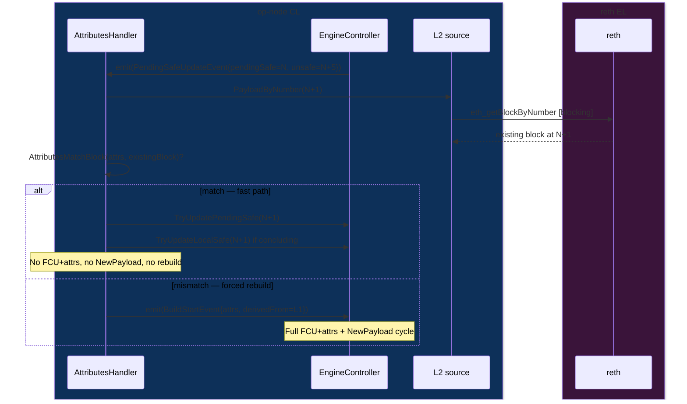

`AttributesMatchBlock()` checks: parent hash, timestamp, prev_randao, transactions, gas limit,
withdrawals, beacon root, fee recipient, EIP-1559 params. If all match, the block is promoted
without any Engine API calls, saving two HTTP round-trips per derived block.

---

## 8. Finalization

### How L1 finality propagates to L2

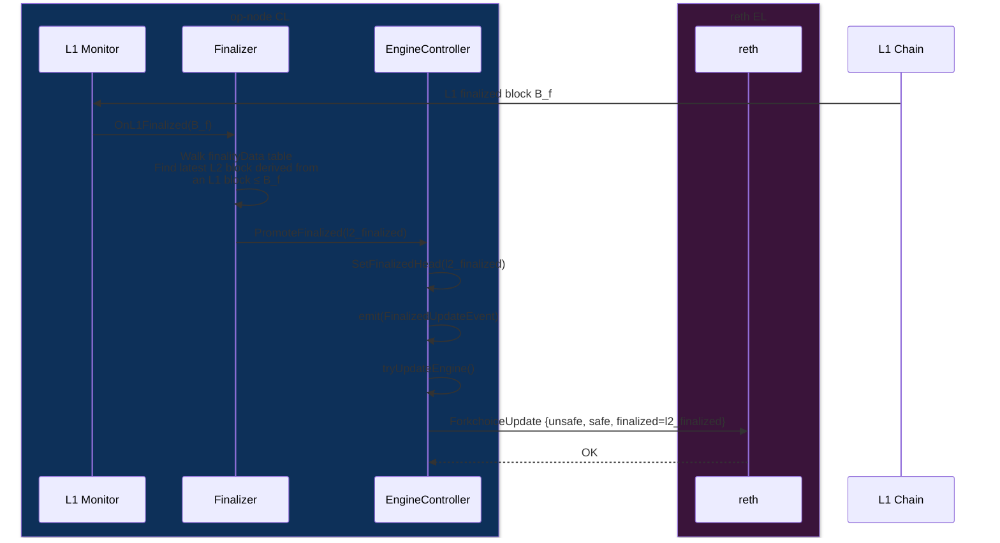

### Finalizer data model

The Finalizer maintains a rolling window of `FinalityData` entries (default 4×32+1 = 129 L1 blocks):

```go
// finality/finalizer.go:78-90
type FinalityData struct {
    // Last L2 block fully derived from this L1 block
    L2Block eth.L2BlockRef
    // The L1 block from which L2Block was derived
    L1Block eth.BlockID
}
```

When L1 block `B_f` finalizes:
1. Finalizer finds all `FinalityData` entries where `L1Block.Number ≤ B_f.Number`
2. The highest such `L2Block` is the new L2 finalized head
3. `PromoteFinalized()` triggers a FCU to reth with the updated finalized hash

L2 finality lags L1 finality by approximately the number of L1 blocks it takes to derive the L2
blocks — typically a few blocks worth of data latency.

---

## 9. Unsafe Payload Sync

When not sequencing (verifier mode) or when the sequencer produces blocks faster than derivation,
op-node receives new L2 blocks via P2P gossip. This is the "unsafe payload" path.

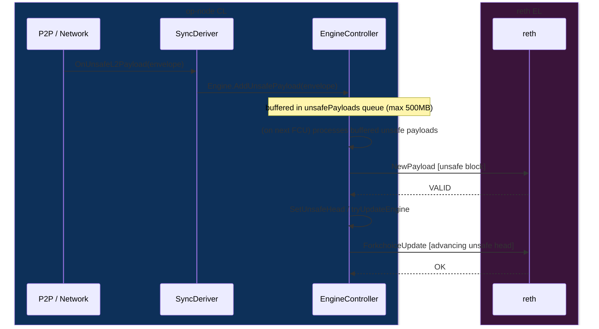

The `altSyncTicker` (every 2×blockTime) checks for gaps in the unsafe payload queue and requests
missing blocks via alternative sync channels (P2P request-response or snap sync).

---

## 10. The Serialization Constraint & Latency

### What serialization means

Because all work runs in one goroutine, each operation blocks the next:

```text
One block cycle in op-node (sequencer mode, 500M gas, p50 values):

T0 ── FindL1Origin             ~0.5ms   (usually cached)
    ── [goroutine wait behind derivation arm]   ~243ms  (bulk of the 247ms median)
    ── SystemConfigByL2Hash     ~2ms    reth HTTP
    ── InfoByHash               ~4ms    L1 HTTP (cached)
    ── [FetchReceipts]          ~20ms+  L1 HTTP (epoch boundary only, 1/12 blocks)
    ── build L1InfoTx+deposits  ~0ms    local
T1  T0→T1 total: 247ms median · 453ms p99 · 522ms max (April 8, 500M gas)
    ── FCU+attrs HTTP           ~2ms    reth round-trip  (p99: 111ms)
T3
    [reth builds block: ~block_time - 50ms]
    ...
seal timer fires:
    ── GetPayload HTTP           ~65ms   reth seal
    ── conductor RPC             ~5ms
    ── NewPayload HTTP           ~65ms   reth import
    ── FCU HTTP (head update)    ~1ms
```

The key impact: **`PreparePayloadAttributes()` blocks the event loop**. While it awaits the L1 RPC,
no other events can be processed — not derivation steps, not FCU responses, nothing.

### op-node attr prep vs kona

| | op-node | kona |
|---|---|---|
| Where | Inside `onSequencerAction()`, inline in event handler | Inside `SequencerActor` tick, async Tokio future |
| Blocks event loop? | **Yes** — entire event loop stalls | **No** — Tokio executor stays active |
| 500M gas median (April 8) | **247ms** | **104ms** |
| 500M gas p99 (April 8) | **453ms** | **224ms** |
| 500M gas max (April 8) | **522ms** | **281ms** |
| Root cause | Single goroutine + synchronous L1 RPC | Async Rust, L1 RPC is awaited not blocked |

### Full event loop blocking model

```text
                op-node event loop timeline (one L1 block, ~2s L2)

T_base+0ms:  ← sequencerCh fires
T_base+0ms:    emit(SequencerActionEvent) → queued
T_base+0ms:    drain.Drain() starts
               ├── FindL1Origin      ~0.5ms
               ├── PreparePayloadAttrs ~4–285ms ← L1 RPC here, BLOCKS ALL
               ├── emit(BuildStartEvent)
               ├── onBuildStart()
               │     ├── FCU+attrs HTTP ~1–60ms ← reth RPC here, BLOCKS ALL
               │     └── emit(BuildStartedEvent)
               └── onBuildStarted() → schedule seal
T_base+Xms:  ← drain.Drain() returns
T_base+Xms:  ← eventLoop resumes, re-enters select
               (derivation steps / other events can run here)

T_deadline-50ms: ← seal timer fires
               drain.Drain() starts
               ├── GetPayload HTTP   ~65ms ← BLOCKS ALL
               ├── conductor.Commit  ~5ms  ← BLOCKS ALL
               ├── NewPayload HTTP   ~65ms ← BLOCKS ALL
               └── FCU HTTP          ~1ms  ← BLOCKS ALL
T_deadline+75ms: ← drain.Drain() returns
```

### Why op-node sequencer latency is worse than kona at high load

At 500M gas with 50k accounts (April 8 reference benchmark):
- op-node T0→T3 median: **249ms** (vs kona-optimised: **102ms**)
- op-node T0→T3 p99: **455ms** (vs kona-optimised: **270ms**)
- op-node attr prep median: **247ms** (vs kona-optimised: **100ms**)
- Root cause: op-node's `PreparePayloadAttributes()` blocks the entire event loop, while kona's
  is an async future on the Tokio executor that does not block other actors.

---

## 11. XLayer Modifications

XLayer has added two significant features to op-node, both in `driver.go`:

### FollowSource mode (skip-l1-check)

In this mode, the node does not derive L2 from L1 directly. Instead it follows an external "upstream
node" for safe/finalized heads, bypassing L1 origin verification. Useful for running a secondary
sequencer that trusts the primary's derivation.

```go
// driver/driver.go:197-207 — XLayer state struct
type xlayerFollowState struct {
    runtimeConfigSetter        RuntimeConfigSetter
    lastRuntimeConfigFetchAt   time.Time
    runtimeConfigFetchInterval time.Duration

    // Cached upstream L1 refs for change detection
    lastHeadL1      eth.L1BlockRef
    lastSafeL1      eth.L1BlockRef
    lastFinalizedL1 eth.L1BlockRef
}
```

The `followUpstream()` function runs on `upstreamSyncTickerC` (every 2×blockTime):

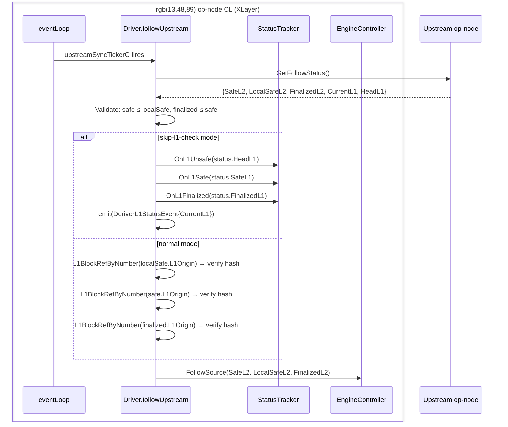

### P2P sequencer address refresh

When in skip-l1-check mode, the P2P sequencer address (used to validate gossiped blocks) cannot be
read from L1. XLayer fetches it periodically from the upstream node instead:

```go
// driver/driver.go:624-639
if s.syncConfig.ShouldSkipFollowSourceL1Check() && s.xlayer.runtimeConfigSetter != nil &&
    time.Since(s.xlayer.lastRuntimeConfigFetchAt) >= s.xlayer.runtimeConfigFetchInterval {
    // Fetch P2PSequencerAddress from upstream (throttled to runtimeConfigFetchInterval, default 10min)
    runtimeCfg, err := rcSrc.GetRuntimeConfig(s.driverCtx)
    s.xlayer.runtimeConfigSetter.SetP2PSequencerAddress(runtimeCfg.P2PSequencerAddress)
}
```

### Key files modified by XLayer

| File | Change |
|---|---|
| `driver/driver.go` | `xlayerFollowState` struct, `followUpstream()`, `upstreamSyncTickerC`, `SetRuntimeConfigSetter()` |
| `rollup/sync/config.go` | `ShouldSkipFollowSourceL1Check()`, `FollowSourceEnabled()` |
| `rollup/config_xlayer.go` | XLayer-specific chain config constants |
| `rollup/l2_time_xlayer.go` | Custom L2 time derivation |
| `rollup/config_xlayer_test.go` | Tests for XLayer config |

---

## 12. op-node vs kona Architectural Comparison

### High-level model

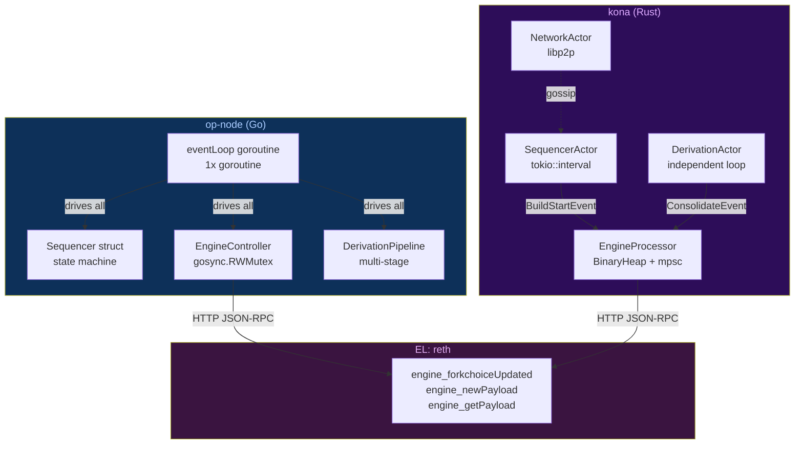

### Key architectural differences

| Dimension | op-node | kona |
|---|---|---|
| **Language** | Go | Rust + Tokio async |
| **Concurrency model** | Single goroutine event loop | Independent async Tokio actors |
| **Sequencer & derivation** | Serialized — same goroutine | Concurrent — separate actors |
| **Engine API dispatch** | Direct synchronous call in event handler | mpsc channel → BinaryHeap → async HTTP |
| **Priority enforcement** | None — FIFO event drain | BinaryHeap: Build > Insert > Consolidate |
| **attr prep blocks loop?** | Yes — `PreparePayloadAttributes()` is sync | No — `prepare_payload_attributes()` is async |
| **When loop is blocked** | During every L1 RPC and engine RPC | Never — Tokio executor runs other tasks |
| **Head state lock** | `gosync.RWMutex` in EngineController | `Arc<Mutex<>>` per actor state |
| **Gossip** | `AsyncGossiper` goroutine (separate) | `NetworkActor` separate Tokio task |
| **Conductor (HA)** | `conductor.CommitUnsafePayload()` sync call | Not implemented in kona |
| **Config** | Struct fields, no hot reload | Struct fields |

### Latency comparison (500M gas, April 8 reference benchmark)

| Metric | op-node | kona (baseline) | kona (optimised) | base-cl |
|---|---|---|---|---|
| T0→T3 median | 249 ms | 111 ms | **102 ms** | 109 ms |
| T0→T3 p99 | 455 ms | 298 ms | **270 ms** | 334 ms |
| T0→T3 max | 528 ms | 331 ms | **277 ms** | 394 ms |
| T0→T1 attr prep median | 247 ms | 104 ms | **100 ms** | 105 ms |
| T0→T1 attr prep p99 | 453 ms | **224 ms** | 264 ms | 326 ms |
| T1→T2 heap drain p99 | N/A | 111 ms | **98 ms** | 142 ms |
| T2→T3 FCU HTTP median | 2.2 ms | **2.0 ms** | 2.1 ms | **2.0 ms** |
| Block fill (avg) | 79% | **84%** | 82% | 81% |
| TPS | 11,249 | **12,055** | 11,682 | 11,600 |

> op-node's attr prep median (247ms) is NOT because the L1 RPCs are slow (those take ~4ms).
> It's goroutine wait time — derivation holds the event loop, sequencer tick queues behind it.
> kona's attr prep (100ms median) is the same L1 RPCs running async while derivation continues.

### Why kona-baseline has HIGHER throughput despite worse latency

The kona-baseline's higher block fill (84% vs 79%) despite worse p99 latency comes from its
architecture: kona's DerivationActor runs independently of the SequencerActor. While reth is building
one block, kona's derivation is advancing the safe head concurrently. This keeps the safe/finalized
heads more current, and reth can consolidate more efficiently. op-node's serialized model means
derivation stalls during block building.

### When each model wins

| Scenario | Better | Why |
|---|---|---|
| Low-load (< 200M gas) | Comparable | Both idle between blocks |
| High-load attr prep | **kona** | Async L1 RPC; loop not blocked |
| HA sequencer (conductor) | **op-node** | Native conductor integration |
| Derivation throughput | **kona** | Concurrent with sequencing |
| Code simplicity | **op-node** | Single goroutine is easier to reason about |
| Predictable timing | **kona** | Tokio scheduler, no cross-concern blocking |

---

*Generated 2026-04-11 from op-node commit history on branch `fix/kona-engine-drain-priority`.*

*Key source files: `op-node/rollup/driver/driver.go`, `sequencing/sequencer.go`,
`engine/engine_controller.go`, `engine/build_start.go`, `engine/build_seal.go`,
`driver/sync_deriver.go`, `driver/step_scheduling_deriver.go`, `finality/finalizer.go`,
`attributes/attributes.go`.*
