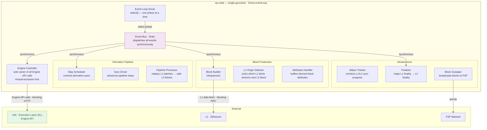
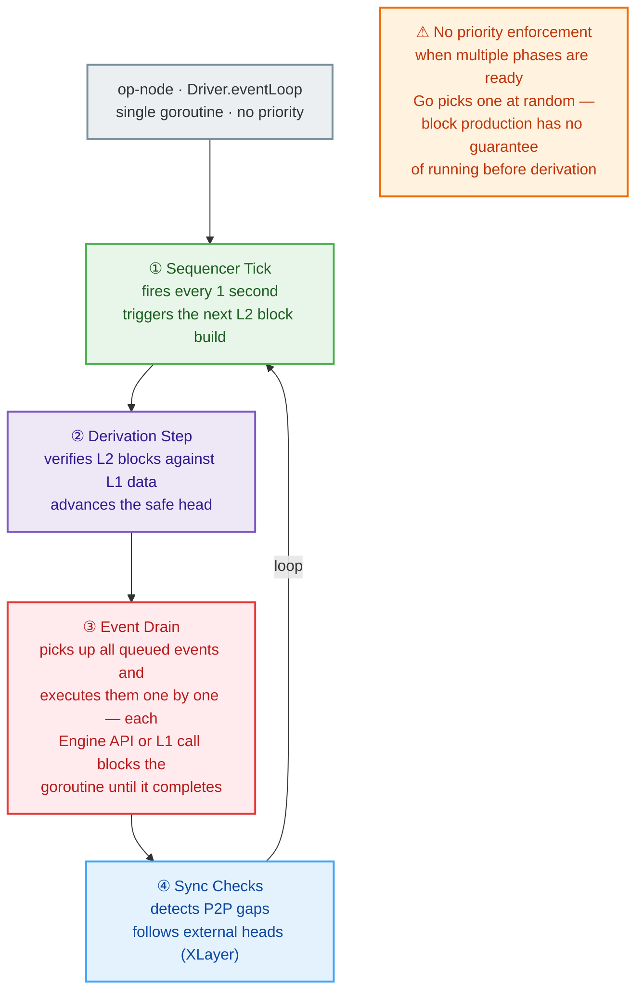
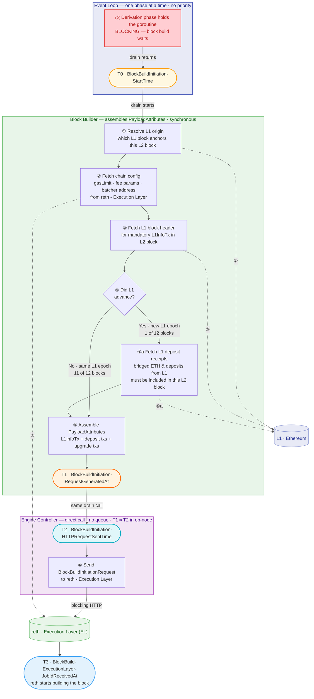
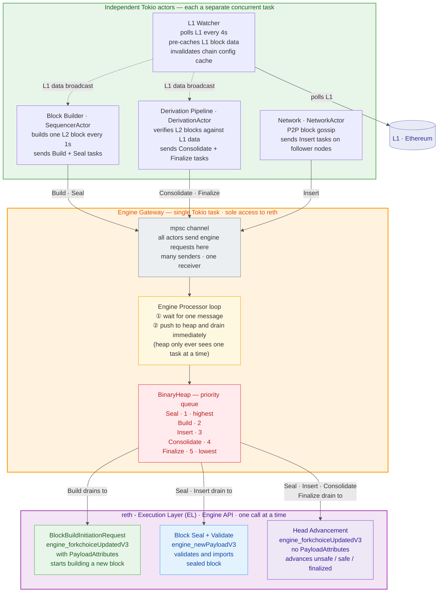
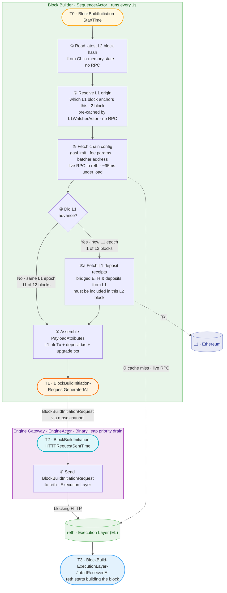
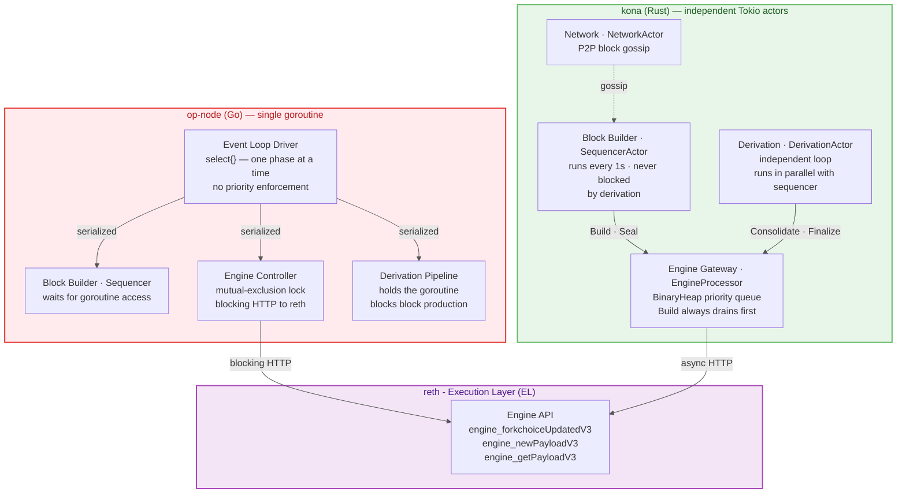
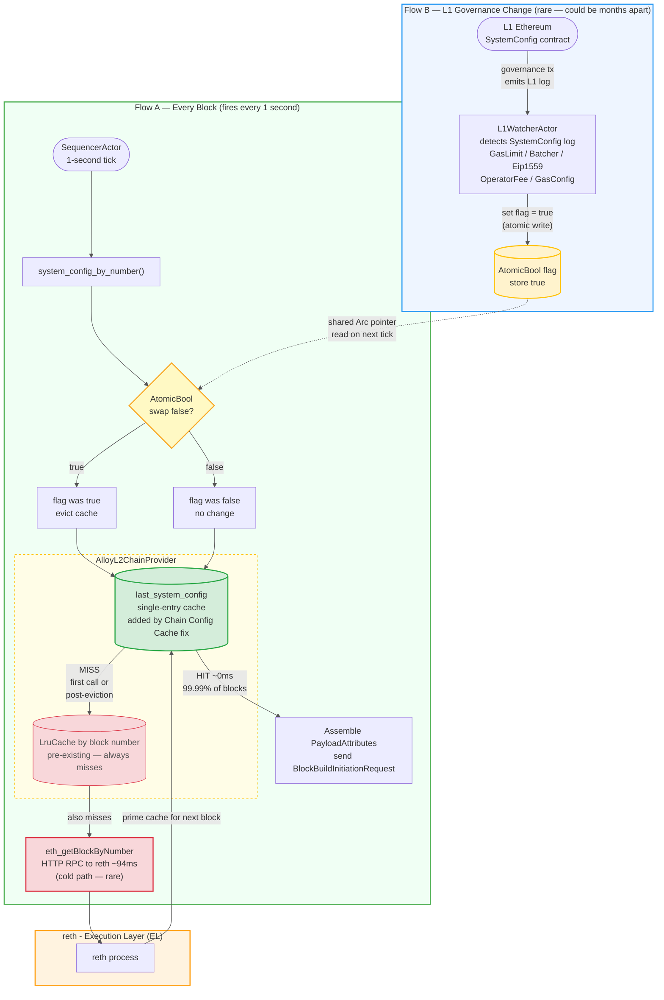
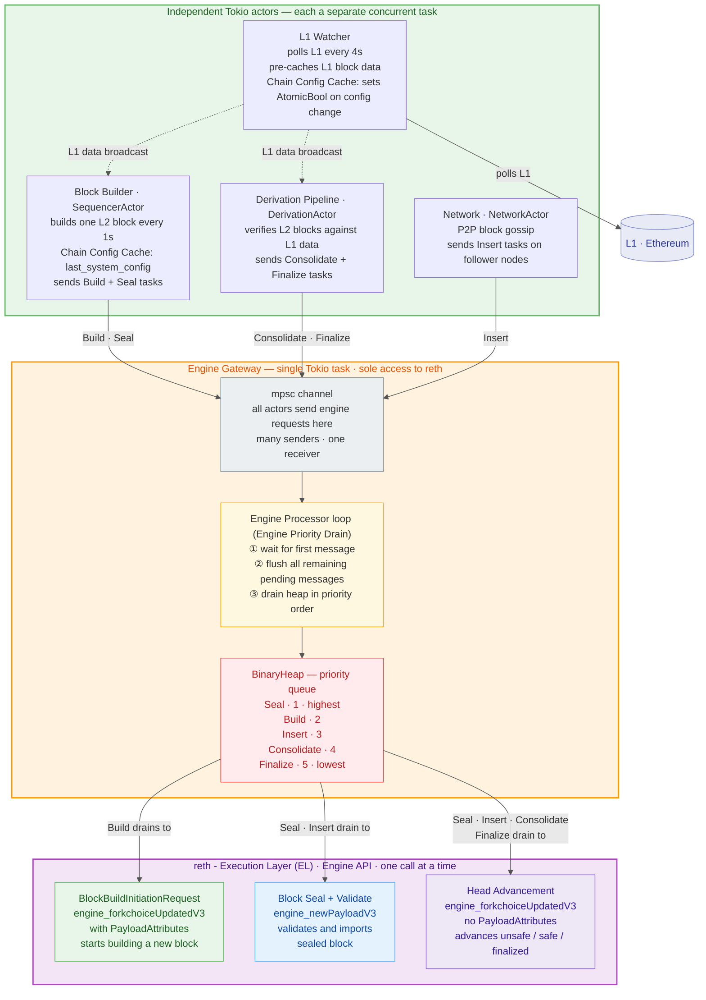
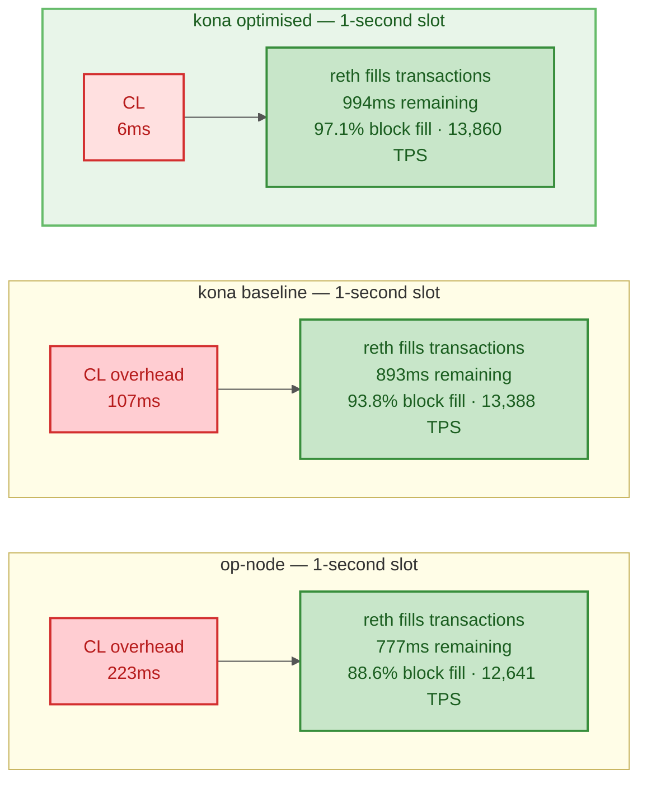

# Xlayer — Consensus-Layer Latency Optimisation

## 1. Terminology

| # | Terminology | Description |
|---|---|---|
| 1 | **Consensus Layer (CL)** | The node responsible for block production decisions. In this report: op-node, kona, or base-cl. |
| 2 | **Execution Layer (EL)** | OKX reth. Identical binary and configuration across all CL runs. |
| 3 | **Engine API** | JSON-RPC interface between CL and EL. Three calls: `engine_forkchoiceUpdatedV3`, `engine_newPayloadV3`, `engine_getPayloadV3`. reth's `authrpc` processes one call at a time (HTTP FIFO). |
| 4 | **BlockBuildInitiationRequest** | `engine_forkchoiceUpdatedV3` with `payloadAttributes` attached — the Engine API call that starts building a new block in reth - Execution Layer (EL). Returns a `payloadId`. Highest priority task in the BinaryHeap. |
| 5 | **BlockBuildInitiator** | CL-internal component that fires the per-block build tick. In op-node: the `Driver` goroutine. In kona / base-cl: the `SequencerActor`. |
| 6 | **PayloadAttributes** | L2 block descriptor assembled by BlockBuildInitiator: L1 origin, timestamp, fee recipient, gas limit, and transaction list. Sent to reth via FCU to start block construction. |
| 7 | **`SystemConfigByL2Hash`** | L2 RPC call to reth that fetches gas limit, batcher address, and fee parameters. Costs ~95ms under load. kona-optimised caches this in memory (Chain Config Cache); baseline / base-cl / op-node make a live RPC every block. |
| 8 | **AdvanceSafeHead** | Low-priority engine task: updates the safe / finalized head from the Derivation Pipeline. Competes with `BlockBuildInitiationRequest` in the BinaryHeap. |
| 9 | **Derivation Pipeline** | Verifies L2 blocks against L1 data and advances the safe head. Ensures the L2 chain matches what L1 committed. In op-node: serialized with sequencer in same goroutine. In kona / base-cl: independent `DerivationActor` running concurrently. |
| 10 | **Sequencer Tick** | 1-second interval timer that triggers BlockBuildInitiator to start a new block. Fires at `BlockBuildInitiation-StartTime` (T0). |
| 11 | **Block Fill Rate** | Percentage of block gas limit used. Higher fill = more TPS. Directly impacted by Block Build Initiation — End to End Latency — longer latency eats into reth's fill window. |
| 12 | **Driver (`eventLoop`)** | op-node's single Go goroutine that serializes sequencing, derivation, and engine calls. When derivation holds the loop, the sequencer tick is blocked — root cause of op-node's 221ms `BlockBuildInitiation-RequestGenerationLatency`. |
| 13 | **EngineController** | op-node's wrapper for all reth - Execution Layer (EL) Engine API calls. Holds a mutual-exclusion lock shared between sequencer and derivation — when one holds it, the other is blocked. |
| 14 | **DerivationStateMachine** | 6-state FSM unique to base-cl. Gates derivation to max 1 Consolidate in-flight, bounding BinaryHeap depth and safe lag. States: `AwaitingELSyncCompletion` → `Deriving` → `AwaitingSafeHeadConfirmation` → `AwaitingL1Data`. |
| 15 | **EngineProcessor / RpcProcessor** | base-cl's split of EngineActor into two sub-processors. EngineProcessor: state-modifying tasks, sole reth - Execution Layer (EL) HTTP owner. RpcProcessor: query-only requests, never touches reth. |
| 16 | **T0** · `BlockBuildInitiation-StartTime` | BlockBuildInitiator tick fires — beginning of block-build initiation for this 1-second slot. |
| 17 | **T1** · `BlockBuildInitiation-RequestGeneratedAt` | `PayloadAttributes` assembled and handed to engine actor — end of `BlockBuildInitiation-RequestGenerationLatency`, start of `BlockBuildInitiation-QueueDispatchLatency`. |
| 18 | **T2** · `BlockBuildInitiation-HTTPRequestSentTime` | HTTP `engine_forkchoiceUpdated` request dispatched to reth — end of `BlockBuildInitiation-QueueDispatchLatency`, start of `BlockBuildInitiation-HttpSender-RoundtripLatency`. For op-node, T1 ≈ T2 (no queue). |
| 19 | **T3** · `BlockBuild-ExecutionLayer-JobIdReceivedAt` | `payloadId` received from reth — end of `BlockBuildInitiation-HttpSender-RoundtripLatency`. Confirms reth has started building the block. |

---

## 2. Background

- XLayer currently uses **op-node** (Go) as its Consensus Layer (CL), paired with OKX reth as Execution Layer (EL).
- This document evaluates three alternative CLs — **kona baseline**, **kona-optimised**, and **base-cl** — to identify and resolve latency bottlenecks in the block production pipeline.
- All benchmarks use the same EL (OKX reth) with identical binary and configuration. All measured differences are attributable to the CL.

### Benchmark Methodology — Adventure Bench

- **Goal:** Measure Consensus Layer latency under sustained high-throughput load on XLayer devnet.
- **What changed:** Adventure (`erc20-bench`) was enhanced to support multi-instance parallel sending, 50k pre-funded wallets, and automated warm-up + measurement phases — enabling repeatable saturation tests.
- **Consensus Layers tested:** op-node (Go), kona baseline (Rust), kona-optimised (Rust), base-cl (Rust).
- **Execution Layer:** OKX reth — identical binary and configuration across all CL runs. The EL is held constant so all differences are attributable to the CL.

#### Run Configuration

| Parameter | Value |
|---|---|
| **Chain** | XLayer devnet (chain 195) · 1-second blocks |
| **Execution Layer** | OKX reth — identical binary and config across all CL runs |
| **Block gas limit** | 500M gas |
| **Test duration** | 120 seconds (measurement window) |
| **Workers** | 40 per instance × 2 instances = 80 concurrent senders |
| **Pre-funded wallets** | 50,000 accounts (25,000 per instance) |
| **Transaction type** | ERC20 token transfer — 100k gas limit / ~35k gas actual |
| **Sender tool** | adventure `erc20-bench` |

#### How the test works

| Phase | What happens |
|---|---|
| **Setup** | Build adventure binary, split 50k accounts across two instances (A + B), deploy ERC20 contracts. |
| **Wallet funding** | Each instance funds 25,000 accounts with 0.2 ETH + 100M ERC20 tokens via BatchTransfer contract. Sequential nonce ordering (`concurrency=1`) to avoid reth queued-promotion issues. |
| **Warm-up (30s)** | Both instances flood the mempool at full rate. No metrics collected — purpose is to reach saturation before measurement starts. Sanity check: block fill must reach ≥ 20%. |
| **Measurement (120s)** | Both instances continue sending. Block scan (`eth_getBlockByNumber`), safe-lag polling (`optimism_syncStatus`), CL docker logs, and reth EL logs are all captured. |
| **Report** | Per-CL markdown + JSON sidecar. Comparison auto-generated when ≥ 2 CL results exist. |

#### How metrics are computed

| Metric | Computation |
|---|---|
| **TPS (block-inclusion)** | Total transactions confirmed on-chain ÷ elapsed chain time (seconds). Only counts txs that landed in blocks — no mempool or warmup noise. |
| **Block Fill Rate** | Per block: `gasUsed ÷ gasLimit × 100`. Reported as average across all measurement blocks. Saturation defined as p10 > 95% (9 out of 10 blocks at least 95% full). |
| **Theoretical TPS ceiling** | `gasLimit ÷ ~35,000 gas per ERC20 tx` → 500M = 14,286 TX/s. |
| **Block Build Initiation latencies** | Parsed from CL docker logs. Percentiles (median, 99th percentile, max) computed from all samples in the 120s window. |
| **reth EL internal timings** | Parsed from reth docker logs (`engine::tree` latency fields). Isolates reth's own processing time from HTTP and queue overhead. |

#### Why 50k wallets and 80 workers

- **50k wallets** provide ~3.5 blocks of account depth at 500M gas ceiling — ensures sustained saturation without nonce contention.
- **80 workers** (40 per instance) generate ~28,000 TX/s combined — roughly 2× the 14,286 TX/s ceiling — guaranteeing the mempool stays full throughout the measurement window.
- Two adventure instances use **disjoint account sets** (A: first 25k, B: last 25k) — zero cross-instance nonce contention.

### 2.1 Problem — op-node Latency

op-node is the **reference Consensus Layer** for the OP Stack (Go) — built on the geth codebase.

- All sequencing, derivation, and Engine API interactions run inside a **single goroutine** (`Driver.eventLoop`).
- Nothing runs in parallel — every operation is serialized.

### Architecture — Single Event Loop

| | |
|---|---|
| **Concurrency** | Every component lives inside **one goroutine** — the `select{}` loop picks one phase at a time. |
| **Priority** | Go's `select{}` has **no priority** — when multiple phases are ready, it picks randomly. Block production has no guarantee of running before derivation. |
| **Blocking** | When the Event Drain phase fires, it dispatches **all** pending events synchronously. Every Engine API call to reth - Execution Layer (EL) and every L1 RPC blocks the goroutine until completion. No other work can proceed. |

#### Event Loop Cycle

### Block Build Initiation — The Serialization Problem

op-node (CL) initiates a new L2 block build every 1 second:
1. Gather gas config and fee params from reth - Execution Layer (EL)
2. Fetch L1 origin data (block header, deposits if new epoch)
3. Assemble `PayloadAttributes`
4. Send `BlockBuildInitiationRequest` to reth

All four steps run inside `drain.Drain()` — **the same goroutine as derivation**. If derivation is busy, the block build waits.

- The actual RPC work to assemble `PayloadAttributes` takes **~6ms**.
- Yet the measured `BlockBuildInitiation-RequestGenerationLatency` is **221ms**.
- The breakdown below reveals where the remaining time goes:

| Phase | Duration | What happens |
|---|---|---|
| **Goroutine wait** | ~215 ms | Derivation holds `drain.Drain()` — sequencer tick is queued behind it |
| `FindL1Origin` | ~0.5 ms | L1 origin lookup (usually cached) |
| `SystemConfigByL2Hash` | ~2 ms | Gas limit & fee params from reth - Execution Layer (EL) |
| `InfoByHash` | ~4 ms | L1 block info (cached) |
| **Total (median)** | **221.6 ms** | **97% is goroutine contention, not RPC cost** |

**Root cause:**
- Derivation and sequencing **share a single goroutine** — they can never overlap.
- When derivation holds the goroutine, the sequencer tick is queued behind it.
- **97%** of `BlockBuildInitiation-RequestGenerationLatency` is this goroutine contention — not slow RPCs.

### Benchmark — op-node (500M gas)

| Metric | op-node |
|---|---|
| **Block Build Initiation — End to End Latency (median)** | 222.6 ms |
| **Block Build Initiation — End to End Latency (99th percentile)** | 331.3 ms |
| `BlockBuildInitiation-RequestGenerationLatency` (median) | 221.6 ms |
| TPS | 12,641 |

---

## 3. Objectives

Identify and adopt a Consensus Layer that delivers **lower block-build latency** than op-node while remaining fully interoperable with OKX reth - Execution Layer (EL).

- **Candidates:** kona (Optimism's Rust implementation of the OP Stack) and base (Coinbase's Rust implementation).
- **Method:** Run controlled benchmarks on XLayer devnet under sustained load, compare latency and throughput against op-node as the baseline.
- **Success criteria:** The chosen CL must demonstrate measurably lower Block Build Initiation — End to End Latency at both median and 99th percentile, without regressing TPS or block fill rate.

### 3.1 In Scope

- Benchmark op-node, kona (baseline) and base under identical conditions.
- Measure Block Build Initiation — End to End Latency, `BlockBuildInitiation-RequestGenerationLatency`, TPS, and block fill rate.
- Identify architectural bottlenecks in each CL's block production pipeline.
- Implement and validate optimizations on the chosen CL.

### 3.2 Out of Scope

- Execution Layer (reth) optimizations — EL is held constant across all runs.
- L1 derivation correctness or fault proof changes.
- Production deployment, rollout strategy, or migration from op-node.
- P2P networking performance or gossip protocol changes.

---

## 4. Solution

### 4.1 kona as Consensus Layer

- **kona** is Optimism's Rust implementation of the OP Stack Consensus Layer, built on the Tokio async runtime.
- Unlike op-node's single-goroutine model, kona uses **independent actors** — each running as a separate Tokio task, communicating via async channels.
- Derivation and block production **never share a thread** — eliminating the goroutine serialization that causes op-node's 221ms latency.

#### Architecture — Actor Model

| | |
|---|---|
| **Concurrency** | Each actor is an independent Tokio task — SequencerActor and DerivationActor **run in parallel**, never blocking each other. |
| **Priority** | All engine requests flow through a **BinaryHeap** with strict priority: Seal (1) > Build (2) > Insert (3) > Consolidate (4) > Finalize (5). Block production always wins. |
| **Scheduling** | EngineProcessor dequeues one message at a time — the heap only ever holds one task, so BinaryHeap priority ordering is structurally bypassed. This is addressed in §4.2 (Engine Priority Drain fix). |

#### Block Build Initiation — Actor Model

kona (CL) initiates a new L2 block build every 1 second:
1. **Read latest L2 block hash** — from CL in-memory state (no RPC)
2. **Resolve L1 origin** — which L1 block anchors this L2 block, pre-cached by L1 Watcher (no RPC)
3. **Fetch chain config** — gasLimit, fee params, batcher address from reth - Execution Layer (EL) (~95ms live RPC)
4. **Fetch L1 block header and deposits** — if L1 advanced (1 of every 12 blocks)
5. **Assemble `PayloadAttributes`** — L1InfoTx + deposit txs + upgrade txs
6. **Send BlockBuildInitiationRequest** — via mpsc channel to Engine Gateway

The Engine Gateway's BinaryHeap receives the Build task and **drains it at priority 2** — ahead of any queued Consolidate or Finalize tasks from derivation.

#### Side-by-Side — op-node vs kona

- Both CLs talk to the **same reth - Execution Layer (EL)** via Engine API — the EL is identical.
- The only difference is **how the CL organizes work internally**.
- **op-node:** single goroutine — everything serialized, no priority.
- **kona:** independent actors — block production and derivation run in parallel, with a priority queue.

#### Why this solves op-node's problem

| op-node constraint | How kona solves it |
|---|---|
| Single goroutine — derivation blocks block production | Independent actors — derivation and sequencing **run in parallel**, never blocking each other |
| No priority — Go `select{}` picks one phase at random | BinaryHeap with strict ordering — Build **always executes before** Consolidate |
| `BlockBuildInitiation-RequestGenerationLatency` median = 221ms (97% is goroutine wait) | Same metric drops to **102ms** — the goroutine wait is eliminated entirely |
| Synchronous L1 RPC blocks the entire event loop | Async Tokio futures — L1 calls **yield to the scheduler**, other actors proceed |

#### Benchmark — kona baseline vs op-node (500M gas)

| Metric | kona baseline | op-node |
|---|---|---|
| **Block Build Initiation — End to End Latency (median)** | **107.2 ms** | 222.6 ms |
| **Block Build Initiation — End to End Latency (99th percentile)** | **265.8 ms** | 331.3 ms |
| `BlockBuildInitiation-RequestGenerationLatency` (median) | **102.1 ms** | 221.6 ms |
| TPS | **13,388** | 12,641 |

**Key takeaway:**
- kona-baseline delivers **2× lower latency** than op-node — **107ms vs 223ms** (median) — with zero code optimisations applied.
- This improvement comes entirely from the **actor model** — derivation no longer blocks block production.
- The remaining ~102ms is the cost of fetching chain config from reth (`SystemConfigByL2Hash`) on every block — addressed in the next section.

### 4.2 kona Optimisations

§4.1 showed that kona-baseline is **2× faster** than op-node — but it still spends **~102ms per block** before reth can start filling transactions. That is 102ms of the 1-second budget consumed inside the CL, not by reth.

Two targeted fixes eliminate this overhead. Both are CL-only changes — reth is untouched.

| Fix | What it eliminates | Latency saved |
|---|---|---|
| **Chain Config Cache** | Redundant RPC to reth every block | ~95ms per block |
| **Engine Priority Drain** | Block-build signal delayed by queued safe-head updates | ~16ms+ worst-case spikes (99th percentile) |

#### Chain Config Cache (dominant cost — ~95ms eliminated)

Every block, kona asks reth for the chain's gas limit, fee parameters, and batcher address — a call called `SystemConfigByL2Hash`. These values almost never change (only when an L1 governance transaction fires, which may happen once in months). Yet kona made this **live RPC on every single block**, costing ~95ms under load.

Worse, the existing cache could not help. It was keyed by block number — and since block number increments every second, it always missed. Every block was a cache miss, every miss was a 95ms round-trip to reth.

**The fix is a single-entry in-memory cache:**

| | Before | After |
|---|---|---|
| **Every block** | Live RPC to reth (~95ms) | In-memory cache hit (~0ms) |
| **When L1 config changes** | Same live RPC (accidentally correct) | Cache evicted within 1 block, one cold fetch, then cache hits resume |
| **On node restart** | Live RPC every block (cache always misses) | One cold fetch on first block, then cache hits for all subsequent blocks |

How invalidation works: L1WatcherActor monitors L1 for governance events. When one fires, it sets an atomic flag. On the next sequencer tick (within 1 second), the cache checks the flag, evicts if set, and performs one cold fetch. No locks, no channels — just one atomic read per block.

**Impact:** `BlockBuildInitiation-RequestGenerationLatency` median: 102ms → 1.6ms

#### Engine Priority Drain Fix (scheduling reliability)

SequencerActor and DerivationActor both send tasks into a shared **mpsc channel**. The **Engine Processor** reads from this channel, places tasks into a **BinaryHeap** (priority queue), and executes highest-priority first. Build tasks should always beat safe-head updates.

**The bug:** Engine Processor read **one task at a time** — the heap only ever held one entry, so priority ordering never fired. Under load, DerivationActor sends bursts of safe-head updates that each executed immediately, delaying the Build task waiting behind them in the channel.

**The fix:** After reading one task, sweep **all remaining pending tasks** from the channel into the heap before executing. The heap now sees Build and safe-head updates together — Build pops first.

| | Before (baseline) | After (optimised) |
|---|---|---|
| **Channel → Heap** | Pick one task, place in heap, execute immediately | Pick one task, then sweep all remaining channel tasks into heap |
| **Heap at execution time** | Always holds 1 task — no priority comparison | Holds all pending tasks — BinaryHeap pops Build first |
| **Block production** | `BlockBuildInitiationRequest` delayed behind safe-head updates | `BlockBuildInitiationRequest` always executes first |

**Impact:** `BlockBuildInitiation-QueueDispatchLatency` 99th percentile reduced by **16×**.

#### Updated Architecture — kona-optimised

The same actor architecture as §4.1, with two targeted fixes annotated:

#### Benchmark — kona-optimised vs kona-baseline vs op-node (500M gas)

*Full comparison report attached separately.*

| Metric | kona-optimised | kona-baseline | op-node |
|---|---|---|---|
| **Block Build Initiation — End to End Latency (median)** | **6.5 ms** | 107.2 ms | 222.6 ms |
| **Block Build Initiation — End to End Latency (99th percentile)** | **142.9 ms** | 265.8 ms | 331.3 ms |
| `BlockBuildInitiation-RequestGenerationLatency` (median) | **1.6 ms** | 102.1 ms | 221.6 ms |
| TPS | **13,860** | 13,388 | 12,641 |
| Block fill | **97.1%** | 93.8% | 88.6% |

#### Why Lower CL Latency Increases Block Fill and TPS

| Concept | Definition |
|---|---|
| **Block fill rate** | `gasUsed ÷ gasLimit × 100` — read from each block header on-chain. The chain itself is the source of truth. |
| **Theoretical ceiling** | 500M gas ÷ ~35k gas per ERC20 tx = **14,286 TX/block** = 14,286 TPS at 1-second blocks. |
| **Who controls the fill?** | reth (EL) fills transactions. But reth cannot start until the CL sends the `BlockBuildInitiationRequest`. |

Every block has a **1-second slot budget**. The CL consumes part of it assembling instructions — whatever remains is reth's fill window. CL overhead directly shortens that window.

**1-Second Slot Budget — CL Overhead vs reth Fill Window**

> Red = CL overhead (time before reth can start filling). Green = reth fill window. Shorter red → longer green → more transactions per block.

| CL | CL overhead (median) | reth fill window | Block fill | TPS |
|---|---|---|---|---|
| op-node | 223 ms | ~777 ms | 88.6% | 12,641 |
| kona-baseline | 107 ms | ~893 ms | 93.8% | 13,388 |
| **kona-optimised** | **6 ms** | **~994 ms** | **97.1%** | **13,860** |

kona-optimised gives reth **217ms more per block** than op-node. Every extra millisecond is more loop iterations inside reth's payload builder — more transactions pulled from the mempool before the block seals.

> **Why this is a fair comparison:** Three conditions hold across all runs — (1) deep mempool: 80 workers send ~28,000 TX/s, 2× the ceiling, so reth never runs dry; (2) fixed seal timing: all CLs fire `engine_getPayload` at the same ~1000ms slot boundary; (3) identical reth: same binary, same config, zero EL changes.

**Key takeaway:**

| | |
|---|---|
| **34x faster than op-node** | kona-optimised: 6.5ms vs op-node: 222.6ms (Block Build Initiation, median) |
| **Chain Config Cache** (dominant gain) | Eliminates ~100ms per block — replaces a live RPC with an in-memory cache hit |
| **Engine Priority Drain** (reliability gain) | Build tasks never starved by derivation bursts — eliminates tail latency spikes |
| **Net effect on reth** | +217ms fill window per block → block fill 89% → 97% → TPS 12,641 → 13,860 |
| **No EL changes** | All improvements are CL-only. reth binary and configuration untouched. |

### 4.3 base-cl vs kona — Architecture & Metrics

base-cl (Coinbase) is also a Rust/Tokio actor-model CL with BinaryHeap engine scheduling — architecturally similar to kona. Its key differentiator is the `DerivationStateMachine`, a 6-state FSM that gates derivation to max 1 Consolidate in-flight.

#### Benchmark — kona baseline vs base-cl (500M gas)

| Metric | kona baseline | base-cl |
|---|---|---|
| **Block Build Initiation — End to End Latency (median)** | 107.2 ms | 101.3 ms |
| **Block Build Initiation — End to End Latency (99th percentile)** | 265.8 ms | 258.8 ms |
| `BlockBuildInitiation-RequestGenerationLatency` (median) | 102.1 ms | 98.9 ms |
| `BlockBuildInitiation-QueueDispatchLatency` (99th percentile) | 87.0 ms | **28.5 ms** |
| `BlockBuildInitiation-HttpSender-RoundtripLatency` (99th percentile) | 55.6 ms | **23.6 ms** |
| TPS | **13,388** | 11,758 |
| Block fill | **93.8%** | 82.4% |

> Without `SystemConfigByL2Hash` cache, kona-baseline and base-cl are near-identical on `BlockBuildInitiation-RequestGenerationLatency` (~102ms vs ~99ms — both pay the ~95ms live RPC). base-cl's `DerivationStateMachine` gives it better tail latency (28.5ms vs 87ms `BlockBuildInitiation-QueueDispatchLatency` 99th percentile) by bounding BinaryHeap depth. kona leads on TPS (13,388 vs 11,758) due to its free-running derivation maximizing reth fill time.

---

## 5. Reference Materials

---
