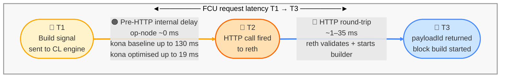

# XLayer Consensus Layer — Sequencer Performance Report

| | |
|---|---|
| **Date** | 2026-04-07 |
| **Chain** | XLayer devnet (chain 195) · 1-second blocks |
| **Gas limit** | 500M |
| **Execution layer** | OKX reth — identical binary and config across all runs |
| **Duration** | 120s (~120 blocks) |
| **Accounts** | 20,000 pre-funded · same accounts across all CLs · sequential runs |

---

## Throughput

| | op-node | kona baseline | **kona optimised** | base-cl |
|---|---|---|---|---|
| **TPS** | 5,839 TX/s | 5,839 TX/s | 5,854 TX/s | **5,891 TX/s** |

---

## FCU Request Latency

**What:** Sequencer sends "build block" signal → reth returns `payloadId`
**Formula:** `T1→T3  =  T1→T2 (CL internal)  +  T2→T3 (HTTP round-trip)`

| | op-node | kona baseline | **kona optimised** | base-cl |
|---|---|---|---|---|
| **Under load (T1→T3)** | 17 ms | 92 ms | 20 ms | **12 ms** ✅ |
| **Peak (T1→T3)** | 35 ms | 131 ms | **22 ms** ✅ | 91 ms |

---

## Pre-HTTP internal delay — what it is and why it matters

After the sequencer sends the "build block" signal **(T1)**, each CL must call reth's engine API **(T2)**.
The time between T1 and T2 is spent entirely **inside the CL** — before reth even receives the request.
Every millisecond here is a millisecond reth is not building the block, eating into the 1-second block window.

**Formula:** `Pre-HTTP internal delay (T1→T2)  =  FCU request latency (T1→T3)  −  HTTP round-trip (T2→T3)`



| CL | What happens between T1 and T2 | Max observed |
|---|---|---|
| op-node | No internal queue — goes straight to HTTP | ~0 ms |
| kona baseline | BinaryHeap: `Build` request waits behind `Consolidate` tasks | 130 ms |
| **kona optimised** | `flush_pending_messages()` drains all pending tasks first → `Build` always wins | **19 ms** |
| base-cl | Same BinaryHeap pattern as kona baseline, without the optimisation | 90 ms |

**op-node** — no internal queue, T1→T2 ≈ 0

```
T0 ── sequencer tick fires
        │
        │  PreparePayloadAttributes()       ← SYNCHRONOUS — entire node frozen here
        │  ┌──────────────────────────────────────────────────────────┐
        │  │  eth_getBlockByNumber("latest")   ← L1 RPC (blocking)  │
        │  │  construct L1InfoTx                                      │
        │  │  assemble PayloadAttributes { ... }                    │
        │  │  ⚠️  Driver goroutine holds sync.Mutex:                  │
        │  │     derivation pipeline is blocked for full duration     │
        │  └──────────────────────────────────────────────────────────┘
        │
T1 ── attrs ready · no queue · direct to HTTP
T2 ── HTTP: engine_forkchoiceUpdatedV3(head, attrs) ──→ reth
T3 ── { payloadId }
```

**kona baseline vs kona optimised** — where the optimisation lands

```
kona BASELINE                               kona OPTIMISED
─────────────────────────────────           ─────────────────────────────────

T0 ── tick fires                            T0 ── tick fires
       │                                           │
       │  prepare_payload_attributes()             │  prepare_payload_attributes()
       │  (async — node stays active)              │  (async — node stays active)
       │                                           │
T1 ── Build{attrs} → mpsc::Sender         T1 ── Build{attrs} → mpsc::Sender

       rx.recv() ONE msg at a time                 flush_pending_messages()
       insert into heap                            loop { try_recv → heap.push }
              │                                   heap has COMPLETE view
       ┌──────────────────────┐                          │
       │  Consolidate [LOW]   │← drained          ┌──────────────────────┐
       │  Consolidate [LOW]   │← drained          │  Build [HIGH] ← TOP  │← wins
       │  Build [HIGH]        │← STARVED          │  Consolidate [LOW]   │
       └──────────────────────┘  up to 37ms       └──────────────────────┘
              │                                           │
T2 ── HTTP to reth (delayed)                T2 ── HTTP to reth (immediate)
T3 ── { payloadId }                       T3 ── { payloadId }
```

---

## What was optimised

| | |
|---|---|
| **Component** | kona engine actor — task dispatch loop |
| **Root cause** | BinaryHeap starvation: `Build` blocked behind `Consolidate` tasks |
| **Fix applied** | `flush_pending_messages()` — drain all pending tasks before dequeuing |
| **Result** | `Build` always wins priority · pre-HTTP stall eliminated |

### The problem

kona's engine actor uses a **BinaryHeap** — a max-priority queue that always dequeues the highest-priority task first.

| Task | Sender | Priority |
|---|---|---|
| `Build` | Sequencer | **HIGH** |
| `Consolidate` | Derivation pipeline | LOW |

- Sequencer sends **one `Build` task** per block — tells reth to start building.
- Derivation pipeline sends **`Consolidate` tasks** continuously — safe/finalized head updates.
- kona reads tasks **one at a time from the mpsc channel** into the heap — not all at once.
- Under load: `Consolidate` tasks are already in the heap **before `Build` is even read from the channel**.
- Heap only sees what's already inserted — `Consolidate` [LOW] dequeues first despite `Build` [HIGH] sitting unread in the channel. `Build` waits.

### The fix — `flush_pending_messages()`

- Before picking any task: **drain the entire channel into the heap at once.**
- Heap now sees all tasks together — `Build` (highest priority) **wins immediately.**

```mermaid
flowchart TB
    subgraph BEFORE["❌  Before — recv() one at a time"]
        direction LR
        CB(["channel"]) -->|"recv() one msg"| HB["heap  (incomplete view)
Consolidate [LOW]  ← dequeued 1st
Consolidate [LOW]  ← dequeued 2nd
Build [HIGH]  ← not yet read from channel"]
        HB -->|"dequeue top"| OB(["⏳  Consolidate runs
    Build waits  up to 130 ms"])
        OB -.->|"eventually: dequeue Build"| RB(["HTTP engine_forkchoiceUpdated → reth
payloadId returned  (delayed)"])
    end

    subgraph AFTER["✅  After — flush_pending_messages()"]
        direction LR
        CA(["channel"]) -->|"flush_pending_messages()"| HA["heap  (complete view)
Build [HIGH]  ← dequeued 1st  ★
Consolidate [LOW]
Consolidate [LOW]"]
        HA -->|"dequeue Build"| DA(["HTTP engine_forkchoiceUpdated → reth"])
        DA --> OA(["🏆  payloadId returned immediately
    reth starts building"])
    end

    style BEFORE fill:#fff5f5,stroke:#ff4444,stroke-width:2px,color:#000
    style AFTER  fill:#f0fff4,stroke:#22cc44,stroke-width:2px,color:#000
    style OB     fill:#FFE0B2,stroke:#FF6600,stroke-width:2px,color:#333
    style RB     fill:#FFE0B2,stroke:#FF6600,stroke-width:1px,color:#333
    style DA     fill:#E8F5E9,stroke:#388E3C,stroke-width:1px,color:#333
    style OA     fill:#C8E6C9,stroke:#2E7D32,stroke-width:2px,color:#333
    style HB     fill:#FFF9C4,stroke:#F9A825,stroke-width:1px,color:#333
    style HA     fill:#E8F5E9,stroke:#388E3C,stroke-width:1px,color:#333
```



---

## kona Optimisation Highlights

- **4.6×** lower FCU request latency p99 (92 ms → 20 ms vs kona baseline)
- **6.0×** lower FCU request latency max (131 ms → 22 ms vs kona baseline)
- Dispatch delay: 130 ms → 19 ms
- Same throughput as op-node — zero regression

---

*Full detailed report with all percentiles: `comparison.md` · Generated 2026-04-07*
