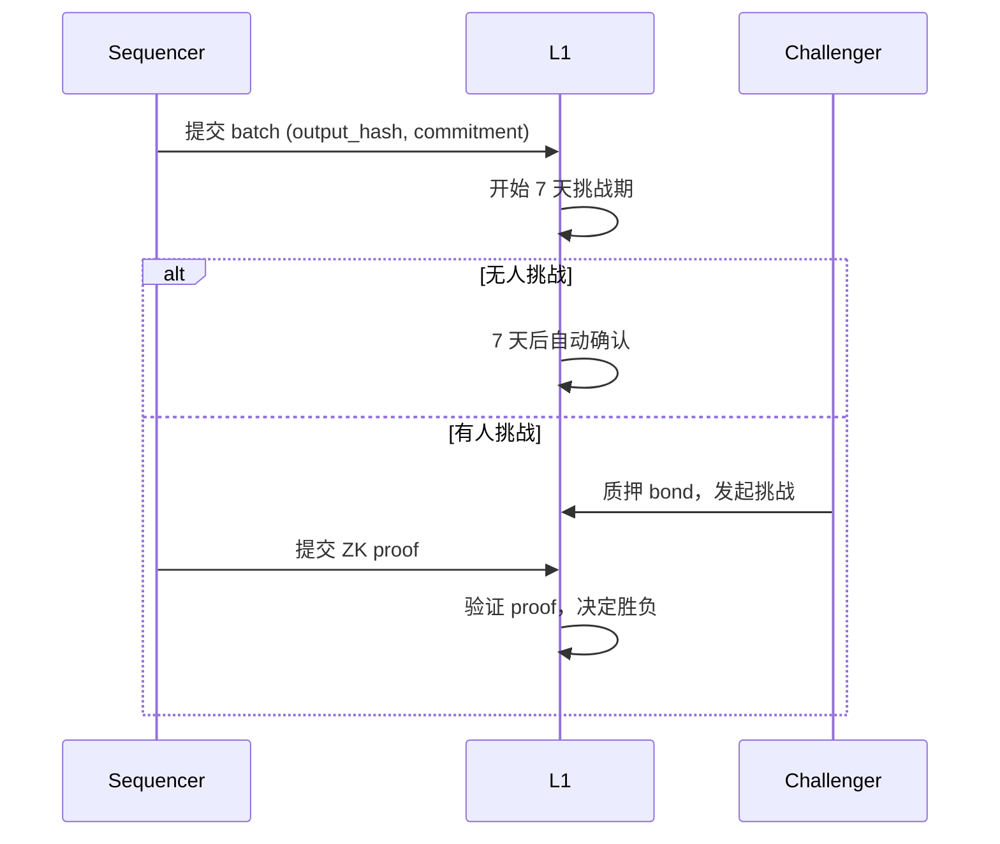
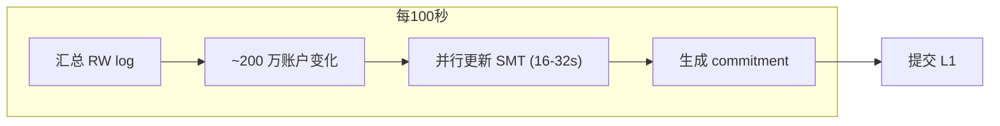
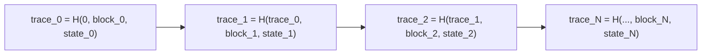
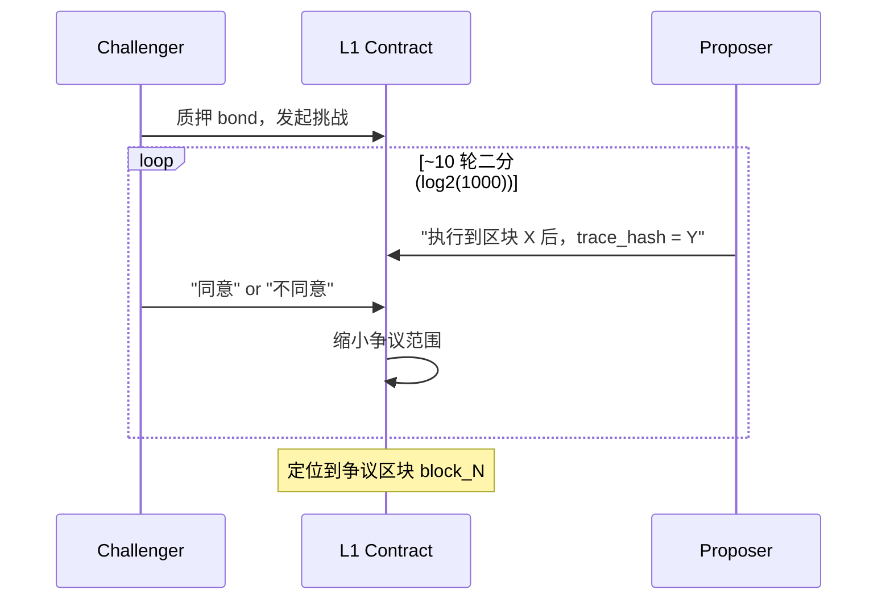
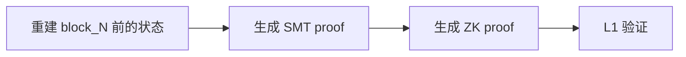
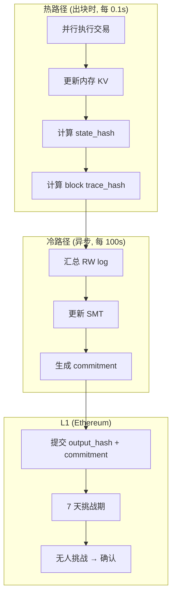
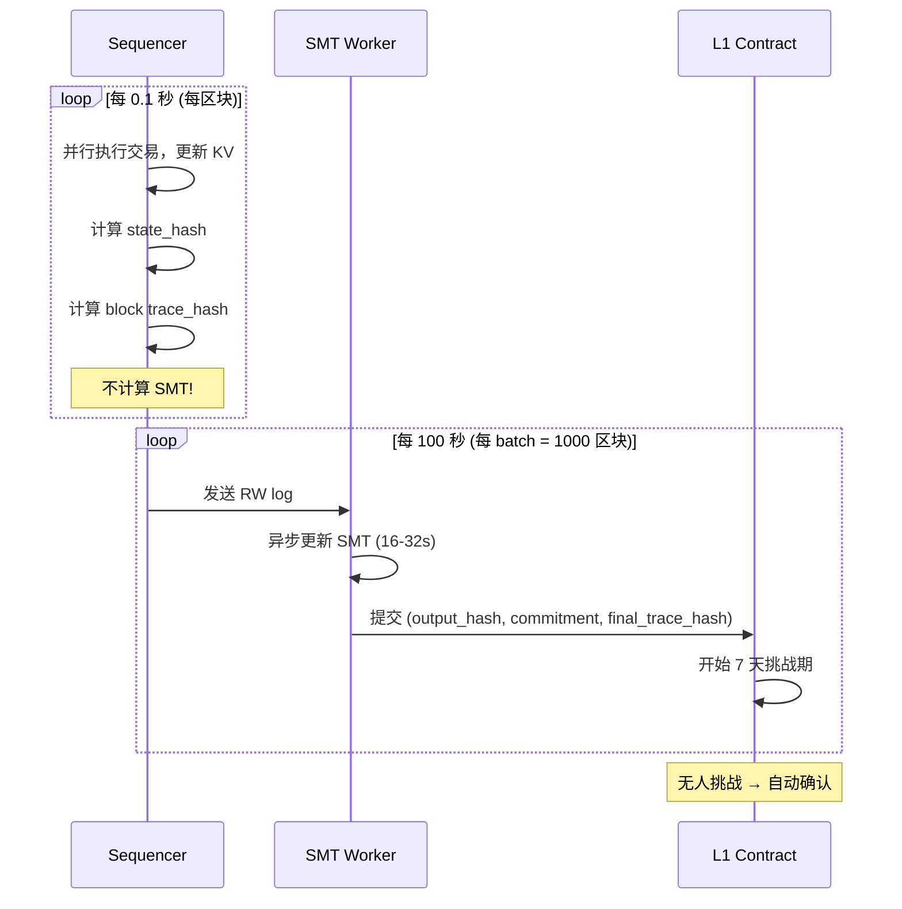
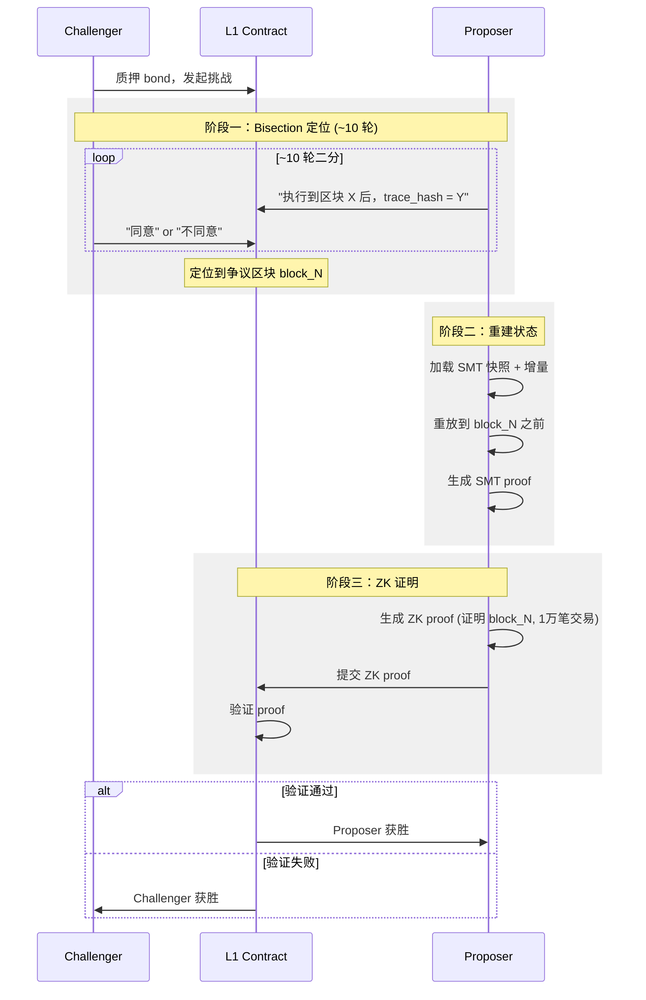
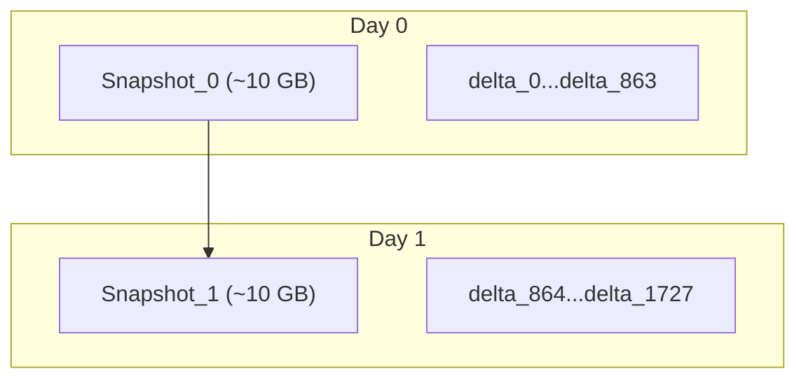

# ZK Bisection 方案

xlayerdex 作为一个高性能区块链，需要有方法保证链安全（去中心化）。本文探讨了使用 **ZK Bisection** 机制保证 xlayerdex 链安全时遇到的问题及解决方案。

**目标**：确认 ZK Bisection 模式下本文给出的方案的可行性。

---

## 1. 背景

### 1.1 Hybrid Proof 的一般流程

使用 Hybrid Proof 机制时，Proposer 只提交 batch 信息，不提交 ZK proof；当有人发起挑战时，才生成 ZK proof 并提交。



### 1.2 原方案设计

原方案引入两个概念：
- `state_hash`：增量哈希，用于区块同步
- `commitment`：异步计算的 Merkle 结构，用于 ZK 证明时验证状态

| 概念 | 用途 | 计算方式 |
|------|------|---------|
| state_hash | 区块同步 | 同步计算（每区块） |
| commitment | ZK 证明 | 异步计算（每 N 区块） |

### 1.3 场景需求

xlayerdex 需要支持：
- **极高 TPS**：10 万+ TPS（0.1 秒出块，每区块 1 万笔交易）
- **大规模账户**：1 亿+ 账户
- **低延迟**：出块不能有性能瓶颈

---

## 2. 问题

原方案存在两个问题：

### 2.1 问题一：commitment 的具体实现未明确

原方案提到 commitment 是 Merkle 结构，但未明确是 **MPT** 还是 **SMT**。

在高 TPS + 异步更新场景下，MPT 存在以下问题：

| 问题 | 说明 |
|------|------|
| 并行更新困难 | 路径可能冲突，难以并行 |
| ZK 不友好 | 结构复杂，电路复杂 |
| 更新路径不可预测 | 需要遍历查找 |

### 2.2 问题二：证明整个 Batch 成本过高

原方案被挑战时需要证明**整个 batch 的所有交易**：

| 证明范围 | 成本 |
|---------|------|
| 100 万笔交易 | ~$39,000 |
| 1 笔交易 | ~$1-10 |

**核心问题**：如何将证明范围从整个 batch 缩小到单笔交易？

---

## 3. 目标

| 优先级 | 目标 | 说明 |
|--------|------|------|
| P0 | **性能** | 不让状态树成为瓶颈，支持 10 万 TPS |
| P1 | **安全** | L1 可验证 L2 状态转换正确性 |
| P2 | **成本** | 被挑战成本可接受（<$500） |
| P3 | **终局性** | 可接受 7 天延迟 |

---

## 4. 解决方案

针对上述两个问题，提出两个优化：

| 问题 | 优化方案 |
|------|---------|
| commitment 实现不明确 | **优化一：用 SMT 替代 MPT** |
| 证明整个 batch 成本高 | **优化二：trace_hash + Bisection** |

### 4.1 优化一：用 SMT 替代 MPT

**SMT (Sparse Merkle Tree)** 相比 **MPT** 更适合异步并行更新：

| 特性 | MPT | SMT |
|------|-----|-----|
| 树深度 | 可变（复杂） | 固定 256 层（简单） |
| 账户定位 | 需要遍历查找 | 直接索引（地址→位置） |
| 并行更新 | 困难（路径可能冲突） | 容易（路径独立） |
| ZK 友好性 | 一般（结构复杂） | 更好（结构简单） |

**异步 SMT 更新流程**：



**性能对比**：

| 方案 | 更新 200 万账户 |
|------|----------------|
| MPT | ~60-120 秒（难以并行） |
| SMT | ~16-32 秒（16 核并行） |

### 4.2 优化二：trace_hash + Bisection

引入 **trace_hash** 用于 Bisection 定位争议点，将证明范围从整个 batch 缩小到单个区块。

> **为什么是区块而不是交易？** DEX 交易是并行执行的，以区块为单位更合适。

#### 4.2.1 Block Trace Hash

每个区块计算：
```
trace_hash_N = H(trace_hash_{N-1}, block_hash_N, state_hash_N)
```



开销：每区块 3 次 hash ≈ 可忽略

#### 4.2.2 Bisection 定位

被挑战时，通过 ~10 轮二分法定位到单个争议区块：



#### 4.2.3 ZK 证明单个区块

定位到 block_N 后，只需证明这一个区块（1 万笔交易）：



**成本对比**：

| 方案 | 证明范围 | 成本 |
|------|---------|------|
| 原方案 | 100 万笔（整个 batch） | ~$39,000 |
| ZK Bisection | 1 万笔（单个区块） | ~$390 |

---

## 5. 完整方案

### 5.1 整体架构



### 5.2 正常流程



### 5.3 被挑战流程



### 5.4 zkVM 证明逻辑

```rust
fn prove(
    // private input:
    initial_used_states,        // block_N 涉及的账户状态
    initial_used_states_proof,  // SMT proof
    transactions,               // block_N 的所有交易 (1万笔)
    
    // public input:
    prev_commitment,            // 执行前的 SMT root
    prev_trace_hash,            // block_{N-1} 后的 trace_hash
    expected_block_hash,        // block_N 的 block_hash
    expected_state_hash,        // block_N 后的 state_hash
    expected_trace_hash,        // block_N 后的 trace_hash
) {
    // 1. 验证输入状态属于 prev_commitment
    verify_smt_proof(prev_commitment, initial_used_states, initial_used_states_proof);
    
    // 2. 并行执行区块内所有交易
    new_states = execute_block(transactions, initial_used_states);
    
    // 3. 计算 block_hash 和 state_hash
    computed_block_hash = hash(transactions);
    computed_state_hash = calc_state_hash(new_states);
    
    // 4. 计算 trace_hash
    computed_trace_hash = H(prev_trace_hash, computed_block_hash, computed_state_hash);
    
    // 5. 验证结果
    assert_eq!(computed_block_hash, expected_block_hash);
    assert_eq!(computed_state_hash, expected_state_hash);
    assert_eq!(computed_trace_hash, expected_trace_hash);
}
```

### 5.5 增量 SMT + 定期快照

为了节省存储，采用增量存储：



存储需求（7 天）：
- 快照：7 × 10 GB = ~70 GB
- 增量：6048 × 200 MB = ~1.2 TB
- **总计：~1.3 TB** ✅

---

## 6. 成本分析

### 6.1 正常运营成本

| 项目 | 频率 | 单价 | 日成本 |
|------|------|------|--------|
| L1 提交 batch | 864 次/天 | ~$10 | ~$8,640 |
| SMT 计算 | 864 次/天 | 计算资源 | 可忽略 |
| 存储 | - | - | ~$50/天 |
| **总计** | | | **~$8,700/天** |

### 6.2 被挑战成本

| 项目 | 成本 |
|------|------|
| Bisection L1 Gas (~10 轮) | ~$50 |
| ZK 证明生成 (1 万笔) | ~$390 |
| L1 验证 Gas | ~$50-100 |
| **总计** | **~$500/次** |

---

## 7. 总结

### 7.1 两个优化

| 优化 | 解决问题 | 效果 |
|------|---------|------|
| **SMT 替代 MPT** | 异步更新性能 | 更新时间 60-120s → 16-32s |
| **trace_hash + Bisection** | 证明成本过高 | 成本 $39,000 → ~$500 |

### 7.2 与原方案对比

| 方面 | 原方案 | ZK Bisection |
|------|--------|--------------|
| commitment 实现 | Merkle（未明确） | SMT（明确） |
| 并行更新 | 困难 | 容易（16 核并行） |
| Bisection | ❌ 无 | ✅ 有 (~10 轮) |
| trace_hash | ❌ 无 | ✅ 每区块记录 |
| 证明范围 | 整个 batch (100 万笔) | 单个区块 (1 万笔) |
| 被挑战成本 | ~$39,000 | ~$500 |

### 7.3 优缺点

| 优点 | 缺点 |
|------|------|
| ✅ 正常情况无 ZK 成本 | ❌ 终局性 7 天 |
| ✅ 出块性能不受影响（10 万 TPS） | ❌ 需要异步 SMT 更新 |
| ✅ 被挑战成本低（~$500） | ❌ 被挑战时需要重建状态 |
| ✅ 支持 1 亿账户 | ❌ 存储需求 ~4.5 TB |
| ✅ DEX 并行执行友好 | |

---

## 8. 附录

### 8.1 关键参数

| 参数 | 值 |
|------|-----|
| 出块速度 | 0.1 秒 |
| 每区块交易 | 10,000 笔（并行执行） |
| TPS | 100,000 |
| Batch 大小 | 1000 区块（100 秒） |
| SMT 更新 | 16-32 秒（16 核并行） |
| 快照频率 | 每天 1 次 |
| 挑战期 | 7 天 |
| Bisection 轮数 | ~10 轮（定位到区块） |

### 8.2 硬件需求

| 组件 | CPU | 内存 | 存储 |
|------|-----|------|------|
| Sequencer | 32+ 核 | 128 GB | 500 GB SSD |
| RPC 节点 | 64 核 | 256 GB | 5 TB |
| Prover | 16 核 × 10 台 | 64 GB × 10 | - |

### 8.3 存储需求

| 内容 | 7 天总量 |
|------|---------|
| 交易数据 | ~3 TB |
| Trace Hash | ~190 GB |
| SMT 增量 | ~1.2 TB |
| SMT 快照 | ~70 GB |
| **总计** | **~4.5 TB** |

---

## 9. 参考资料

- [Optimism Fault Proof](https://docs.optimism.io/stack/protocol/fault-proofs/explainer)
- [op-succinct](https://github.com/succinctlabs/op-succinct)
- [SP1 zkVM](https://github.com/succinctlabs/sp1)
- [Sparse Merkle Tree](https://medium.com/@kelvinfichter/sparse-merkle-trees-explained-f41e6cbb2d6b)
