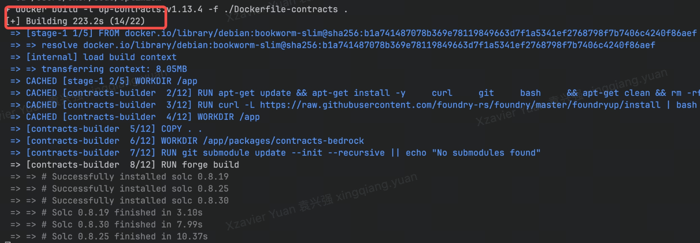
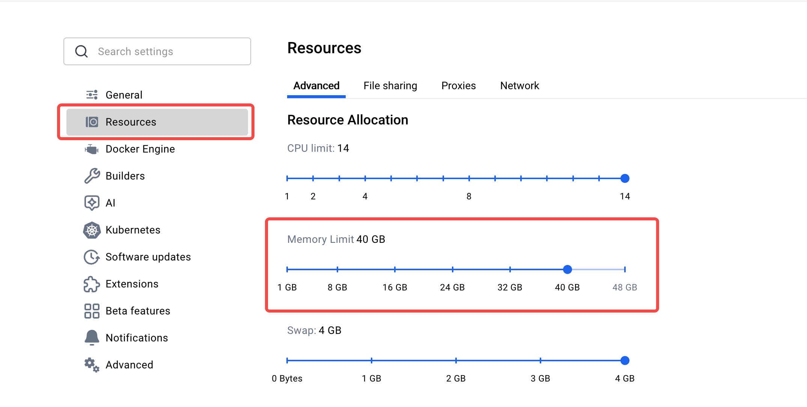

# Optimism Test Environment Setup Guide

## Environment Configuration

Configure `example.env` (do not modify `.env` directly) and run `./clean.sh` to sync changes.

| Case | .env Configuration |
|------|---------------------|
| **Geth as Sequencer** | `SEQ_TYPE=geth`<br>`SKIP_OP_RETH_BUILD=true`<br>`DB_ENGINE=pebble` |
| **Reth as Sequencer** | `SEQ_TYPE=reth`<br>`SKIP_OP_RETH_BUILD=false`<br>`OP_RETH_LOCAL_DIRECTORY=/absolute/path/to/reth/repository`<br>`OP_RETH_BRANCH=dev` |
| **Geth as RPC** | `RPC_TYPE=geth`<br>`LAUNCH_RPC_NODE=true`<br>`SKIP_OP_RETH_BUILD=true`<br>`DB_ENGINE=pebble` |
| **Reth as RPC** | `RPC_TYPE=reth`<br>`LAUNCH_RPC_NODE=true`<br>`SKIP_OP_RETH_BUILD=false`<br>`OP_RETH_LOCAL_DIRECTORY=/absolute/path/to/reth/repository`<br>`OP_RETH_BRANCH=dev` |
| **OP-Succinct Enabled** | `OP_SUCCINCT_ENABLE=true`<br>`SEQ_TYPE=reth` <br>`RPC_TYPE=geth` <br>`MIN_RUN=false` <br>`OP_SUCCINCT_MOCK_MODE=true` (for testing)<br>`OP_SUCCINCT_FAST_FINALITY_MODE=true` (skip challenger) |

**Notes:**
- Always modify `example.env`, then run `./clean.sh` to sync to `.env`
- Run `./init.sh` to build Docker images after configuration changes. By default, Docker images are not build locally.
- `DB_ENGINE` can be `pebble` or `leveldb` (only required for Geth)

## Prerequisites

### System Requirements
- Docker 20.10.0 or higher
- Docker Compose
- At least 32GB RAM
- At least 32GB available disk space

> **Important**: If you encounter performance issues, increase Docker engine memory limit to over 32GB
> 
> 

### Initial Setup (First Time Only)
1. Run `./init.sh` or `./init-parallel.sh` to build Docker images locally. By default, Docker images are not built locally. You need to set the following variables to ``true`` in `example.env` and set the corresponding paths to build Docker images locally:
```
OP_STACK_LOCAL_DIRECTORY=<path to a clone of https://github.com/okx/optimism>
OP_GETH_LOCAL_DIRECTORY=<path to a clone of https://github.com/okx/op-geth>
OP_RETH_LOCAL_DIRECTORY=<path to a clone of https://github.com/okx/reth>
OP_GETH_BRANCH=<default is dev>
OP_RETH_BRANCH=<default is dev>
SKIP_OP_STACK_BUILD=true
SKIP_OP_CONTRACTS_BUILD=true
SKIP_OP_GETH_BUILD=true
SKIP_OP_RETH_BUILD=true
```

> Important: `init.sh` should only be run once during initial setup. Re-run only if you need to rebuild Docker images after code changes.

### Code Updates and Image Rebuilding (Optional)
If you've updated the Optimism codebase and need to rebuild Docker images:

1. **Update image tags** in `example.env`:
   ```bash
   # Example: increment version numbers
   OP_GETH_IMAGE_TAG=op-geth:v1.101512.0-patch
   OP_STACK_IMAGE_TAG=op-stack:v1.13.5
   OP_CONTRACTS_IMAGE_TAG=op-contracts:v1.13.5
   ```

2. **Apply changes**:
   ```bash
   ./clean.sh  # This will update .env from example.env
   ```

3. **Rebuild images**:
   ```bash
   ./init.sh  # Rebuilds all Docker images

   # Or in parallel (add -v for verbose output)
   ./init-parallel.sh

   # Or rebuild specific images only (optional)
   source .env && cd .. && docker build -t ${OP_STACK_IMAGE_TAG} -f Dockerfile-opstack . && cd -
   ```

### Directory Structure
```
devnet/
├── 0-all.sh            # One-click deployment script
├── init.sh             # Initialization script
├── init-parallel.sh    # Parallel initialization script
├── clean.sh            # Environment cleanup script
├── 1-start-l1.sh       # L1 chain startup script
├── 2-deploy-op-contracts.sh  # Contract deployment script
├── 3-op-init.sh        # Environment initialization script
├── 4-op-start-service.sh    # Service startup script
├── 5-run-op-succinct.sh # OP-Succinct components setup script
├── docker-compose.yml  # Docker Compose configuration
├── Makefile            # Build automation
├── scripts/            # Utility scripts
│   ├── transfer-leader.sh      # Leader transfer script
│   ├── stop-leader-sequencer.sh # Sequencer stop script
│   ├── active-sequencer.sh      # Check active sequencer
│   ├── add-game-type.sh         # Add dispute game type
│   ├── add-peers.sh             # Add peer connections
│   ├── deploy-op-succinct.sh    # OP-Succinct contracts deployment script
│   ├── generate-vkeys.sh        # Generate verification keys for OP-Succinct real mode
│   ├── docker-install-start.sh # Docker installation helper
│   ├── gray-upgrade-simulation.sh # Gray upgrade simulation
│   ├── kill-rpc.sh              # Kill RPC node
│   ├── mempool-rebroadcaster-scheduler.sh # Compares and rebroadcasts missing txs between reth and geth
│   ├── replace-genesis.sh       # Replace genesis configuration
│   ├── setup-cgt-function.sh    # Setup CGT functions
│   ├── show-dev-accounts.sh     # Display dev accounts info
│   ├── start-rpc.sh             # Start RPC node
│   ├── stop-rpc.sh              # Stop RPC node
│   ├── test-cgt.sh              # Test CGT functionality
│   └── trusted-peers.sh         # Configure trusted peers
├── config-op/          # Configuration directory
├── entrypoint/         # Container entrypoint scripts
├── l1-geth/            # L1 Geth configuration and data
├── saved-cannon-data/  # Pre-generated cannon/dispute game data
├── contracts/          # Smart contracts
├── images/             # Documentation images
├── example.env         # Environment template
```

## Quick Start

### One-Click Deployment

```bash
make run
```

This command automatically:
- Cleans up previous deployment
- Builds Docker images
- Deploys complete environment

⚠️ **Important Notes**:

1. Configuration Management:
   - if `.env` file does NOT exist, it will be created from `example.env`, when call `./init.sh`
   - if `.env` file exists, it will NOT be overwritten

2. Environment Reset:
   - `clean.sh` will stop all containers
   - Clean all data directories

> Note: For first-time setup, we recommend following the step-by-step deployment process to better understand each component and troubleshoot any potential issues.

### Fast Verify Deployment
```bash
# Send test transaction
cast send 0x14dC79964da2C08b23698B3D3cc7Ca32193d9955 \
  --value 1 \
  --gas-price 2000000000 \
  --private-key 0x59c6995e998f97a5a0044966f0945389dc9e86dae88c7a8412f4603b6b78690d \
  --rpc-url http://localhost:8124
```

### Step-by-Step Deployment
For more granular control or troubleshooting, follow the steps below.

## Deployment Process

### 1. L1 Environment Setup
Run `./1-start-l1.sh`:
- Starts a complete PoS L1 test chain (EL + CL)
- CL node handles blob data storage
- Automatically funds test accounts:
  - Batcher
  - Proposer
  - Challenger

### 2. Smart Contract Deployment
Run `./2-deploy-op-contracts.sh`:
- Deploys Transactor contract
- Deploys and initializes all Optimism L1 contracts
- Generates configuration files:
  - `rollup.json`: op-node configuration
  - `genesis.json`: L2 initial state

### 3. Environment Initialization
Run `./3-op-init.sh`:
- Initializes op-geth database
  - Sequencer node
  - RPC node
- Generates dispute game components:
  - Compiles op-program
  - Generates prestate files
  - Creates state proofs

### 4. Service Startup
Run `./4-op-start-service.sh`:
- Launches core services:
  - op-batcher: L2 transaction batch processing
  - op-proposer: L2 state submission
  - op-node: State sync and validation
  - op-geth: L2 execution engine
  - op-challenger: State validation
  - op-dispute-mon: Dispute monitoring
  - op-conductor: Sequencer HA management

### 5. OP-Succinct Setup (Optional)
Run `./5-run-op-succinct.sh`:
- Only runs if `OP_SUCCINCT_ENABLE=true` in `.env`
- Deploys OP-Succinct contracts (AccessManager, Verifier, FaultDisputeGame)
- Starts services:
  - op-succinct-proposer: ZK validity proof proposer
  - op-succinct-challenger: Optional challenger (disabled if `OP_SUCCINCT_FAST_FINALITY_MODE=true`)

### 6. Conductor Management
The test environment includes a 3-node conductor cluster for sequencer high availability (HA).

#### Architecture
- **Cluster Type**: 3-node Raft consensus cluster
- **Active Sequencer**: Only runs on leader node
- **Failover**: Automatic when leader becomes unhealthy
- **High Availability**: Ensures continuous L2 block production

#### Configuration
Enable or disable conductor cluster in `example.env`:
```bash
# Enable HA mode with conductor cluster
CONDUCTOR_ENABLED=true

# Disable HA, run single sequencer
CONDUCTOR_ENABLED=false
```

#### Network Ports
Each conductor node uses three ports:
- **RPC Port**: Management API
  - Node 1: 8547
  - Node 2: 8548
  - Node 3: 8549

- **Consensus Port**: Raft protocol
  - Node 1: 50050
  - Node 2: 50051
  - Node 3: 50052

- **Sequencer Port**: L2 execution
  - Node 1: 9545
  - Node 2: 9546
  - Node 3: 9547

#### Health Monitoring
The conductor cluster monitors each node's:
- Sync status with L1
- P2P network connectivity
- Block production rate

When leader becomes unhealthy:
- Automatically transfers leadership
- Deactivates unhealthy sequencer
- Activates sequencer on new leader

#### Leadership Management
There are two ways to trigger leader transfer:

1. Using `transfer-leader.sh`:
```bash
# Auto transfer to any healthy node
./scripts/transfer-leader.sh

# Transfer to specific node (1 or 2 or 3)
./scripts/transfer-leader.sh 2
```

2. Force transfer by stopping leader's sequencer:
```bash
# Stops block production while keeping the container running
# Automatically triggers leader transfer after health check timeout
# Can be run multiple times to test different leadership scenarios
./scripts/stop-leader-sequencer.sh
```

This method simulates a sequencer failure scenario, enabling comprehensive testing of automatic failover mechanisms. Each execution stops the current leader's sequencer and triggers a transfer to another node, allowing you to test different leadership scenarios by running the script multiple times. The cluster maintains high availability through dynamic role switching - when a sequencer stops producing blocks, it transitions to follower status while another node assumes leadership. The system remains resilient as any follower can automatically promote to leader if the current leader encounters issues.

3. Gray upgrade using op-conductor:
```bash
# Emulate the whole gray upgrade process to achieve 0 downtime
./scripts/gray-upgrade-simulation.sh
# Meanwhile, open another terminal window to load test
polycli loadtest --rpc-url http://localhost:8124 \
  --private-key "0x4bbbf85ce3377467afe5d46f804f221813b2bb87f24d81f60f1fcdbf7cbf4356" \
  --verbosity 700 --requests 50000  -c 1 --rate-limit -1
```

The `scripts/gray-upgrade-simulation.sh` script simulates a rolling upgrade process for the sequencer cluster managed by op-conductor. It upgrades a follower sequencer while keeping the leader running, then transfers leadership to the upgraded node. This approach ensures service continuity and validates the cluster's resilience during upgrades.

## Utility Scripts

### Development Accounts Display Script

The `scripts/show-dev-accounts.sh` script displays all development accounts with their private keys:

#### Features
- **Account Listing**: Shows all 30 development accounts (paths 0-29)
- **Private Key Display**: Reveals private keys for testing
- **Address Generation**: Shows corresponding addresses
- **Mnemonic Path**: Displays derivation paths

#### Usage
```bash
# Display all dev accounts
./scripts/show-dev-accounts.sh
```

#### What it does
1. **Generates Accounts**: Creates 30 accounts from standard mnemonic (paths 0-29)
2. **Shows Details**: Displays address, private key, and derivation path
3. **Standard Mnemonic**: Uses "test test test test test test test test test test test junk"
4. **Path Format**: Uses `m/44'/60'/0'/0/{i}` derivation paths

#### Important Notes
- **Balance Status**: Most dev accounts are pre-funded with 10,000 ETH, but some accounts may have zero initial balance

### Mempool rebroadcaster scheduler

The `scripts/mempool-rebroadcaster-scheduler.sh` script facilitates running the mempool rebroadcaster tool periodically in a default 1 minute interval.

### Usage

- The mempool rebroadcaster tool is crucial to ensure reth and geth transaction pool consistency.
- In production, the mempool-rebroadcaster should be running inside a scheduler or cron job.
- For our local devnet, we can deploy the tool inside the scheduler by running the script.

### Reth vs geth txpool

- There are slight differences in the txpool behaviour between opgeth and reth which thus the need for the tool.

||Geth|Reth|
|---------|------|------|
|Pending| Next nonce transactions with no nonce gap | Next nonce transactions with a fee higher than the base fee|
|Queued| Transactions with a nonce gap | Transactions below the base fee, even if they are next nonce, and transactions with a nonce gap|

## Troubleshooting

### Common Issues

#### 1. Service Startup Failures
- **Check Docker logs**: `docker compose logs <service-name>`
- **Verify port availability**: Ensure ports 8545, 8546, 4000, 3500 are free
- **Validate environment variables**: Check `.env` file matches `example.env`
- **Memory issues**: Increase Docker memory limit to 32GB+

#### 2. Contract Deployment Issues
- **Verify L1 node is running**: Check `docker compose ps`
- **Check account balances**: Ensure test accounts have sufficient ETH
- **Validate gas settings**: Check gas limit and price in deployment logs

#### 3. Synchronization Issues
- **L2 not syncing**: Check op-geth-seq is running and producing blocks
- **RPC node issues**: Verify op-geth-rpc can connect to op-geth-seq
- **Genesis mismatch**: Ensure rollup.json matches actual L2 genesis

#### 4. Conductor Cluster Issues
- **Leader election problems**: Check Raft consensus logs
- **Sequencer not switching**: Verify health check configuration
- **P2P connectivity**: Check network configuration and firewall

## Service Ports Overview

| Service | Port | Description |
|---------|------|-------------|
| **L1 Services** | | |
| l1-geth | 8545 | L1 Ethereum RPC |
| l1-geth | 8546 | L1 Ethereum WebSocket |
| l1-geth | 8551 | L1 Ethereum Engine API |
| l1-beacon-chain | 4000 | L1 Beacon RPC |
| l1-beacon-chain | 3500 | L1 Beacon HTTP |
| l1-beacon-chain | 18080 | L1 Beacon Metrics |
| **L2 Services** | | |
| op-geth-seq | 8123 | L2 Sequencer RPC |
| op-geth-seq | 7546 | L2 Sequencer WebSocket |
| op-geth-seq | 8552 | L2 Sequencer Engine API |
| op-geth-rpc | 9123 | L2 RPC Node RPC |
| op-seq | 9545 | L2 Node RPC |
| op-seq | 7070 | L2 Node P2P |
| op-seq | 9223 | L2 Node P2P (UDP) |
| op-rpc | 9555 | L2 RPC Node RPC |
| **Conductor Cluster** | | |
| op-conductor | 8547 | Conductor 1 RPC |
| op-conductor | 50050 | Conductor 1 Consensus |
| op-conductor2 | 8548 | Conductor 2 RPC |
| op-conductor2 | 50051 | Conductor 2 Consensus |
| op-conductor3 | 8549 | Conductor 3 RPC |
| op-conductor3 | 50052 | Conductor 3 Consensus |
| **Other Services** | | |
| op-batcher | 8548 | Batcher RPC |
| op-proposer | 8560 | Proposer RPC |

## Profiling Documentation

| Guide | Description |
|-------|-------------|
| [Profiling Reth](../docs/PROFILING_RETH.md) | Main profiling guide for op-reth with CPU and memory profiling |
| [Memory Profiling](../docs/MEMORY_PROFILING.md) | Jemalloc heap profiling for memory leaks and allocation patterns |
| [Perf TUI Reference](../docs/PERF_TUI_REFERENCE.md) | Quick reference for perf report interactive commands |
