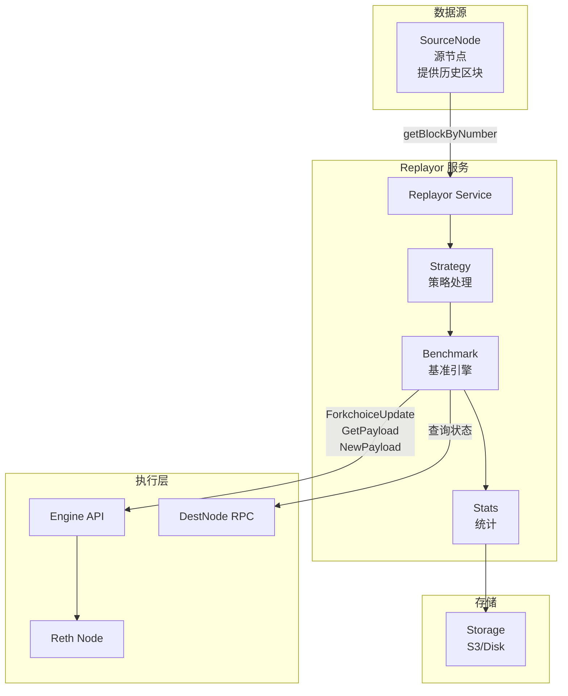
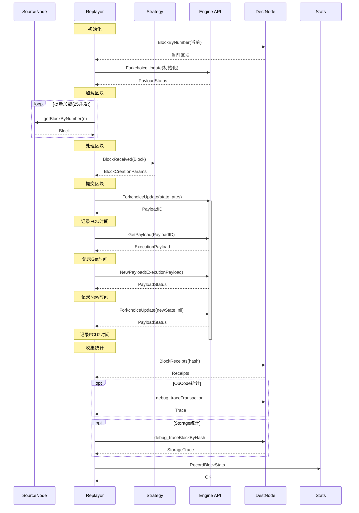
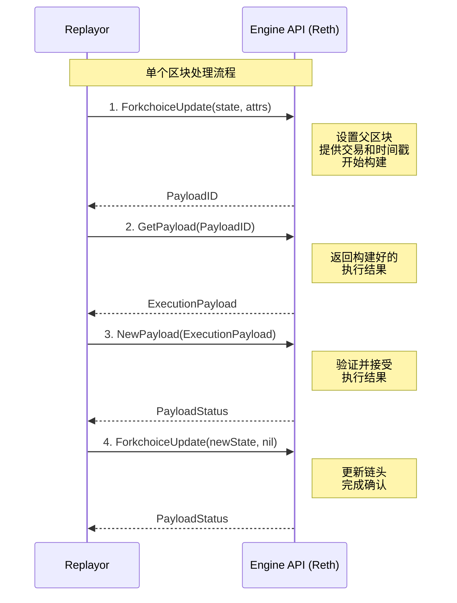
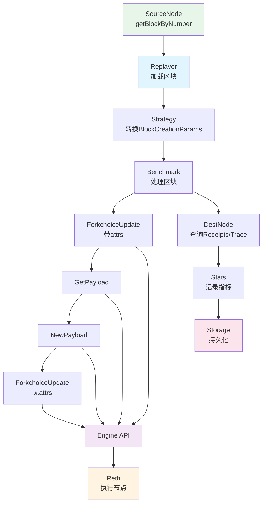

# Replayor 架构图和泳道图

## 系统架构图

## 完整泳道图 - 区块重放流程

## Engine API 调用流程

## 组件交互图

## 关键接口说明

### SourceNode 接口
- `eth_getBlockByNumber`: 获取指定区块号的完整区块数据

### Engine API 接口
- `engine_forkchoiceUpdatedV3`: 更新forkchoice状态，可选提供PayloadAttributes
- `engine_getPayloadV3`: 根据PayloadID获取构建好的执行结果
- `engine_newPayloadV3`: 提交执行结果到执行层

### DestNode 接口
- `eth_getBlockByNumber`: 获取当前区块
- `eth_getBlockReceipts`: 获取区块的收据
- `debug_traceTransaction`: 追踪交易执行过程
- `debug_traceBlockByHash`: 追踪区块的存储变化

