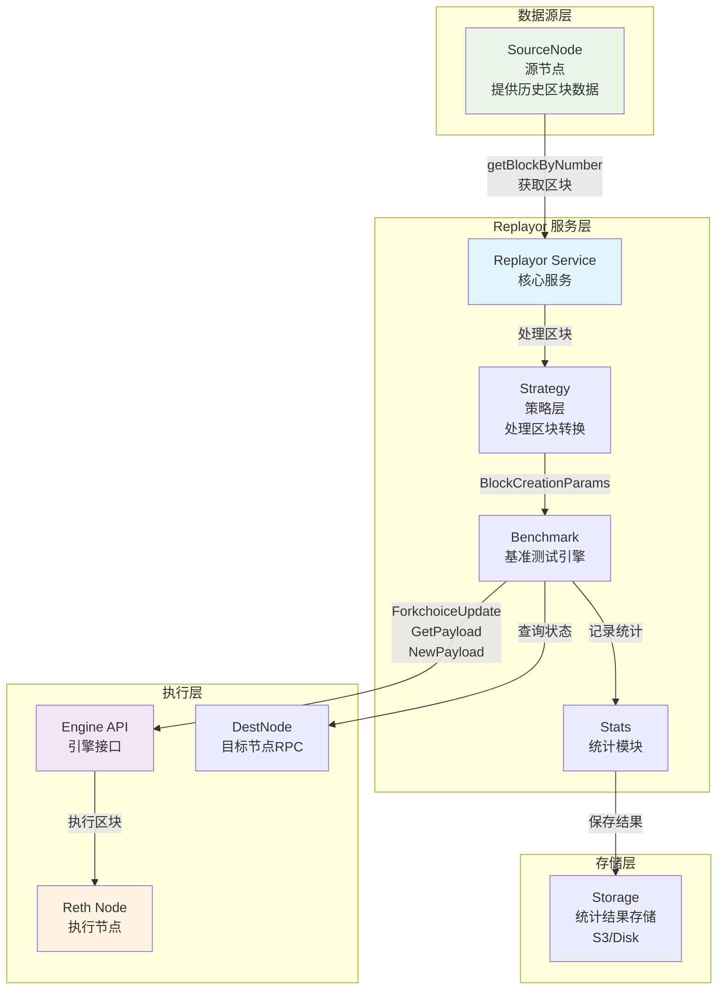
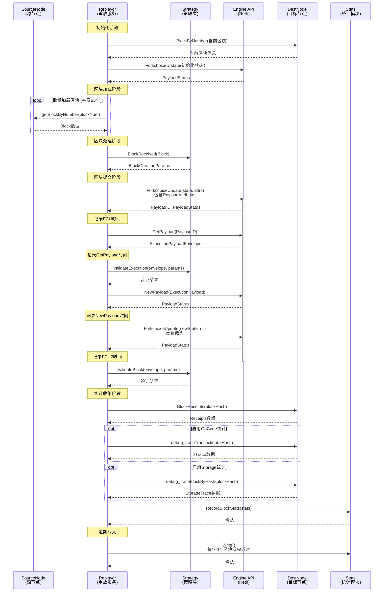
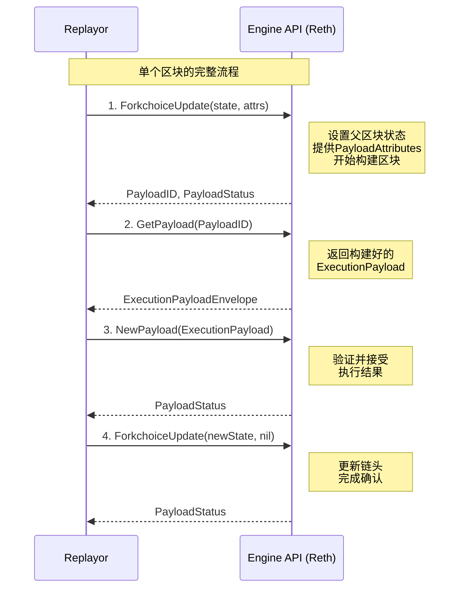
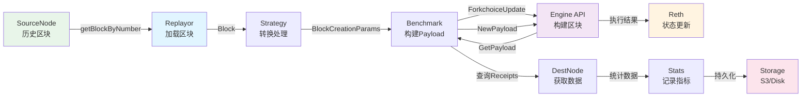

# Replayor 架构图和泳道图

## 系统架构图

## 组件说明

### SourceNode (源节点)
- **职责**: 提供历史区块数据
- **接口**: `eth_getBlockByNumber`
- **用途**: Replayor从中获取需要重放的区块数据

### Replayor Service (核心服务)
- **职责**: 协调整个重放流程
- **功能**:
  - 初始化客户端连接
  - 管理Benchmark生命周期
  - 监控重放进度

### Strategy (策略层)
- **职责**: 处理区块转换逻辑
- **类型**: 
  - `OneForOne`: 一对一重放
  - `Replay`: 重放策略
  - `Stress`: 压力测试策略
- **功能**: 将区块转换为`BlockCreationParams`

### Benchmark (基准测试引擎)
- **职责**: 执行区块重放的核心逻辑
- **功能**:
  - 从SourceNode加载区块
  - 通过Engine API提交区块
  - 收集性能统计

### Reth (执行节点)
- **职责**: 执行区块并维护状态
- **接口**: Engine API
- **功能**: 执行交易、更新状态树

### Engine API (引擎接口)
- **职责**: 提供区块构建和执行接口
- **主要接口**:
  - `engine_forkchoiceUpdatedV3`
  - `engine_getPayloadV3`
  - `engine_newPayloadV3`

### DestNode (目标节点RPC)
- **职责**: 提供查询接口
- **接口**: 
  - `eth_getBlockByNumber`
  - `eth_getBlockReceipts`
  - `debug_traceTransaction`
  - `debug_traceBlockByHash`

### Stats (统计模块)
- **职责**: 收集和存储性能指标
- **指标**: 
  - FCU时间
  - GetPayload时间
  - NewPayload时间
  - Gas使用情况
  - OpCode统计
  - Storage变化

---

## 泳道图 - 区块重放流程

---

## 详细流程说明

### 1. 初始化阶段
1. Replayor连接DestNode，获取当前区块号
2. 通过ForkchoiceUpdate设置初始状态，等待Reth同步完成
3. 如果设置了BenchmarkStartBlock，会先快速推进到起始区块

### 2. 区块加载阶段
- 使用并发（25个goroutine）从SourceNode批量获取区块
- 通过`getBlockByNumber`获取指定区块号的数据
- 将区块放入`incomingBlocks`通道

### 3. 区块转换阶段
- `mapBlocks`协程从`incomingBlocks`读取区块
- 通过Strategy的`BlockReceived`方法转换为`BlockCreationParams`
- 将转换后的参数放入`processBlocks`通道

### 4. 区块提交阶段（核心流程）
1. **ForkchoiceUpdate (带PayloadAttributes)**
   - 设置父区块的forkchoice状态
   - 提供PayloadAttributes（包含交易、时间戳等）
   - Reth返回PayloadID用于后续获取

2. **GetPayload**
   - 使用PayloadID获取执行后的区块
   - 包含完整的执行结果

3. **验证执行结果**
   - 通过Strategy验证执行结果是否正确

4. **NewPayload**
   - 提交执行结果到Reth
   - Reth验证并接受区块

5. **ForkchoiceUpdate (不带PayloadAttributes)**
   - 更新链头到新提交的区块
   - 完成区块的最终确认

### 5. 统计收集阶段
- 从DestNode获取区块的Receipts
- 可选：通过debug_traceTransaction获取OpCode统计
- 可选：通过debug_traceBlockByHash获取Storage变化
- 记录所有性能指标到Stats模块

### 6. 数据持久化
- 每100个区块自动写入一次
- 测试完成时最终写入
- 支持S3和本地磁盘存储

---

## Engine API 调用时序

---

## 数据流图

